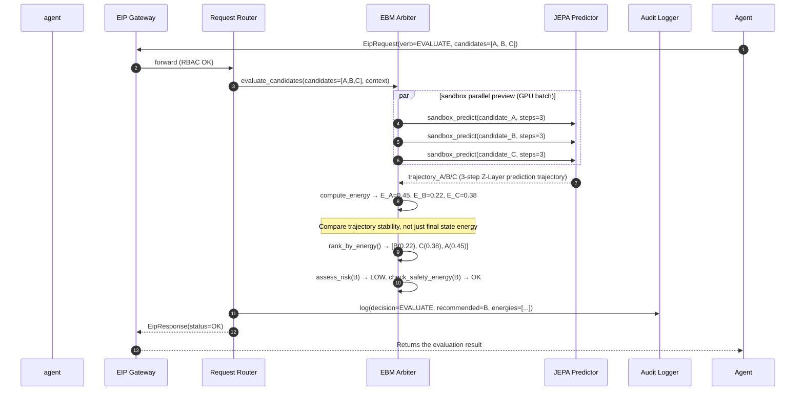
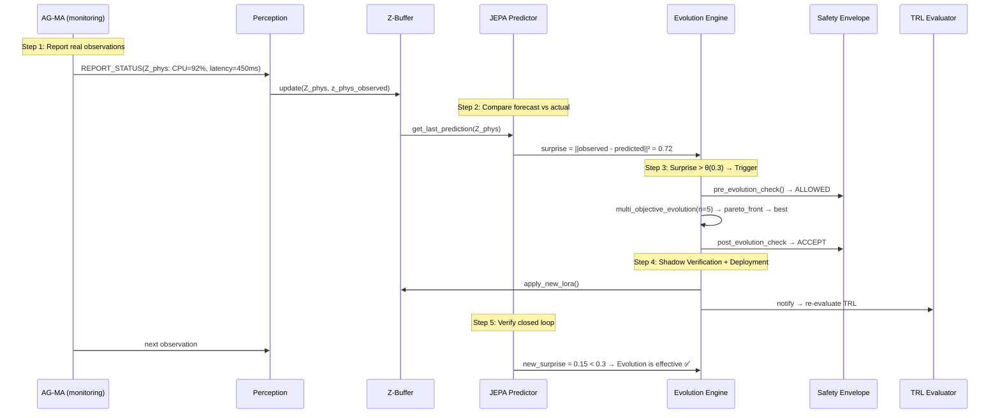
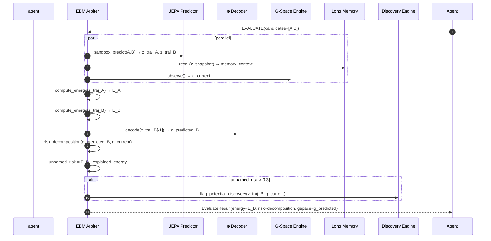
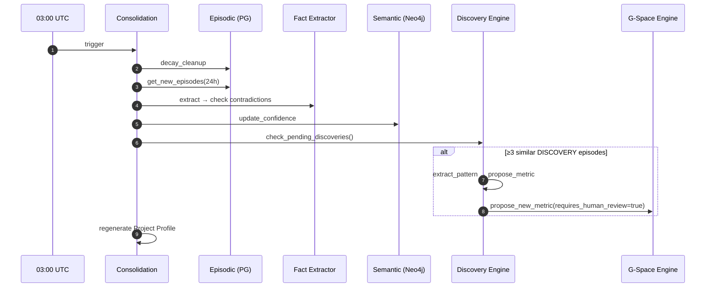
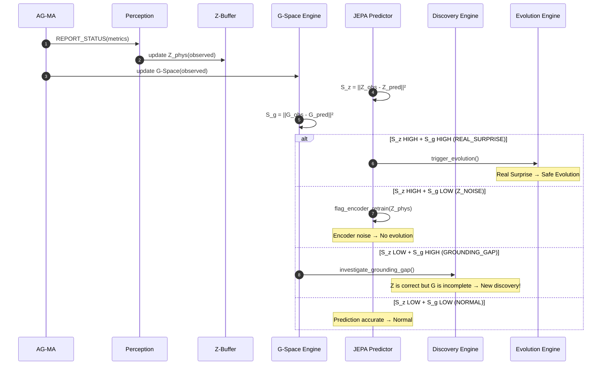
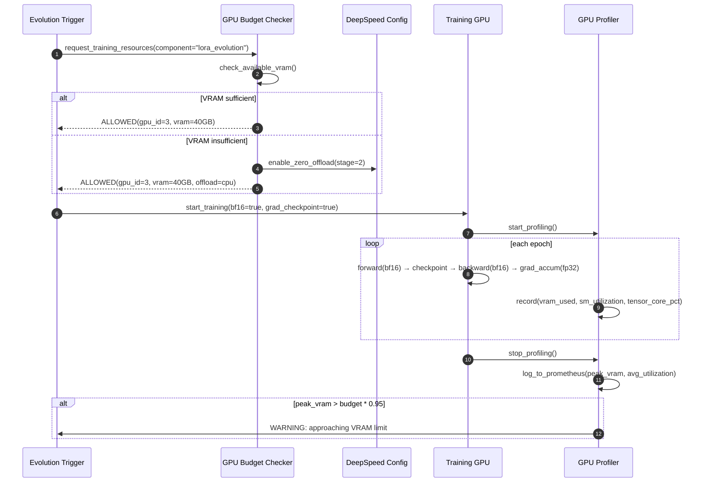
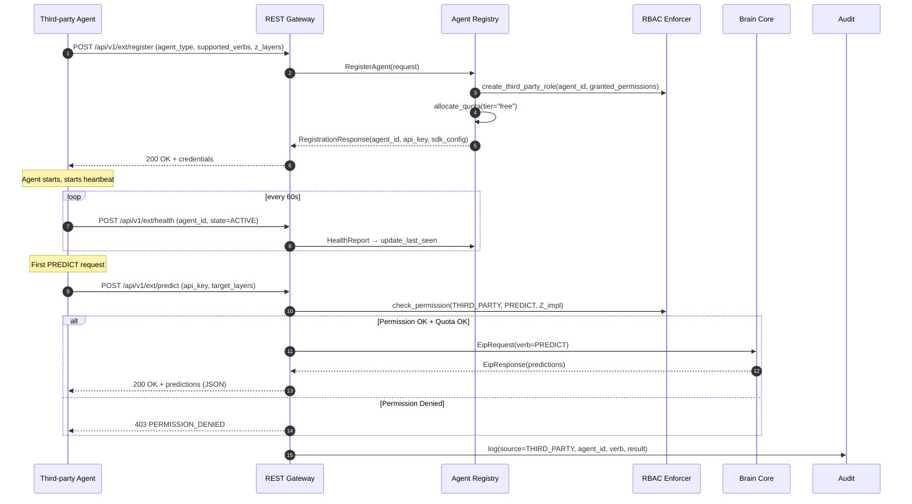

# ⚙️ UEWM Engineering Specification

**Document version:** V2.0.1
**Document number:** UEWM-ENG-006
**Last update:** 2026-04-03
**Status:** Design completed (supports all AC verification + dual space timing diagram + GPU specifications + SIGReg training pipeline + VoE verification specifications)
**Benchmarking requirements:** All R01-R13, GND, GPU, EXT, LIC, LeWM
**Change History:**
- Engineering Spec V2-5/deliver-v1.0: Sequence diagram §2.1-2.13, component dependencies, deployment products, cold start, data pipeline verification
- V1.0.1: GPU engineering specifications (§8), Standalone deployment (§8.4), third-party registration timing diagram (§8.3)
- V2.0.0: Dual space sequence diagram (§2.14-2.16), G-Space component dependencies, PoC technology stack
- **V2.0.1: SIGReg/VoE/probe engineering specifications, Gate Review automation; fully merge V1.0.1 content, eliminating all reference dependencies**

---

## 1. Overview

Implementation-level engineering specifications: key interaction sequence diagrams (18, including V2.0 dual space), component dependency matrix, deployment products, configuration management, cold start protocol, GPU optimization specifications, third-party Agent registration process, PoC verification specifications.

---

## 2. Key interaction sequence diagram

### 2.1 Sequence diagram 1: PREDICT request (Agent → Brain)

Agent sends PREDICT → EIP Gateway RBAC verification → Request Router routing → JEPA Predictor reads the current status from Z-Buffer → performs prediction → results return → audit log record.

### 2.2 Sequence diagram 2: REPORT_STATUS + surprise detection

Agent reports status → Perception Pipeline encoding → Z-Buffer update → JEPA comparison prediction vs actual → Calculate surprise degree → Super threshold → Trigger evolution.

### 2.3 Sequence diagram 3: EVALUATE including sandbox parallel preview



### 2.4 Sequence diagram 4: ORCHESTRATE (SCHEDULE)

The orchestration module derives state from Z-Layer → orders task dependencies → returns recommended execution order.

### 2.5 Timing diagram 5: LOA cascade evaluation

TRL fallback event → ALFA recalculates LOA → Orchestration module identifies downstream → Assess impact → Kafka notification → Audit.

### 2.6 Sequence diagram 6: Orchestration module project health

Cron every 30s → the orchestration module reads signals from Z-Buffer/Agent/EBM → weighted synthesis → push to Dashboard.

### 2.7 Sequence diagram 7: cross-modal alignment training

```mermaid
sequenceDiagram
    participant Cron as Alignment Scheduler
    participant AT as AlignmentTrainer
    participant TRL as TRL Evaluator
    participant GPU as Training GPU Pool

    Cron->>AT: trigger_alignment(stage=STAGE_1, layers=[Z_impl])
    AT->>TRL: check_prerequisites(STAGE_1, [Z_impl]) → OK
    AT->>GPU: request_training_gpu()
    altGPU available
        GPU-->>AT: GPU-3 allocated
    else GPU busy (inference priority)
        Note over AT: Retry every 60s, max wait 30min
    end

    loop epoch 1..50
        AT->>AT: train_epoch(InfoNCE, temperature=0.07)
        AT->>AT: evaluate_ari = compute_ARI()
        alt ARI >= 0.3 (convergence)
            AT->>TRL: notify_alignment_complete → may upgrade TRL
        else ARI < 0.1 after 20 epochs (abort)
            AT-->>Cron: ABORTED
        end
    end
    AT->>GPU: release_training_gpu()
```

### 2.8 Timing diagram 8: Error budget check and automatic downgrade

Prometheus collects every 10s → Error Budget Engine calculates burn-rate → Decision level → L2: Parallel pause evolution + lower priority (all completed within 30s) → 15min stable period after recovery → Downgrade to L0 → Resume evolution.

### 2.9 Sequence diagram 9: Regular self-reflection

Cron daily 03:00 UTC → 5-dimensional introspection (prediction consistency/causal graph health/cross-layer alignment/decision diversity/blind spot detection) → anomalies → inject evolution engine directed LoRA → audit.

### 2.10 Sequence diagram 10: Manual feedback learning

Human OVERRIDE → Brain EBM evaluation (current vs suggestion) → Calculate r_human → Buffer storage → 50 experience accumulation → Bias check (single user ≤30%, ≥3 roles) → Specialized LoRA training (lr=50%) → Security envelope check → ACCEPT/ROLLBACK.

### 2.11 Sequence diagram 11: Product version consistency detection

Agent SUBMIT_ARTIFACT → Z-Buffer record version → Orchestration module checks upstream reference → Version mismatch → Kafka ARTIFACT_ALERT → PM Dashboard + upstream and downstream Agent notification → ≤60s alarm.

### 2.12 Sequence diagram 12: external tool failure degradation

Adapter health_check failed → Required dependency failure → ALFA forces LOA≤4 → EIP LOA_UPDATE event → Orchestration module LOA cascade evaluation → Agent switches to degraded mode.

### 2.13 Complete closed-loop tracking: Observation → Surprise → Evolution → Verification



### 2.14 Sequence diagram 14: Memory enhancement decision + G-Space (V2.0 enhancement)



**[V1.0.1 Long Memory original timing diagram §2.14]** — Memory enhancement decision (pure memory, no G-Space):

EBM parallel: EVAL candidate A/B + RECALL(z_snapshot→3 similar Episodes→2 CAUSAL Facts) + Profile.get() → ANTI_PATTERN matching A → E_A+=20%, PREFERENCE tendency B → E_B-=5% → recommended=B + MemoryInfluence.

### 2.15 Sequence Diagram 15: Memory Consolidation (V2.0 including Discovery)



### 2.16 Sequence Diagram 16: Dual Space Surprise Degree → 4 Classification Processing



### 2.17 Timing diagram seventeen: GPU optimized training pipeline (V1.0.1 §8.2)



### 2.18 Sequence diagram 18: Third-party Agent registration and first interaction (V1.0.1 §8.3)



---

## 3. Component dependency matrix (V2.0 update)

### 3.1 Startup sequence

PostgreSQL → Redis → Kafka → Vault → Neo4j → **G-Space Collectors (Prometheus/GitHub/CI API)** → Brain Core (Z-Buffer → Perception → **G-Space Engine** → **Bridging Functions** → JEPA → EBM → **Discovery Engine** → Long Memory → Orchestrator → Evolution → TRL) → EIP Gateway → Agents (Inner Ring → Middle Ring → Outer Ring) → Portal API

### 3.2 Dependencies between components

| Components | Strong dependencies | Weak dependencies |
|------|--------|--------|
| Brain Core | PostgreSQL, Redis | Kafka, Vault |
| **G-Space Engine** | **Prometheus, GitHub API, CI API** | **Jira/Linear (process.*)** |
| **Bridging Functions** | **G-Space Engine, Z-Buffer** | — |
| **Discovery Engine** | **Bridging Functions, Long Memory** | — |
| EIP Gateway | Brain Core | Kafka |
| Agent | EIP Gateway | External Tools |
| Long Memory | PostgreSQL+pgvector, Neo4j, Redis | S3 |

---

## 4. Component mapping (V2.0 update)

```
uewm/brain-core container:
  Z-Buffer + G-Space Engine + Bridging Functions + JEPA + EBM +
  Discovery Engine + Orchestrator + TRL + Error Budget + Request Router

uewm/perception container: (no changes)
uewm/evolution container: (no changes, but using dual space surprise)
uewm/eip-gateway container: (V2.0: +QUERY_GSPACE, +DISCOVERY event)
uewm/agent-{type} container: (V2.0: including GSpaceQueryClient)
uewm/portal-api container: (V2.0: including Discovery Dashboard)
uewm/standalone-api container: [V1.0.1, V2.0: including G-Space query]
```

**V1.0.1 Mapping Reference:**
- `uewm/brain-core`: Z-Buffer + JEPA + EBM + Long Memory + Orchestrator + TRL + Error Budget + Request Router
- `uewm/perception`: Perception Pipeline + 8 Encoders + AlignmentTrainer
- `uewm/evolution`: Evolution Engine + Safety Envelope + Circuit Breaker + Pareto + Bias + Reflection + Knowledge Engine

---

## 5. Key protocols and processes

### 5.1-5.6 EIP message flow/evolution trigger/downgrade switching

For details, see EIP Protocol §4, Self Evolution §11, Agents Design §4.

### 5.7 Cold start protocol (V2.0 enhanced)

```
Phase A — Passive Observation + G-Space Acquisition (Day 1-7):
  Only REPORT_STATUS + G-Space indicator collection
  G-Space is valuable from Day 1 (no ML required)
  Z-Space TRL Evaluator evaluates every 6 hours
  Measuring point M1: TRL-0 Acknowledgment timestamp

Phase B - Knowledge Transfer (Day 3-10, parallel to A):
  The orchestration module checks available knowledge sources (by KSL). Privacy Budget Manager controls migration.
  TRL re-evaluation is triggered immediately after each migration.

Phase C — Progressive Onboarding + Bridge Validation (Day 7+):
  ALFA automatically calculates LOA based on TRL. TRL<3→INFORMATION_ONLY.
  Measuring point M2: TRL-1 achieved (ARI>0 but <0.3)
  Measuring point M3: TRL-2 achieved (ARI≥0.3)
  V2.0 increase: φ R² starts calculation (needs ≥50 observations)
  unnamed_risk does not trigger Discovery during cold start (insufficient data)
  cold_start_duration = M3 - M1

Phase D - Completion Determination:
  Full MVLS layer surprise < 0.5 + φ R² > 0.1 → Cold start completed
  Measuring point M4: Cold start complete
```

### 5.8 Data pipeline verification integration

Training pipeline: collection → cleaning → encoding → **VectorQualityValidator** → warehousing → versioning. Trigger: DVC pre-commit → MLflow post-training → LoRA post-evolution → monthly cron. Blocking rules: NaN>0→hard blocking, all zeros>1%→hard blocking, L2 abnormality>10%→soft blocking. Warning: L2 abnormality 5-10%, cosine>0.65, low variance>5%.

---

## 6. Deploy product specifications

### 6.1 Container Image List (V2.0 Update)

| Image | Base Image | GPU | V2.0 Changes |
|------|---------|-----|-----------|
| `uewm/brain-core` | pytorch:2.x-cuda12 | Yes | +G-Space Engine, +Bridging, +Discovery |
| `uewm/perception` | pytorch:2.x-cuda12 | yes | none |
| `uewm/evolution` | pytorch:2.x-cuda12 | Yes | Dual space surprise |
| `uewm/eip-gateway` | golang:1.22-alpine | No | +QUERY_GSPACE, +DISCOVERY event |
| `uewm/agent-{type}` | python:3.12-slim | No (AG-CD optional) | +GSpaceQuery, +DiscoveryAlert |
| `uewm/portal-api` | node:20-alpine | No | +Discovery Dashboard |
| `uewm/standalone-api` | python:3.12-slim | No | +G-Space query endpoint [V1.0.1] |

### 6.2 Helm Chart Structure

```
helm/uewm/
├── Chart.yaml
├── values.yaml (Profile-S default)
├── values-profile-m.yaml
├── values-profile-l.yaml
├── values-standalone.yaml [V1.0.1]
├── templates/
│ ├── brain-core/ (2 replicas Active-Standby, no HPA)
│ ├── eip-gateway/ (3 replicas Active-Active, HPA CPU 80%)
│ ├── agents/ (one Deployment + HPA per Agent type)
│ ├── data/ (PostgreSQL/Redis/Kafka/Milvus/Neo4j StatefulSets)
│ ├── monitoring/ (Prometheus/Grafana/OTel)
│ ├── security/ (Vault/cert-manager/NetworkPolicies)
│ └── namespaces.yaml
```

### 6.3 CI/CD Pipeline

CI: Lint+Tests → Protobuf compilation + Schema compatibility (buf) → Integration testing (EIP closed loop) → Security scanning (Trivy+Semgrep) → Container building (multi-arch) → Harbor push. CD: Staging → 1h soak → Canary 10% → Full dose → 5min health check.

---

## 7. Configuration management specifications

### 7.1 Configuration level (high → low priority)

Runtime Override (K8s ConfigMap hot-reload) → Profile Override (values-profile-*.yaml) → Default Values (values.yaml) → Code Defaults

### 7.2 Profile differentiated configuration

| Configuration items | Profile-S | Profile-M | Profile-L |
|--------|-----------|-----------|-----------|
| brain.replicas | 1 | 2 (Active-Standby) | 2 + sharded by tenant |
| brain.gpu_count | 2 | 4 | 8 |
| agent.{type}.max_replicas | 2 | 5 | 20 |
| slo.brain_p99_ms | 300 | 500 | 1000 |
| evolution.max_per_day | 1 | 5 | 15 |
| llm.monthly_budget_usd | 500 | 5000 | 25000 |
| audit.storage_budget_tb | 1 | 10 | 50 |
| error_budget.shadow_mode | true (Phase 0) | true (Phase 0) | false |

### 7.3 Feature Flags (V2.0 update)

| Flag | Default | Description |
|------|------|------|
| FF_EVOLUTION_ENABLED | false (early phase 0) | Evolution engine master switch |
| FF_FEDERATED_LEARNING | false | Federated Learning (Phase 2+) |
| FF_ERROR_BUDGET_ENFORCE | false (shadow) | Error budget execution vs shadow |
| FF_OUTER_RING_AGENTS | false | Outer Ring Agent (Phase 2+) |
| FF_MIDDLE_RING_AGENTS | false | Middle Ring Agent (Phase 1+) |
| FF_LLM_COST_ENFORCE | true | LLM cost ceiling |
| FF_ALIGNMENT_TRAINING | true | Cross-modal alignment training |
| **FF_THIRD_PARTY_AGENTS** | **false** | **Third Party Agent Registration (Phase 1+) [V1.0.1]** |
| **FF_STANDALONE_API** | **false** | **Stand-alone Brain Core API (Phase 1+) [V1.0.1]** |
| **FF_TENSORRT_INFERENCE** | **false** | **TensorRT Inference Optimization (Phase 1+) [V1.0.1]** |
| **FF_MIXED_PRECISION** | **true** | **BF16 Mixed Precision Training [V1.0.1]** |
| **FF_GRADIENT_CHECKPOINT** | **true** | **Gradient Checkpoint [V1.0.1]** |
| **FF_COMMUNITY_EDITION** | **true** | **Community Edition Function Limitations [V1.0.1]** |
| **FF_GSPACE_ENGINE** | **true** | **G-Space indicator collection [V2.0]** |
| **FF_BRIDGING_FUNCTIONS** | **true** | **Z↔G bridging and consistency loss [V2.0]** |
| **FF_DISCOVERY_ENGINE** | **false (Phase 1+)** | **Discovery Engine [V2.0]** |
| **FF_DUAL_SURPRISE** | **true** | **Double space surprise (replacing single space) [V2.0]** |
| **FF_RISK_DECOMPOSITION** | **true** | **EBM Risk Decomposition Output [V2.0]** |

### 7.4 Configuration change audit

All changes are recorded in the audit log through Git (values.yaml) or K8s ConfigMap change events: changer, diff, time, and associated PR number.

---

## 8. GPU optimization project specifications [V1.0.1]

### 8.1 GPU memory budget check (at startup)

```python
class GPUMemoryBudgetChecker:
    """Check GPU memory budget at startup to prevent OOM."""
    
    COMPONENT_BUDGETS = {
        # component: (min_mb, max_mb, description)
        "jepa_predictor": (6000, 10000, "JEPA Predictor FP16 reasoning"),
        "encoders_phase0": (3000, 6000, "3× MVLS Encoders FP16"),
        "encoders_full": (8000, 14000, "8× Full Encoders FP16"),
        "ebm_arbiter": (1000, 3000, "EBM MLP + sandbox preview cache"),
        "z_buffer": (500, 12000, "Active project Z-Buffer, scaled by the number of projects"),
        "alignment_trainer": (12000, 20000, "Alignment training (enable gradient checkpointing)"),
        "lora_evolution": (2000, 5000, "LoRA training"),
        "memory_retrieval": (500, 2000, "pgvector ANN index cache"),
        "system_overhead": (2000, 4000, "CUDA context + PyTorch overhead"),
    }
    
    def check_on_startup(self, device_capabilities):
        total_vram = device_capabilities.max_vram_mb
        inference_budget = sum(b[1] for k, b in self.COMPONENT_BUDGETS.items()
                              if k not in ["alignment_trainer", "lora_evolution"])
        training_budget = sum(b[1] for k, b in self.COMPONENT_BUDGETS.items()
                              if k not in ["encoders_full"])
        
        if inference_budget > total_vram * 0.85:
            raise GPUBudgetExceeded(f"Inference budget {inference_budget}MB > 85% of {total_vram}MB")
        if training_budget > total_vram * 0.90:
            logger.warning(f"Training budget {training_budget}MB > 90% of {total_vram}MB, enable gradient checkpoint")
```

For the timing diagram, see §2.17 (GPU Training Pipeline) + §2.18 (Third-party Agent Registration).

### 8.4 Standalone Brain Core API Deployment Specifications [V1.0.1]

```
Standalone deployment container manifest (minimized):

  Required:
    uewm/brain-core → pytorch:2.x-cuda12, GPU required
    uewm/perception → pytorch:2.x-cuda12, GPU required
    uewm/standalone-api → python:3.12-slim, no GPU [new in V1.0.1]
    postgresql → 15+, pgvector extension
    redis → 7+

  Optional:
    uewm/evolution → required when enabling evolution
    neo4j → required when enabling long-term memory

No need for:
    uewm/agent-* → Standalone mode without Agent
    uewm/eip-gateway → Standalone API direct access to Brain Core
    uewm/portal-api → None Portal

  Helm values-standalone.yaml:
    agents: { enabled: false }
    eip_gateway: { enabled: false }
    portal: { enabled: false }
    standalone_api: { enabled: true, replicas: 2 }
    brain: { observation_source: "api" }
```

---

## 9. PoC verification engineering specifications (new in V2.0)

### 9.1 PoC technology stack

```
PoC period (Phase 0A, 8 weeks):
  Language: Python 3.12
  ML: PyTorch 2.x + HuggingFace (CodeBERT) + scikit-learn + statsmodels
  Regularization: SIGReg (self-implemented, ~50 lines PyTorch, per LeWM) [V2.0.1]
  Projection head: 1-layer MLP + BatchNorm (per LeWM Key Discovery) [V2.0.1]
  Hidden dimension: 256-d per Z-Layer (per LeWM 192-d revelation) [V2.0.1]
  Data: SQLite (PoC Phase) → PostgreSQL (Phase 0B)
  Visualization: matplotlib + t-SNE/UMAP
  Version management: Git + DVC
  Hardware: Mac M5 Max (development) + RTX 3060 (CUDA verified)
  
  PoC code size estimate: ~3500 lines of Python (+500 for VoE tests) [V2.0.1]
  PoC data volume estimate: ~6000 commits × ~80 metrics = ~480K data points
  VoE test set: 50 normal + 50 abnormal = 100 scenarios [V2.0.1]
```

### 9.2 Gate Review Automation [V2.0.1 Update]

```python
classPoCGateReview:
    """Phase 0A Gate Review automated inspection [V2.0.1: using LeWM verification method]."""
    
    CRITERIA = {
        # V2.0.1 Main indicators (from LeWM)
        "probing_r_linear": {"threshold": 0.6, "method": "Linear probe Pearson r on G-Space metrics"},
        "probing_r_mlp": {"threshold": 0.85, "method": "MLP probe Pearson r on G-Space metrics"},
        "voe_auc": {"threshold": 0.80, "method": "ROC-AUC on normal vs anomalous scenarios"},
        # V2.0.0 reserved indicators
        "phi_r2_avg": {"threshold": 0.2, "method": "mean R² across G-Space dims"},
        "z_adds_value": {"threshold": 0.05, "method": "p-value of Z+G vs G-only"},
        # Supplementary indicators
        "ari_clustering": {"threshold": 0.2, "method": "k-means ARI (supplementary)"},
        "sigreg_normality": {"threshold": 0.05, "method": "Epps-Pulley p-value (must pass)"},
        # Upper limit indicator
        "noise_rate": {"threshold": 0.30, "method": "Z_NOISE events / total (upper bound)"},
    }
    
    def evaluate(self, results) -> GateDecision:
        # V2.0.1: The main indicator uses probing + VoE (not just ARI)
        primary_pass = (
            results["probing_r_linear"] >= 0.6 and
            results["voe_auc"] >= 0.80 and
            results["sigreg_normality"] >= 0.05
        )
        secondary_pass = (
            results["phi_r2_avg"] >= 0.2 and
            results["z_adds_value"] <= 0.05 # p-value
        )
        noise_ok = results["noise_rate"] <= 0.30
        
        if primary_pass and secondary_pass and noise_ok:
            return GateDecision.PASS
        elif primary_pass or secondary_pass:
            return GateDecision.PARTIAL
        else:
            return GateDecision.FAIL
```