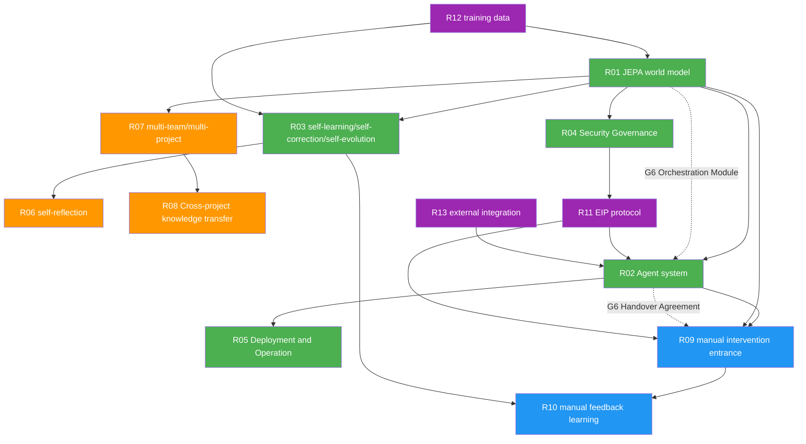

# 📋 UEWM requirements specification document (integrated version)

**Document version:** V6.1
**Document Number:** UEWM-REQ-000-R6.1
**Creation date:** 2026-03-05
**Last update:** 2026-03-21
**Status:** Design-Ready
**Integrated source:** UEWM-REQ-000 V1.0 + UEWM-IMPROVE-001 V1.0 + Orchestration layer gap analysis + Design readiness supplement + Design gate review final version + Design gate in-depth review patch + Final version editing correction

---

## Revision History

| Version | Date | Change Description |
|------|------|---------|
| V1.0 | 2026-03-05 | Initial version, including R01–R10 all requirements |
| V2.0 | 2026-03-19 | Integrate the design improvement plan of feasibility gap analysis (G1–G5), add new sub-requirements and revise the acceptance criteria |
| V3.0 | 2026-03-19 | Added G6 cross-ring orchestration gap analysis: Brain Core built-in orchestration module, cross-ring handover protocol, project manager role access |
| V4.0 | 2026-03-19 | Design-ready supplement: Added R11 EIP protocol specification / R12 training data policy / R13 external integration boundary; deepened R04 security governance; quantified fuzzy acceptance criteria; supplemented observability / product version management / basic model dependency / GPU contention and other requirements; aligned requirement priority and delivery stage |
| V5.0 | 2026-03-19 | Design gate review final version: Added Agent execution engine strategy (R02.10); improved project overview (target users/success criteria/scope boundaries/language coverage); quantified R01 original acceptance criteria; added Z_phys data acquisition risk; added end-to-end scenario walkthrough (Appendix F) |
| V6.0 | 2026-03-21 | Design gate in-depth review patch (7 gap fixes): R05 adds SLO breach response strategy and error budget (Gap-1); G6-S1 adds multi-project orchestration concurrency model and resource arbitration strategy (Gap-2); R12 adds data retention/deletion/machine forgetting strategy (Gap-3); Appendix F New scenario 4 multi-tenant knowledge migration walkthrough (Gap-4); R05 adds LLM inference cost baseline (Gap-5); R11 adds EIP strongly typed payload specification (Gap-6); NFR-11 adds audit log capacity planning (Gap-7) |
| V6.1 | 2026-03-21 | Final version editing corrections (5 items): E1 corrects the EIP enumeration zero value to UNKNOWN=0 (Protobuf safe default value); E2 adds editing bridging instructions for the old version of Any-based IDL; E3 R07 acceptance criteria adds AC-5 to reference the Gap-2 concurrency model; E4 NFR-9 adds Tier-1 SLO Footnotes for relationships; E5 Appendix F New Scenario 5 SLO burn-rate Operations Walkthrough |

---

## 1. Project Overview

### 1.1 Project positioning

Develop a basic universal world model UEWM (Universal Engineering World Model), as well as related action Agents, to complete closed-loop research and development of the entire process from product idea conception to system product promotion.

### 1.2 Target users

Medium to large enterprises with software engineering teams of 3–50 people, CI/CD and cloud native infrastructure (Kubernetes), and multiple parallel projects that need to be coordinated and managed.

### 1.3 Project success criteria

| Phase | Time | Success Criteria |
|------|------|---------|
| Phase 0 | M1–M4 | MVLS three-layer up to TRL-3; inner loop 5 Agent end-to-end closed loop can be demonstrated; EIP protocol integration test passed |
| Phase 1 | M5–M7 | Middle ring 3 Agent operational (LOA ≥ 5); cross-ring handover protocol demonstrated; first external customer pilot access |
| Phase 2 | M8–M10 | All 12 Agents are runnable; multiple teams and multiple projects run in parallel; knowledge migration takes effect (cold start shortened ≥ 50%) |
| Phase 3 | M11+ | All Z-Layer reaches TRL-4+; self-evolving closed-loop stable operation for 30 days; SOC 2 Type II passed |

### 1.4 Range Boundary

**In UEWM range:**

- Brain Core (JEPA + EBM + orchestration module)
- 12 engineering agents and their EIP communication with Brain Core
- Agent adapter layer (encapsulates external tool calls)
- Self-evolving engine (LoRA training, security envelope, circuit breaker)
- Manual intervention Portal API (backend interface)
- Security governance engine (RBAC, approval workflow, audit log)
- Training data collection and management pipeline

**Not in scope of UEWM:**

- UEWM's own R&D CI/CD pipeline (just use standard engineering practices)
- User identity authentication (through external SSO/OIDC connection, no self-built IdP)
- Billing and metering system (if required for commercialization, as an independent product module)
- Portal front-end UI framework (this document only defines the API interface, and the UI is delivered independently)
- Installation, configuration and operation of external tools (Git, CI, K8s, Prometheus, etc.)
- Applications in non-software engineering fields (hardware engineering, mechanical engineering, etc.)

### 1.5 Programming language and technology coverage

| Stage | Agent Code Generation/Analysis Support Language | Description |
|------|--------------------------|------|
| Phase 0 | Python + Go | Aligned with MVLS training data, open source data is the most abundant |
| Phase 1 | + Java + TypeScript | Covering the mainstream technology stack of enterprises |
| Phase 2+ | Scaling on demand | Determined based on customer demand and training data availability |

Schema document format: Markdown + OpenAPI YAML. Inter-Agent delivery product format: standardized by NFR-10 (JSON Schema or Protobuf).

---

## 2. Feasibility gap improvement overview

Based on V1.0, this integrated version includes specific design improvement plans for the following eight feasibility gaps:

| # | Gap | Core Conflict | Solution Strategy | Influence Requirements |
|---|------|---------|---------|---------|
| G1 | Unified latent space encoding problem | 8-layer Z-Layer semantics are hugely different, unified 2048-d space has not been verified | Hierarchical maturity model + progressive latent space alignment + MVLS | R01 |
| G2 | 12-Agent full life cycle rigidity | All Agents are P0, the weakest link blocks the entire link | Three-ring layered delivery + ALFA framework + Agent downgrade | R02 |
| G3 | Missing self-evolution failure mode | Lack of detection, limitation and recovery mechanism for evolution failure | Safety envelope + evolutionary circuit breaker + Pareto constraint | R03, R06 |
| G4 | Performance requirements lack load context | NFR metrics without concurrency/scale parameterization | Load profile matrix + hierarchical SLO system | R05, NFR |
| G5 | Tensions between knowledge migration and data privacy | R08 cross-project knowledge sharing and R04/R07 data isolation fundamental contradiction | Privacy utility spectrum + hierarchical knowledge distillation | R07, R08 |
| G6 | Lack of cross-ring orchestration capabilities | 12 Agents with no one responsible for cross-ring coordination, task sequencing, and milestone tracking | Brain Core built-in orchestration module + cross-ring handover protocol | R01, R02, R09 |
| G7 | Agent-Brain communication protocol is not defined | The message format/routing/error handling of the interaction between 12 Agents and Brain is not standardized | New R11 EIP protocol specification | R11 (new) |
| G8 | The training data and external integration boundaries are missing | The encoder has no data source, the Agent has no external tool boundaries, and security governance is too broad | Added R12 data strategy + R13 integration boundary + R04 deepening | R12, R13, R04 |

**V6.0 design gate in-depth review supplementary gaps (7 items):**

| # | Gap | Core Conflict | Solution Strategy | Influence Requirements |
|---|------|---------|---------|---------|
| Gap-1 | SLO breach response strategy is missing | SLO has target but no breach response, subsystem linkage is missing | Error budget + Burn-Rate level four alarm + automatic protection downgrade + change freeze | R05 |
| Gap-2 | Multi-project orchestration concurrency model is not defined | No arbitration rules when multiple projects compete for the same Agent/GPU | Three-level scheduling mode (fair sharing/priority preemption/tenant isolation) + Per-Tenant quota | R07, G6-S1 |
| Gap-3 | Missing training data retention/deletion policy | Unregulated data disposal and machine forgetting after customer exit | KSL-graded retention/deletion/machine forgetting policy + deletion audit | R12 |
| Gap-4 | End-to-end scenario lacks multi-tenant coverage | Scenarios 1-3 are all single projects, and multi-tenant/knowledge migration/privacy budget has not been verified | New scenario 4: Cross-Tenant knowledge migration + privacy budget exhaustion + tenant isolation verification | Appendix F |
| Gap-5 | Agent LLM inference cost is unconstrained | The design team has no cost ceiling and may choose models that are too expensive | Per-Profile monthly cost baseline + Per-Task-Tier single cost ceiling | R05, R02.10 |
| Gap-6 | EIP Protobuf Any type has no compile-time safety | Any bypasses type checking, making integrated debugging difficult | Define strongly typed payload messages for each EipVerb, prohibiting final IDL retention Any | R11 |
| Gap-7 | No planning for audit log capacity | The log volume under Profile-L may be huge, and there is no storage tiering strategy | Estimated log volume by Profile + Hot/Warm/Cold three-tier storage + Query SLO | NFR-11 (new) |

---

## 3. Requirements Overview

| Number | Requirement name | Source | Priority | Corresponding design document | G improvement |
|------|----------|------|-------|------------|------|
| R01 | JEPA Basic World Model | Original Requirements | P0-Phase0 | `UEWM_Architecture.md` | G1, G6 |
| R02 | Engineering full life cycle Agent system | Original requirements | P0-split ring | `UEWM_Agents_Design.md` | G2, G6 |
| R03 | Self-learning/self-correction/self-evolution capabilities | Original requirements | P0-Phase0 | `UEWM_Self_Evolution.md` | G3 |
| R04 | Safety governance and approval mechanism | Original requirements | P0-Phase0 | `UEWM_Safety_Governance.md` | G5, G8 |
| R05 | Deployment, operation, maintenance and implementation plan | Original requirements | P0-Phase0 | `UEWM_Deployment_Operations.md` | G4 |
| R06 | Regular self-reflection and self-correction evolution | Second batch | P1-Phase1 | `UEWM_Self_Evolution.md` §6 | G3 |
| R07 | Multi-team/multi-project general support | Second batch | P1-Phase1 | `UEWM_Architecture.md` P8 | G5 |
| R08 | Cross-team/project knowledge transfer learning | Second batch | P2-Phase2 | `UEWM_Self_Evolution.md` §5 | G5 |
| R09 | Role engineer manual intervention entrance | The third batch | P0-Phase0 | `UEWM_Agents_Design.md` §5 | G2, G6 |
| R10 | World Model Learning from Human Suggestions | Third Batch | P1-Phase1 | `UEWM_Self_Evolution.md` §7 | G3 |
| R11 | Engineering Intelligent Protocol (EIP) Specification | New in V4.0 | P0-Phase0 | `UEWM_EIP_Protocol.md` | G7 |
| R12 | Training Data Strategy | New in V4.0 | P0-Phase0 | `UEWM_Data_Strategy.md` | G8 |
| R13 | External system integration boundary | V4.0 new | P0-split ring | `UEWM_Integration_Map.md` | G8 |

> **Priority Description:** P0-Phase0 = must be completed before/during Phase 0; P0-Split Ring = delivered in batches with the third ring; P1-Phase1 = Phase 1 delivery; P2-Phase2 = Phase 2 delivery.

---

## 4. Detailed description of requirements

### R01 — JEPA basic world model (revised version, integrating G1 + G6)

**Description of requirements:**

Refer to Yann LeCun's JEPA related papers to develop a basic universal world model UEWM.

**Specific requirements:**

1. Built based on the JEPA (Joint Embedding Predictive Architecture) theoretical framework
2. Use hierarchical latent space representation (Hierarchical Latent Space)
3. Scheme arbitration and security constraints using energy-based models (EBM)
4. Prediction and reasoning in latent space rather than pixel/text level
5. Ability to model and predict world states
6. Support causal reasoning and multi-step prediction
7. **[NEW — G1-S1]** Define Z-Layer TRL maturity levels (TRL-0 to TRL-5)
8. **[New — G1-S3]** First deliver MVLS (minimum feasible latent space: Z_impl + Z_quality + Z_phys) to achieve TRL-3
9. **[New — G1-S2]** Provides progressive cross-modal alignment training protocol
10. **[New - G1-S1]** The system dynamically adjusts Agent autonomy and EBM weight according to the layer TRL level
11. **[New - G1-S1]** Immature layer (TRL<3) corresponding Agent is forced to downgrade to manual assistance mode
12. **[New - G6-S1]** Brain Core's built-in project orchestration module (Orchestration Module) derives project status (schedule risk, resource contention, dependency readiness) from the existing Z-Layer without introducing an independent Z-Layer
13. **[New - V4.0]** Clarify the basic model dependency strategy: each encoder will give priority to fine-tuning based on the pre-trained model (such as CodeBERT for Z_impl, TimesFM for Z_phys), rather than training from scratch; if there is no suitable pre-trained model layer, training from scratch is allowed, but it needs to be demonstrated in the design stage

#### G1-S1: Z-Layer Maturity Grading Model

**Core idea:** It is no longer required that 8 layers reach the available state at the same time. Instead, the maturity level of each layer is defined, and the system dynamically adjusts behavior according to the layer maturity.

```
Z-Layer maturity level definition:

  TRL-0 (concept): The encoder architecture is determined, but there is no training data and the latent space is meaningless
  TRL-1 (prototype): Encoder produces vectors, but semantic clustering ARI < 0.3
  TRL-2 (validation): Semantic clustering ARI ≥ 0.3, but cross-layer causality not verified
  TRL-3 (integrated): One-way causality can be detected (this layer → neighbor layer Granger p<0.05)
  TRL-4 (Mature): Bidirectional causal transmission is reliable, predicted MSE < 0.1, and can support Agent decision-making
  TRL-5 (self-optimization): Self-evolution closed-loop verification passed, surprise degree converged
```

**System behavior and maturity association rules:**

| System Behavior | TRL-0/1 | TRL-2 | TRL-3 | TRL-4 | TRL-5 |
|---------|---------|-------|-------|-------|-------|
| Agents in this layer can operate autonomously | ❌ | ❌ | ⚠️ Low risk | ✅ | ✅ |
| This layer participates in EBM energy calculation | ❌ | ❌ | Weight reduction (0.1x) | Standard weight | Standard weight |
| This layer participates in causal backtracking | ❌ | ❌ | One-way | Two-way | Two-way |
| This layer incorporates self-evolution training | ❌ | Data collection | Independent training | Joint training | Online evolution |
| Manual intervention requirements | Full manual | Full manual | Approval required | High-risk approval | Standard process |

**Target TRL timeline for each tier:**

```
Phase 0 (M1-M4): Target TRL-3+ layer → Z_impl, Z_quality, Z_phys
Phase 1 (M5-M7): Layers targeting TRL-3+ → Z_arch, Z_logic
Phase 2 (M8-M10): Layers targeting TRL-2+ → Z_biz, Z_val, Z_market (synthetic data + early customers)
Phase 3 (M11+): Target TRL-4+ layer → All (requires sufficient real data accumulation)
```

#### G1-S2: Progressive cross-modal alignment training protocol

**Core idea:** Instead of relying on a single-layer MLP to align 9 heterogeneous encoders, a multi-stage alignment training process is designed to gradually establish cross-modal semantic consistency.

```
Stage 1: Comparative learning within the domain (each layer is independent)
  Goal: Ensure that the output space of each encoder is internally semantically coherent
  Method: Z_impl for the same project at different time points should be closer than Z_impl for different projects
  Loss: InfoNCE contrast loss (each layer is trained independently)
  Validation: Semantic clustering ARI ≥ 0.3

Phase 2: Alignment of adjacent layers (pairs)
  Goal: Establish semantic correspondence between adjacent layers
  Method: Z_impl and Z_quality for the same project at the same time point should be closer than random pairing
  Loss: Cross-modal comparison loss + causal prediction loss
  Validation: Cross-layer prediction MSE improvement > 30% for adjacent layers

Phase 3: Global joint alignment (needs to pass Phase 2)
  Goal: All layers form a unified semantic space
  Method: Multi-view contrastive learning + VICReg/SIGReg regularization
  Loss: Σ L_contrastive(i,j) + λ * L_vicreg for all layer pairs (i,j)
  Verification: Cross-layer causal diagram is effective > 80%
```

**Key algorithm: Cross-modal alignment loss**

```python
class CrossModalAlignmentLoss:
    """
    Progressive cross-modal alignment loss.
    
    Theoretical basis:
    - CLIP-style contrastive learning proves that heterogeneous modes can be aligned in a shared space
    - Adopt "weakly supervised alignment": using project context as a natural pairing signal
    
    Core insights:
    - Different Z-Layers in the same project and at the same time point are naturally paired
    - Z-Layer of different projects is naturally negatively paired
    """
    
    def __init__(self, temperature=0.07):
        self.temperature = temperature
    
    def compute(self, z_layer_a, z_layer_b, project_ids):
        # Normalize to unit sphere
        z_a = F.normalize(z_layer_a, dim=-1)
        z_b = F.normalize(z_layer_b, dim=-1)
        
        # Similarity matrix [batch, batch]
        sim_matrix = z_a@z_b.T/self.temperature
        
        #Positive sample mask: same project and same time point
        positive_mask = (project_ids.unsqueeze(0) == project_ids.unsqueeze(1)).float()
        
        # InfoNCE (bidirectional)
        loss_a2b = -torch.log(
            (torch.exp(sim_matrix) * positive_mask).sum(dim=1) /
            torch.exp(sim_matrix).sum(dim=1)
        ).mean()
        
        loss_b2a = -torch.log(
            (torch.exp(sim_matrix.T) * positive_mask).sum(dim=1) /
            torch.exp(sim_matrix.T).sum(dim=1)
        ).mean()
        
        return (loss_a2b + loss_b2a) / 2
```

**Alignment quality verification metrics:**

| Indicator name | Calculation method | Compliance threshold | Action for non-compliance |
|--------|---------|---------|----------|
| Intra-domain clustering ARI | K-means clustering vs known labels | ≥ 0.3 | Add encoder training data |
| Cross-layer cosine alignment | Cross-layer cos_sim mean value of the same item | ≥ 0.3 | Add cross-layer comparison training |
| Causal signal fidelity | Granger test p-value for known causal chains in latent space | < 0.05 | Adjust alignment loss weights |
| Information retention after projection | Mutual information estimation before and after projection | > 0.7 original information | Increase ProjectionAdapter capacity |

#### G1-S3: Minimum feasible latent space (MVLS)

```
MVLS definition:
  Core three layers: Z_impl (code implementation) + Z_quality (test quality) + Z_phys (operational indicators)
  
  Reason for selection:
  1. The coding sources of these three layers are the most structured (AST/CFG, test coverage, Prometheus indicators)
  2. There is the strongest causal chain between them (code quality → test results → running performance)
  3. The corresponding Agent (AG-CD, AG-CT, AG-DO, AG-MA) is the easiest to verify
  4. Training data is most easily obtained from open source projects
  
  MVLS verification standards:
  1. Given a change in Z_impl, JEPA can predict the direction of Z_quality change with an accuracy > 70%
  2. Given an anomaly of Z_quality, causal backtracking can locate the specific subspace in Z_impl, with an accuracy > 60%
  3. Anomaly prediction of Z_phys (based on Z_impl + Z_quality) F1-score > 0.6
  4. The variance of the above indicators on 10 different items is < 20%
```

**MVLS extension path to complete latent space:**

```
MVLS (3 layers) → core five layers → extended seven layers → complete eight layers
                
Timeline: Phase 0 Phase 1 Phase 2 Phase 3
Z_impl ✅ TRL-3 ✅ TRL-4 ✅ TRL-4 ✅ TRL-5
Z_quality ✅ TRL-3 ✅ TRL-4 ✅ TRL-4 ✅ TRL-5
Z_phys ✅ TRL-3 ✅ TRL-4 ✅ TRL-4 ✅ TRL-5
Z_arch — ✅ TRL-3 ✅ TRL-4 ✅ TRL-5
Z_logic — ✅ TRL-3 ✅ TRL-4 ✅ TRL-5
Z_biz — — ✅ TRL-2 ✅ TRL-4
Z_val — — ✅ TRL-2 ✅ TRL-4
Z_market — — — ✅ TRL-3
```

#### G6-S1: Project Orchestration Module (Orchestration Module)

**Core idea:** The three-ring layered architecture (G2) solves the issue of Agent's phased delivery, but does not answer "who will coordinate task sequencing, handover timing, resource contention and milestone tracking between the three rings". These responsibilities should not be shouldered by a separate 13th Agent - project orchestration is an "execution function" of Brain Core, not a separate engineering execution domain.

**Why not a new Agent:**

```
Reasons why AG-PM (Project Management Agent) was rejected:

  1. No corresponding Z-Layer: Project health is a meta-signal derived from all Z-Layer,
     Instead of independent encoded engineering signals, adding Z-Layer will exacerbate the G1 modal gap.
  2. Coordination bottleneck: PM Agent needs to intervene in all 12 Agents (similar to SECURITY),
     But SECURITY is a low-frequency audit, and PM is a high-frequency scheduling-it will become a throughput bottleneck.
  3. Architecture conflict: 12 Agents are "doers" and Brain is the "decision maker"——
     Orchestration belongs to decision-making, and it is the correct abstraction level to put it inside Brain
```

**Architectural positioning of the orchestration module:**

```
Brain Core internal structure:
  ├── JEPA Predictor — Status Prediction (Existing)
  ├── EBM Evaluator — Decision Quality Assessment (Existing)
  └── Orchestrator (New) — Project Orchestration
      ├── Task Dependency Scheduler
      ├── Cross-Ring Handoff Evaluator
      ├── Resource Contention Arbiter
      ├── Milestone Tracker
      ├── LOA Cascade Assessor
      ├── Project Status Synthesizer
      └── Cross-Agent Conflict Resolver
```

**Input signals for the arrangement module (derived from existing Z-Layer, no new Z-Layer is introduced): **

```python
class OrchestratorInputSignals:
    """
    The Orchestration module derives project-level meta signals from existing Z-Layer signals.
    There is no need for a separate Z_project layer - project health is a function of the other layers.
    """
    
    def derive_project_health(self, project_id):
        signals = {}
        
        # Derive progress risk from Z-Layer TRL progress
        for layer in self.get_project_layers(project_id):
            trl = self.get_trl(layer)
            target_trl = self.get_target_trl(layer, current_phase)
            signals[f"{layer}_progress_gap"] = target_trl - trl
        
        # Derive delivery risk from Agent historical performance
        for agent_id in self.get_project_agents(project_id):
            perf = self.get_performance(agent_id)
            signals[f"{agent_id}_reliability"] = perf.success_rate
            signals[f"{agent_id}_current_loa"] = self.alfa.compute_effective_loa(agent_id, None)
        
        # Derive quality risk from EBM energy trend
        energy_trend = self.get_energy_trend(project_id, window_days=7)
        signals["energy_trend"] = energy_trend #increase = quality decrease
        
        # Overall rating (weighted)
        signals["project_health_score"] = self.weighted_aggregate(signals)
        
        return signals
```

**Core capabilities of the orchestration module:**

| Capabilities | Input signals | Outputs | Consumers |
|------|---------|------|--------|
| Task dependency sorting | Agent current status + task DAG | Recommended execution order | All Agents |
| Cross-ring handover evaluation | Upstream Agent output quality (EBM energy) | Handover ready/blocked + reason | Downstream Agent |
| Resource contention arbitration | Multi-project GPU/CPU request queue | Resource allocation priority | Kubernetes Scheduler |
| Milestone Tracking | TRL Progress + Planning Timeline | Deviation Report + Risk Warning | Project Manager (Portal) |
| LOA cascade assessment | Agent LOA change events | Downstream impact analysis + adjustment recommendations | Affected Agents + Manual |
| Project status summary | All above signals | Structured status reporting | Project manager (Portal) |
| Cross-Agent conflict coordination | Decision-making on conflicts between Agents | Arbitration plan or upgrade to manual | Both Agents in the conflict |

**[New — V6.0 Gap-2] Multi-project orchestration concurrency model:**

When multiple projects request the same Agent or GPU resources at the same time, the orchestration module needs to arbitrate according to the following policy:

```
Multi-project resource arbitration strategy:

  Scheduling mode (Level 3):
  ├── L1 Weighted Fair Share — Default mode
  │ ├── Each Tenant receives a share of resources proportional to its SLA level
  │ ├── Projects within the same Tenant are distributed according to priority weight (set when the project is created and can be adjusted at runtime)
  │ ├── Free shares can be temporarily borrowed by other projects (preemptible, borrowing delay ≤ 5s return)
  │ └── Applicable: Normal operation, Profile-S/M
  │
  ├── L2 Priority Preemption — High Stress Mode
  │ ├── Trigger condition: Agent request queue depth > 3x normal value or SLO burn-rate > 5%/h
  │ ├── High-priority projects can preempt the Agent time slice of low-priority projects
  │ ├── The preempted Agent task is suspended (not discarded), and will automatically resume after the resources are released.
  │ ├── Items with the same priority cannot preempt each other → Wait in line
  │ └── Applicable: sudden load, production accident response
  │
  └── L3 Tenant Isolation—Strong Isolation Mode
      ├── Trigger condition: Any Tenant’s SLO fails to meet the standard for 10 consecutive minutes
      ├── The Agent instances and GPU quotas of each Tenant are completely isolated and not shared.
      ├── Resource utilization decreases, but SLO isolation is guaranteed
      └── Applicable to: Profile-L, or Tenants whose contracts require resource isolation

  Agent concurrent allocation rules:
  ├── Up to 5 parallel instances per Agent type (e.g. AG-CD) under Profile-M
  ├── Instance allocation:
  │ ├── Each project has at least 1 exclusive instance (if there are active tasks)
  │ ├── The remaining instances are distributed according to project priority weight
  │ └── If there are insufficient instances, low-priority projects are queued, maximum wait = Tier 2 SLO
  ├── GPU resource allocation:
  │ ├── Inference GPU pool: always prioritize training as per NFR-9
  │ ├── Training GPU pool: LoRA evolution of each project is scheduled according to fair sharing
  │ └── Cross-project GPU contention: Orchestration modules sorted by evolutionary urgency (surprise level)
  └── Escalation of conflict:
      ├── Projects with the same priority compete for the same Agent → Automatic arbitration of the orchestration module (first come, first served + priority is given to the one with the shortest estimated completion time)
      ├── Arbitration failed (the estimated time of both parties is the same) → Notify PROJECT_MANAGER role manual decision-making
      └── Manual does not respond within SLA → Dictionary order by project ID (deterministic guarantee)
```

**Per-Tenant quota model for multi-project orchestration:**

```python
class TenantResourceQuota:
    """
    Resource quota definition for each Tenant.
    The orchestration module checks the quota before task scheduling. If the quota is exceeded, the task will be queued or demoted.
    """
    
    PROFILE_QUOTAS = {
        "Profile-S": {
            "max_concurrent_agent_tasks": 5,
            "max_projects": 1,
            "gpu_share_pct": 100, # Single tenant exclusive
            "evolution_slots_per_day": 1,
        },
        "Profile-M": {
            "max_concurrent_agent_tasks": 50,
            "max_projects": 10,
            "gpu_share_pct": None, # Dynamically allocated according to weight
            "evolution_slots_per_day": 5,
        },
        "Profile-L": {
            "max_concurrent_agent_tasks": 200,
            "max_projects": 50,
            "gpu_share_pct": None, # Distributed by SLA level
            "evolution_slots_per_day": 15,
        },
    }
    
    def can_schedule(self, tenant_id, agent_type, project_id):
        quota = self.get_tenant_quota(tenant_id)
        current_usage = self.get_current_usage(tenant_id)
        
        if current_usage.concurrent_tasks >= quota["max_concurrent_agent_tasks"]:
            return ScheduleVerdict.QUEUED(reason="tenant_quota_exceeded")
        
        return ScheduleVerdict.ALLOWED
```

- AC-1: **[Quantization]** H-JEPA architecture implementation: all 8-layer Z-Layer encoders can load and output 2048-d vectors (Phase 0 only requires MVLS three layers to run)
- AC-2: **[Quantification]** The EBM energy function is computable: given the latent space representation of any two solutions, EBM outputs comparable energy scores within 50ms, and the energy ranking has Kendall τ ≥ 0.5 (on the standard test set) with the human expert ranking.
- AC-3: **[Quantification]** The Predictor module can perform multi-step prediction: given the current Z-Layer state, it can predict the state after 1/3/5 steps, 1-step prediction MSE < 0.15, 3-step prediction MSE < 0.3 (on the MVLS three-layer validation set)
- AC-4: **[New]** MVLS three layers (Z_impl, Z_quality, Z_phys) all reach TRL-3 (Phase 0 acceptance)
- AC-5: **[New]** Cross-layer causal signal fidelity test passed (Granger test p<0.05)
- AC-6: **[New]** The TRL level of each layer can automatically evaluate and dynamically downgrade the influence weight of immature layers.
- AC-7: **[New — G6]** Orchestration module can derive project health scores from Z-Layer signals and output task sequencing recommendations
- AC-8: **[New — V4.0]** Pre-training model selection or training from scratch documentation for each encoder has been completed
- AC-9: **[New - V6.0 Gap-2]** When multiple projects concurrently request the same Agent, the orchestration modules are correctly allocated according to the weighted fair sharing strategy, and there is no starvation phenomenon.
- AC-10: **[New — V6.0 Gap-2]** When the Per-Tenant quota is exceeded, new tasks are queued correctly and the queuing delay does not exceed the corresponding Tier SLO

---

### R02 — Project full life cycle Agent system (revised version, integrating G2 + G6)

**Description of requirements:**

The world model needs to be connected to several Agents covering the complete software engineering life cycle to form an end-to-end closed loop.

**Specific requirements:**

1. Agent must cover the following 12 aspects:

| Serial number | Link | Agent |
|------|------|-------|
| 1 | Product Analysis | AG-PA |
| 2 | Product Design | AG-PD |
| 3 | System Architecture Design | AG-SA |
| 4 | Specific functional disassembly design | AG-FD |
| 5 | Code Development | AG-CD |
| 6 | Code Test | AG-CT |
| 7 | System product deployment goes online | AG-DO |
| 8 | System product testing | AG-ST |
| 9 | System product monitoring and alarm | AG-MA |
| 10 | System Product Analysis (BI) | AG-BI |
| 11 | System product promotion | AG-PR |
| 12 | Security Audit | AG-AU |

2. **[New - G2-S1]** Agent is delivered in three layers:

```
┌────────────────────────────────────────────────────────────┐
│ │
│ Outer Ring: Business Decision Domain – Phase 2 Delivery, LOA 3-5 │
│ ┌───────────────────────────────────────────────────────┐ │
│ │ AG-PA (Product Analysis) AG-PD (Product Design) │ │
│ │ AG-BI (BI analysis) AG-PR (promotion operation) │ │
│ │ │ │
│ │ Middle Ring: Architectural Logical Domain — Phase 1 Delivery, LOA 5-7 │ │
│ │ ┌────────────────────────────────────────────────────┐ │ │
│ │ │ AG-SA (system architecture) AG-FD (functional disassembly) │ │ │
│ │ │ AG-AU (Security Audit) │ │ │
│ │ │ │ │ │
│ │ │ Inner Ring: Technical Execution Domain — Phase 0 Delivery │ │ │
│ │ │ ┌─────────────────────────────────────────────┐ │ │ │
│ │ │ │ AG-CD (code development) AG-CT (code testing) │ │ │ │
│ │ │ │ AG-DO (deployment and online) AG-ST (system test) │ │ │ │
│ │ │ │ AG-MA (monitoring alarm) │ │ │ │
│ │ │ │ LOA: 7-9 (high degree of autonomy) │ │ │ │
│ │ │ └──────────────────────────────────────────────┘ │ │ │
│ │ └──────────────────────────────────────────────────────┘ │ │
│ └───────────────────────────────────────────────────────┘ │
└────────────────────────────────────────────────────────────┘
```

**Detailed definition of each ring:**

```
Inner Loop Agent (Phase 0 — Technical Execution Domain):
  ├── Agent: AG-CD, AG-CT, AG-DO, AG-ST, AG-MA
  ├── Target LOA: 7-9
  ├── Corresponding to Z-Layer: Z_impl, Z_quality, Z_phys (MVLS)
  ├── Manual intervention: only high-risk operations require approval
  ├── Acceptance: End-to-end Code→Test→Deploy→Monitor closed-loop automatic operation
  └── Degraded mode: When Brain is unavailable → Rule engine takes over

Middle Agent (Phase 1 — Architecture Logical Domain):
  ├──Agent: AG-SA, AG-FD, AG-AU
  ├── Target LOA: 5-7
  ├── Corresponding to Z-Layer: Z_arch, Z_logic
  ├── Manual intervention: All architectural decisions require manual confirmation
  ├── Acceptance: Architecture design → Functional disassembly can automatically generate a draft, which will flow into the inner loop after human approval
  └── Downgrade mode: Generate suggestions for people to choose from, no automatic execution

Outer Loop Agent (Phase 2 — Business Decision Domain):
  ├── Agent: AG-PA, AG-PD, AG-BI, AG-PR
  ├── Target LOA: 3-5
  ├── Corresponding to Z-Layer: Z_biz, Z_val, Z_market
  ├── Manual intervention: human-led, agent-assisted
  ├── Acceptance: Able to generate analysis reports and suggestions for decision-making
  └── Downgrade mode: completely manual operation, the agent only provides information query
```

3. **[New — G2-S2]** Each Agent implements the ALFA Automation Level Framework (LOA 1-10)
4. **[New — G2-S2]** LOA is dynamically calculated by Z-Layer TRL + historical performance + risk context
5. **[New - G2-S3]** Define degradation mode and recovery conditions for each Agent
6. **[New - G2-S3]** When any link in the entire link is interrupted, the whole chain will not stop and the operation will be degraded.
7. **[New - G6-S2]** Define the Cross-Ring Handoff Protocol: The inter-ring handoff is evaluated and triggered by the Brain Core orchestration module
8. **[New - G6-S2]** When any Agent LOA is dynamically degraded, the orchestration module automatically evaluates the downstream cascading impact and adjusts the project plan
9. **[New - V4.0]** Delivery products between Agents (requirement documents, architecture documents, functional decomposition, code, test reports, etc.) implement version management, and the orchestration module is responsible for detecting product version inconsistencies between upstream and downstream Agents and alerting
10. **[New - V5.0]** Agent task execution engine policy statement: Agent’s intelligent engine for executing engineering tasks can adopt one or a combination of the following modes:
    - a. **LLM driver**: Call a large language model (external API or self-deployment) to generate text/code/documentation
    - b. **Rule Engine**: Perform deterministic operations (such as K8s YAML generation, CI triggering) based on predefined rules and templates
    - c. **Hybrid Mode**: Brain Core provides decision context + LLM provides generative capabilities + Rules engine handles the deterministic part
    - d. The specific selection is determined on an Agent-by-Agent basis during the design phase, but the following constraints must be met:
      - If you rely on external LLM API, the dependency will be included in R13 external integration management, and fault degradation rules will apply.
      - LLM call costs incorporated into resource baseline for R05 load profile
      - Agent reasoning process must meet NFR-8 traceability requirements
      - The five agents in the inner ring of Phase 0 must be clearly selected and demonstrated in the design document

> **Design constraint description:** Brain Core determines WHAT (decisions to make), external tools perform HOW-mechanical (mechanical operations such as Git commit, K8s deploy, etc.), and the Agent execution engine is responsible for HOW-intelligent (intermediate steps that require intelligence such as code generation, architecture design, and test strategy formulation). The boundaries between the three are defined in the R13 system boundary statement.

#### G2-S2: Agent Automation Level Framework (ALFA)

```
LOA = Level of Automation (Sheridan & Verplank 10-level scale)
  LOA 1: Machine does not provide assistance
  LOA 3: The machine provides a set of alternatives
  LOA 5: The machine recommends a plan and the person executes it after confirmation
  LOA 7: Machine executes automatically, but notifies people
  LOA 9: The machine executes automatically, and people can choose whether to be notified
  LOA 10: Machines are fully autonomous
```

**LOA dynamic calculation:**

```python
class AgentAutomationLevelFramework:
    """
    The current automation level (LOA 1-10) of each Agent is dynamically calculated based on three dimensions:
      1. Z-Layer Maturity Level (TRL)
      2. Historical performance (Performance)—the adoption rate and success rate of past decisions
      3. Risk context (Risk) – the risk level of the current operation
    """
    
    TRL_TO_BASE_LOA = {
        0: 1, 1: 2, 2: 4, 3: 6, 4: 8, 5: 9,
    }
    
    def compute_effective_loa(self, agent_id, operation):
        # base_LOA = lowest TRL mapping dependent on Z-Layer
        dependent_layers = self.get_agent_layers(agent_id)
        min_trl = min(self.get_trl(layer) for layer in dependent_layers)
        base_loa = self.TRL_TO_BASE_LOA[min_trl]
        
        # Historical performance adjustment: ±2
        perf = self.get_performance(agent_id)
        if perf.adoption_rate > 0.8 and perf.success_rate > 0.9:
            perf_bonus = +2
        elif perf.adoption_rate < 0.5 or perf.success_rate < 0.6:
            perf_bonus = -2
        else:
            perf_bonus = 0
        
        # Risk limit
        RISK_LOA_CAP = {"LOW": 10, "MEDIUM": 8, "HIGH": 6, "CRITICAL": 4}
        risk_cap = RISK_LOA_CAP[self.assess_risk(operation)]
        
        # effective_LOA = min(base + bonus, risk_cap), clamp [1, 10]
        return max(1, min(10, min(base_loa + perf_bonus, risk_cap)))
```

**LOA to Agent behavior mapping:**

| LOA | Behavior Pattern | Description |
|-----|---------|------|
| 1-2 | INFORMATION_ONLY | Agent only collects display information, all decisions are made by humans |
| 3-4 | OPTIONS_FOR_HUMAN | Agent generates 3-5 options for people to choose from |
| 5-6 | RECOMMEND_AND_WAIT | Agent recommends the best solution and waits for confirmation |
| 7-8 | AUTO_EXECUTE_NOTIFY | Agent executes automatically and notifies the person asynchronously afterwards |
| 9-10 | FULLY_AUTONOMOUS | Agent completely autonomous |

#### G2-S3: Agent downgrade framework

```
Downgrade strategy matrix:

When AG-PA is not available:
  ├── AG-PD Downgrade: Accept manually entered product requirements (skip automated competitive product analysis)
  ├── Global impact: low (AG-PA is the input terminal and can be replaced by humans)
  └── Recovery conditions: Z_market reaches TRL-3

When AG-SA is unavailable:
  ├── AG-FD downgrade: accept human-provided architecture documentation
  ├── AG-CD downgrade: use default schema template
  ├── Global impact: Medium (degrades the quality of architectural decisions, but does not block development)
  └── Recovery conditions: Z_arch reaches TRL-3

When AG-CD is not available:
  ├── Global impact: High (core productivity link)
  ├── Downgrade mode: Brain only provides code suggestions and developers write it manually
  └── Recovery condition: Z_impl reaches TRL-4

When Brain Core is unavailable:
  ├── All Agent downgrade: switch to rule engine mode
  ├── Rules Engine: Simplified decision-making based on predefined rules (no EBM, no causal reasoning)
  ├── Global impact: Very high (but the system does not stop)
  └── Recovery conditions: Brain Core is back online
```

#### G6-S2: Cross-Ring Handoff Protocol

**Core idea:** The work handover between the three rings should not rely on implicit assumptions (such as "AG-SA is automatically triggered after AG-PD is completed"), but should be explicitly controlled by the Brain Core orchestration module based on quality assessment.

**Handover Readiness Assessment:**

```python
class CrossRingHandoffEvaluator:
    """
    Evaluate whether the upstream loop output reaches the acceptable quality threshold for the downstream loop.
    
    Core principles:
    - Handover is not about handing over "when it's done", but about handing over "when it's good enough"
    - "Good enough" is determined by a combination of EBM energy assessment + structured checklist
    - Give specific gaps when the target is not met, rather than simply blocking
    """
    
    # Definition of handover gate: source ring → target ring → gate condition
    HANDOFF_GATES = {
        ("outer", "middle"): {
            "name": "Product→Architecture Handover Gate",
            "source_agents": ["AG-PA", "AG-PD"],
            "target_agents": ["AG-SA", "AG-FD"],
            "energy_threshold": 0.3, # EBM evaluation score < 0.3 before handover
            "required_artifacts": [
                "product_requirements_doc",
                "user_story_list",
                "acceptance_criteria",
            ],
            "human_approval_required": True, # Foreign → Chinese always requires manual confirmation
        },
        ("middle", "inner"): {
            "name": "Architecture→Execution Handover Gate",
            "source_agents": ["AG-SA", "AG-FD"],
            "target_agents": ["AG-CD", "AG-CT"],
            "energy_threshold": 0.25,
            "required_artifacts": [
                "architecture_design_doc",
                "feature_decomposition",
                "api_contracts",
            ],
            "human_approval_required": True, # Medium→Inside High risk requires human effort
        },
        ("inner", "outer"): {
            "name": "Execution→Business Feedback Upgrade",
            "source_agents": ["AG-MA", "AG-ST"],
            "target_agents": ["AG-PA", "AG-PD", "AG-BI"],
            "trigger": "production_issue_or_metric_anomaly",
            "human_approval_required": False, # Internal → external information transfer can be automatic
        },
    }
    
    async def evaluate_handoff_readiness(self, source_ring, target_ring, project_id):
        gate = self.HANDOFF_GATES[(source_ring, target_ring)]
        
        # 1. Check whether necessary outputs exist
        missing_artifacts = self.check_artifacts(gate["required_artifacts"], project_id)
        
        # 2. EBM energy assessment output material quality
        energy = await self.brain.evaluate_artifacts(project_id, source_ring)
        
        # 3. Comprehensive judgment
        if missing_artifacts:
            return HandoffVerdict.BLOCKED(reason=f"Missing: {missing_artifacts}")
        if energy > gate.get("energy_threshold", 0.3):
            return HandoffVerdict.QUALITY_GAP(energy=energy, threshold=gate["energy_threshold"])
        if gate.get("human_approval_required"):
            return HandoffVerdict.AWAITING_APPROVAL(gate=gate["name"])
        
        return HandoffVerdict.READY
```

**LOA Cascading Impact Assessment:**

```
Cascade processing when Agent LOA changes dynamically:

  Triggering event: AG-SA dropped from LOA 7 to LOA 4 (due to Z_arch TRL fallback)
  
  The orchestration module automatically executes:
  ├── 1. Identify downstream dependencies: AG-FD, AG-CD depend on AG-SA output
  ├── 2. Assess the scope of influence: Has the current task of AG-FD received valid output from AG-SA?
  │ ├── Received and not expired → Downstream is not affected, only risk is marked
  │ └── Not received or expired → Downstream tasks are paused and switched to waiting for manual architecture input
  ├── 3. Notify relevant role engineers: Architect (ARCHITECT) receives intervention request
  ├── 4. Update milestone forecast: estimated number of days of delay
  └── 5. Record events: write audit log + arrange decision log
```

**Acceptance Criteria (revised version):**

- AC-1: **[Modify]** Phase 0: Inner loop 5 Agents end-to-end closed loop, LOA ≥ 7
- AC-2: **[Modify]** Phase 1: 3 Agents can run in the middle ring, LOA ≥ 5
- AC-3: **[Modify]** Phase 2: 4 Agents in the outer ring can run, LOA ≥ 3
- AC-4: **[NEW]** Each Agent can automatically switch between LOA 3 and LOA 8
- AC-5: **[New]** When the Brain Core is completely unavailable, the inner loop Agent can run in rule engine mode
- AC-6: (original) Each Agent interacts with Brain Core through a unified protocol
- AC-7: **[NEW — G6]** Configurable cross-ring handover gates and automatic handover readiness assessment
- AC-8: **[New - G6]** When Agent LOA is downgraded, the orchestration module completes the cascade impact assessment within 30s and notifies relevant parties
- AC-9: **[New - V4.0]** When the product versions between the upstream and downstream Agents are inconsistent, the orchestration module will detect and alarm within 60s.
- AC-10: **[New - V5.0]** The execution engine selection (LLM/rule/hybrid) of the 5 agents in the inner loop of Phase 0 has been clarified and demonstrated in the design document, and the LLM dependency has been included in the R13 adapter management

---

### R03 — Self-learning/self-correction/self-evolution capabilities (revised version, integrated G3)

**Description of requirements:**

The basic general world model needs to have the capabilities of self-learning, self-correction, and self-evolution. Continue to evolve by connecting different Agent application scenarios.

**Specific requirements:**

1. **Self-learning**: Learn new knowledge from Agent interaction (driven by surprise)
2. **Self-Correction**: Detect prediction drift and perform causal root cause analysis and positioning correction
3. **Auto-evolution**: Continuously optimize model parameters through incremental updates of LoRA
4. Support experience replay mechanism
5. Have version management and rollback capabilities
6. **[NEW — G3-S1]** Define Evolution Safety Envelope:
   - a. Single evolution constraint: single-layer regression ≤ 10%, overall regression ≤ 5%
   - b. LoRA weight change range: ΔW Frobenius norm upper limit 0.1
   - c. Causal graph protection: effective causal edges are lost ≤ 5% after evolution
   - d. Evolution frequency: ≤ 5 times/24h, ≤ 15 times/week
   - e. Cumulative regression over the past 7 days ≤ 15%
7. **[New - G3-S2]** Implement Evolution Circuit Breaker:
   - a. 3 consecutive evolutionary rollbacks → automatic pause for 48h
   - b. After pause, try to resume in half-open mode (lower learning rate, limit range)
8. **[New — G3-S3]** Pareto improvement constraints:
   - a. Only accept LoRA updates that do not cause any layer degradation
   - b. Multiple candidate parallel training + Pareto front selection
9. **[New — G3-S1]** Bias detection:
   - a. Single user feedback proportion ≤ 30%
   - b. Feedback from at least 3 roles
   - c. Decision diversity entropy after evolution ≥ 0.6
10. **[New]** Root cause analysis of evolution failure:
    - a. Automatically generate a failure analysis report for each rollback
    - b. Accumulation of 3+ failures triggers evolutionary strategy introspection

#### G3-S1: Evolving Security Envelope

```python
class EvolutionSafetyEnvelope:
    """
    Self-evolving security envelope. Define the boundaries of the operating space allowed by evolution.
    Exceeding envelope → immediate rollback + pause evolution + warning
    """
    
    class SingleEvolutionConstraints:
        MAX_SINGLE_LAYER_REGRESSION_PCT = 10 # Single layer degradation up to 10%
        MAX_TOTAL_REGRESSION_PCT = 5 # Overall maximum degradation of 5%
        MAX_LORA_WEIGHT_DELTA_NORM = 0.1 # ΔW Frobenius norm upper limit
        MAX_CAUSAL_EDGE_LOSS_PCT = 5 # Lose up to 5% of valid causal edges
    
    class CumulativeEvolutionConstraints:
        MAX_EVOLUTIONS_PER_24H = 5
        MAX_EVOLUTIONS_PER_WEEK = 15
        CONSECUTIVE_ROLLBACK_LIMIT = 3
        PAUSE_DURATION_HOURS = 48
        MAX_CUMULATIVE_REGRESSION_7D_PCT = 15
    
    class BiasDetectionConstraints:
        MIN_DECISION_ENTROPY = 0.6 # Lower limit of decision entropy
        MAX_SINGLE_USER_FEEDBACK_RATIO = 30 # Single user feedback does not exceed 30%
        MIN_FEEDBACK_ROLE_DIVERSITY = 3 # At least 3 role feedbacks
```

#### G3-S2: Evolutionary Circuit Breaker

```python
class EvolutionCircuitBreaker:
    """
    State machine:
      CLOSED → normal evolution
      OPEN → Evolution paused (safety envelope triggered)
      HALF_OPEN → tentative recovery (small-scale testing after the cooling-off period)
    
    pre_evolution_check: Check frequency and status before evolution
    post_evolution_check: Verify regression, causal edges, and decision diversity after evolution
    → ACCEPT/ROLLBACK/ROLLBACK_AND_OPEN
    """
    
    class State(Enum):
        CLOSED = "closed"
        OPEN = "open"
        HALF_OPEN = "half_open"
    
    async def pre_evolution_check(self, trigger):
        """OPEN→wait for the cooling-off period; HALF_OPEN→limit the range + reduce the learning rate; CLOSED→check the frequency"""
    
    async def post_evolution_check(self, before_metrics, after_metrics):
        """Check: Single-level regression → Overall regression → Causal edge preservation → Decision diversity"""
    
    def _handle_failure(self, reason):
        """Continuous failures ≥ 3 → OPEN + alarm; otherwise → ROLLBACK"""
```

#### G3-S3: Pareto improvement constraints

```python
class SeesawDetector:
    """
    Change evolution from single-objective optimization to multi-objective Pareto optimization.
    
    Method:
    1. Train N candidate LoRAs with different hyperparameters
    2. Evaluate the multi-layer performance of each candidate on the validation set
    3. Find the Pareto front
    4. Select the "most balanced" candidate from the Pareto front (closest to the ideal point)
    
    is_pareto_improvement(before, after, tolerance=0.02):
      → True if and only if no layer degrades beyond tolerance and at least one layer improves significantly
    
    multi_objective_evolution(training_data, n_candidates=5):
      → Generate multiple candidate LoRA → Pareto front → Choose the most balanced → Return or None
    """
```

**Acceptance Criteria (revised version):**

- AC-1: (Original) Surprise trigger → LoRA update → Surprise decrease Verifiable
- AC-2: (original) drift detection accuracy > 90%
- AC-3: (original) model version traceability and rollback
- AC-4: **[NEW]** Security envelope constraints 100% enforced, no violations
- AC-5: **[New]** Continuous failure fuse mechanism can be demonstrated
- AC-6: **[NEW]** Pareto Improvement Check Pass Rate > 80%
- AC-7: **[NEW]** No seesaw effect within 30 days (continuous degradation of any layer > 3 times)

---

### R04 — Security Governance and Approval Mechanism (revised version, deepening G5 + G8)

**Description of requirements:**

The system must have a complete security governance system to prevent harmful operations and ensure compliant operation. As a self-evolving, multi-tenant, cross-project knowledge sharing AI system, security governance needs to cover traditional InfoSec and AI-specific attack surfaces.

**Specific requirements:**

1. RBAC permission control (Agent capability boundary)
2. Approval workflow based on risk level
3. Operation audit log
4. Energy threshold safety constraints
5. Model update security access control
6. **[Associated G5]** Linked with the KSL level system, KSL-0 projects implement zero-leakage audits
7. **[New - V4.0]** Threat model definition and defense strategy
8. **[New - V4.0]** RBAC refined model: role-permission-Agent three-dimensional mapping
9. **[NEW — V4.0]** Compliance Standard Goal Statement
10. **[New — V4.0]** Key and Certificate Management Strategy
11. **[New — V4.0]** Security audit dimension of the evolution process

#### V4.0-S1: Threat Model

```
UEWM Threat Model - Classified by Attack Surface:

  T1. Agent injection/hijacking:
  ├──Threat: Malicious Agent sends forged data to Brain Core, polluting the world model state
  ├── Attack vector: The hijacked AG-CD submits malicious code characteristics, which offsets the Z_impl encoding
  ├── Defense: Agent identity mTLS two-way authentication + message signature + input anomaly detection
  └── Detection: EBM energy mutation alarm (single Agent input causes global energy jump > 2σ)

  T2. LoRA poisoning (via R10 manual feedback):
  ├── Threat: Malicious users drive the model to evolve in the wrong direction by continuing to submit biased feedback
  ├── Attack vector: A single architect continues to recommend microservice architecture, causing the model to have blind spots on monolithic architecture.
  ├── Defense: R03 bias detection (single user ≤30%) + feedback source diversity enforcement + feedback anomaly detection
  └── Detection: Decision Diversity Entropy Monitoring in Evolving Security Envelopes

  T3. Cross-tenant information leakage:
  ├── Threat: Reverse inference of other project data through federated learning gradients or knowledge graphs
  ├── Attack vector: Gradient Inversion (Gradient Inversion) Restore training data
  ├── Defense: KSL Hierarchical Privacy + Differential Privacy (ε Budget) + Secure Aggregation
  └── Detection: Privacy Budget Manager + Regular Privacy Audit

  T4. Privilege escalation attack:
  ├── Threat: Low LOA Agent attempts to perform high LOA operations, bypassing approval
  ├── Attack vector: Forging the LOA level or using the Brain Core interface to directly issue high-privilege instructions
  ├── Defense: LOA is forced to be verified on the Brain Core side, and the Agent side cannot declare LOA on its own
  └── Detection: Real-time alarms when operations do not match LOA

T5. Security degradation when Brain Core is attacked:
  ├── Threat: After the Brain Core itself is attacked/injected, it may issue dangerous instructions to all Agents
  ├── Defense: Hard-coded operation boundaries on the Agent side (even Brain instructions cannot cross the boundaries) + double signature mechanism
  └── Downgrade: Brain Core health check failed → All Agents automatically switch to rule engine mode
```

#### V4.0-S2: RBAC refinement model

```
RBAC three-dimensional mapping: role × permission type × agent scope

Permission granularity definition:
  ├── READ: View Agent status, task queue, and decision records
  ├── SUGGEST: Submit suggestion type intervention
  ├── REQUIRE: Submit requirement type intervention (needs approval)
  ├── OVERRIDE: Submit override type intervention (requires advanced approval)
  ├── ABORT: Abort the current task of Agent (requires security approval)
  ├── ADMIN: Modify Agent configuration, approval process, KSL level
  └── EVOLVE: Trigger/approval model evolution (requires double confirmation by security engineer + another character)

Role permission matrix (condensed representation):

  PM: READ(all) + SUGGEST/REQUIRE(AG-PA,PD,BI,PR) + READ(arrangement dashboard)
  ARCHITECT: READ(all) + SUGGEST/REQUIRE/OVERRIDE(AG-SA,FD,CD)
  DEVELOPER: READ(inner loop) + SUGGEST/REQUIRE(AG-CD,CT,FD)
  QA: READ(inner loop) + SUGGEST/REQUIRE(AG-CT,ST)
  DEVOPS: READ(inner loop) + SUGGEST/REQUIRE/OVERRIDE(AG-DO,MA,ST)
  MARKETING: READ(outer ring) + SUGGEST(AG-PR,BI)
  SECURITY: READ(all) + OVERRIDE/ABORT(all) + EVOLVE(approval)
  PROJECT_MANAGER:READ(all+arrangement dashboard) + SUGGEST/REQUIRE(arrangement module, AG-PA, PD, BI, PR)
  SYSTEM_ADMIN: ADMIN(all)

Dynamic permission rules:
  ├── Agents with LOA ≤ 4: All interventions are automatically downgraded to SUGGEST (no OVERRIDE permission)
  ├── CRITICAL risk operation: Mandatory joint approval of SECURITY role is required
  └── Cross-tenant operations: All prohibited, no exceptions
```

#### V4.0-S3: Compliance standards and key management

```
Compliance objectives:
  ├── Phase 0 goal: SOC 2 Type I ready (control point design completed)
  ├── Phase 2 goal: SOC 2 Type II compliance (operational verification passed)
  ├── Data residency: Z-Layer data and training data do not cross regions, and the deployment area is configurable
  ├── Log retention: audit log ≥ 1 year, operation log ≥ 90 days, evolution log permanently retained
  └── Applicable regulations: Select GDPR / CCPA / China Data Security Law based on deployment region

Key and certificate management:
  ├── mTLS certificate: automatic rotation period ≤ 90 days, managed by built-in CA or Vault
  ├── LoRA weight signature: The LoRA weight file produced for each evolution comes with a SHA-256 signature
  ├── Audit log anti-tampering: append-only storage + daily signature chain verification
  └── Key storage: HashiCorp Vault or K8s Secrets (encrypted at-rest)

Evolved security audit dimensions (linked with R03):
  ├── Before each evolution is triggered: EVOLVE permission is required (security engineer + double confirmation from another character)
  ├──Each evolution output: LoRA weight signature + evolution log + before and after comparison report
  ├── Emergency rollback: Anyone holding the SECURITY character can trigger the rollback alone
  └── Evolution audit report: automatically generated every week, including the number of evolutions/number of rollbacks/number of security envelope triggers
```

**Acceptance Criteria (revised version):**

- AC-1: 100% interception of unauthorized operations
- AC-2: All high-risk operations require approval
- AC-3: The audit log is complete and available for inspection
- AC-4: **[New]** Zero leakage of KSL-0 project information (security audit verification)
- AC-5: **[New — V4.0]** All defense measures for threat models T1-T5 are implemented and passed penetration testing
- AC-6: **[New - V4.0]** RBAC refinement model. The permission matrices of 8 roles are all configurable and auditable.
- AC-7: **[New — V4.0]** mTLS certificate automatic rotation + LoRA weighted signature + audit log signature chain all running
- AC-8: **[NEW — V4.0]** SOC 2 Type I control points complete the design at the end of Phase 0

---

### R05 — Deployment, operation, maintenance and implementation plan (revised version, integrated with G4)

**Description of requirements:**

Provide complete technology selection, deployment architecture, CI/CD pipeline, monitoring solution and high availability design.

**Specific requirements:**

1. Containerized deployment based on Kubernetes
2. CI/CD automated pipeline
3. Full-link observability (Prometheus + Grafana + Jaeger)
4. High availability and disaster recovery solutions
5. Phased implementation milestones
6. **[NEW — G4-S1]** Define load profile matrix (Profile S/M/L)
7. **[New - G4-S2]** Implement tiered SLO system (Tier 1/2/3)

#### G4-S1: Load Profile Matrix

```
Profile-S (Small): Single team, single project
  ├── Concurrent Agent requests: 5
  ├── Number of active projects: 1
  ├── Number of active teams: 1
  ├── Active human users: 3
  ├── EIP RPC QPS: 10 req/s
  ├── Evolution frequency: 1 time/day
  └── Data volume: 100GB (total of all storages)

Profile-M (Medium): Multiple teams and multiple projects
  ├── Concurrent Agent Requests: 50
  ├── Number of active projects: 10
  ├── Number of active teams: 5
  ├── Active human users: 30
  ├── EIP RPC QPS: 100 req/s
  ├── Evolution frequency: 5 times/day
  └── Data volume: 1TB

Profile-L (Large): Enterprise level
  ├── Concurrent Agent requests: 200
  ├── Number of active projects: 50
  ├── Number of active teams: 20
  ├── Active human users: 100
  ├── EIP RPC QPS: 500 req/s
  ├── Evolution frequency: 15 times/day
  └── Data volume: 10TB
```

#### G4-S2: Hierarchical SLO system

```
Tier 1 SLO (Core Path — Brain Reasoning):
  ├── Profile-S: P50 < 100ms, P99 < 300ms, P99.9 < 1s
  ├── Profile-M: P50 < 200ms, P99 < 500ms, P99.9 < 2s
  ├── Profile-L: P50 < 300ms, P99 < 1000ms, P99.9 < 3s
  └── Measurement point: EIP Gateway entrance to Brain response return

Tier 2 SLO (Agent end-to-end task):
  ├── Simple tasks (code formatting, unit test running): P99 < 30s
  ├── Medium tasks (code review, functional teardown): P99 < 5min
  ├── Complex tasks (architecture assessment, full system testing): P99 < 30min
  └── Tasks requiring manual approval: SLA < 4h in approval queue

Tier 3 SLO (backend process):
  ├── Self-evolution single iteration: < 15min (Profile-S), < 30min (Profile-L)
  ├── Self-reflection report generation: < 5min
  ├── Cross-project knowledge aggregation: < 1h (daily batch)
  └── Model version rollback: < 2min

Availability SLO (by component):
  ├── Brain Core (JEPA+EBM): 99.95% (≤ 22 min/month downtime)
  ├── EIP Gateway: 99.99% (≤ 4 min/month)
  ├── Agent cluster (per Agent): 99.9% (≤ 44 min/month)
  ├── End-to-end availability (Idea→Deploy): 99.5% (considering long links)
  └── Data layer (Redis+PG+Kafka): 99.99%

Resource baseline (corresponding to Profile):
  ├── Profile-S: 2 GPU (A100), 32 CPU, 128GB RAM, 100GB SSD
  ├── Profile-M: 4 GPU (A100), 96 CPU, 384GB RAM, 1TB SSD
  └── Profile-L: 8 GPU (A100), 256 CPU, 1TB RAM, 10TB SSD
```

#### V6.0-S1: SLO breach response strategy and error budget (Gap-1)

**Core Idea:** The SLO defines the goal, but does not define the system behavior in the event of a breach. Error Budget converts availability targets into consumable "fault tolerance quotas" and automatically triggers protection degradation when the budget is exhausted.

```
Error budget definition (30 day rolling window):

  Brain Core (Target 99.95%):
  ├── Monthly error budget: 30 days × 24h × 60min × 0.05% = 21.6 min
  ├── Budget Unit: Each P99 request exceeding the standard is counted as "error time"
  └── Real-time query: The layout dashboard displays the remaining budget percentage

  EIP Gateway (target 99.99%):
  ├── Monthly error budget: 30 days × 24h × 60min × 0.01% = 4.3 min
  └── Extremely low tolerance, any violation will alert you immediately

  Agent cluster (target 99.9%):
  ├── Monthly error budget: 30 days × 24h × 60min × 0.1% = 43.2 min (per Agent)
  └──Each Agent calculates independently

  End-to-end (target 99.5%):
  ├── Monthly error budget: 30 days × 24h × 60min × 0.5% = 216 min
  └── Includes the end-to-end impact of all component-level failures
```

**Burn-Rate alarm rating:**

```
Burn-Rate definition: current error consumption rate / normal rate
  Normal rate = monthly budget / 30 days (linear consumption assumption)

Alarm classification:

  Level-1 (observation):
  ├── Trigger: 1h burn-rate > 2x (i.e. 1 hour consumes 2 hours of budget)
  ├── Action: Grafana Alert → DEVOPS Slack Notification
  ├── Automatic response: None
  └── Response SLA: Confirm within 1h

  Level-2 (warning):
  ├── Trigger: 6h burn-rate > 5x (i.e. 6 hours consume 30 hours of budget)
  ├── Action: PagerDuty Alarm → DEVOPS + SECURITY Notification
  ├── Automatic response:
  │ ├── Pause all LoRA evolution training (release GPU for inference)
  │ ├── The orchestration module reduces the priority of non-critical Agent tasks
  │ └── Agent HPA triggers expansion (if CPU/memory is the bottleneck)
  └── Response SLA: manual intervention within 30 minutes

  Level-3 (Critical):
  ├── Trigger: Monthly error budget remaining < 20% or 1h burn-rate > 14x
  ├── Action: Full channel alert (PagerDuty + Slack + Email + Portal Banner)
  ├── Automatic response:
  │ ├── Level-2 All Actions +
  │ ├── New project creation frozen (no new loads will be accepted)
  │ ├── Outer loop Agent (AG-PA/PD/BI/PR) pauses (releases resources to the inner loop)
  │ ├── All Agent LOAs are automatically reduced by 1-2 levels (reduce automatic execution, reduce Brain load)
  │ └── The orchestration module enters "conservative mode": only processes currently ongoing tasks and does not start new tasks
  └── Response SLA: manual intervention within 15 minutes

  Level-4 (Budget exhausted):
  ├── Trigger: Monthly error budget remaining = 0%
  ├── Action: Enter "Change Freeze"
  │ ├── Ban all LoRA evolutions (until next budget cycle)
  │ ├── Disable deployment of new versions (AG-DO enters read-only mode)
  │ ├── Only fault repair deployment is allowed (requires SECURITY + DEVOPS approval)
  │ └── The orchestration module only maintains monitoring and alarming, and does not issue new tasks.
  └── Release conditions: Monthly budget reset or SYSTEM_ADMIN manual release and record the reason
```

**SLO default and subsystem linkage:**

```
Impact of SLO default on other subsystems:

Brain P99 exceeds standard → chain of influence:
  ├── R03 Self-evolution: Pause (NFR-9 reasoning priority)
  ├── R02 Agent LOA: Global reduction by 1 level (reduce Brain call frequency)
  ├── R06 Self-reflection: postpone to off-peak hours
  └── G6 Orchestration: Reduce task sorting refresh frequency (from real-time to once every 30 seconds)

  Agent cluster exceeds the standard → Impact chain:
  ├── Affected Agent: LOA reduced to ≤ 4 (RECOMMEND_AND_WAIT)
  ├── Orchestration module: mark the Agent as "restricted" and do not assign new tasks
  └── Downstream Agent: The transfer door is blocked, waiting for recovery

  EIP Gateway exceeds the standard → Impact chain:
  ├── Systemwide: All Agent communications are affected
  ├── Orchestration module: switch to local cache mode (use the latest synchronized state)
  └── Manual intervention: Portal displays "Communication Degraded" banner
```

**Error Budget Dashboard Requirements (Incorporated into R09 Orchestration Dashboard):**

```
The error budget dashboard displays:
  ├── The remaining error budget of each component in the current month (percentage + remaining minutes)
  ├── Past 24h / 7d / 30d burn-rate trend chart
  ├── Current alarm level (Level 0-4)
  ├── List of automatically triggered protective actions (including trigger time and release conditions)
  └── Prediction: According to the current burn-rate, the budget will be exhausted in N days
```

#### V6.0-S2: LLM Inference Cost Baseline (Gap-5)

**Core idea:** R02.10 states that the Agent execution engine can rely on external LLM APIs, but does not constrain the cost cap. The design team needs a clear cost ceiling when selecting models, otherwise they may choose a model that is too expensive.

```
LLM Inference Cost Baseline (Monthly, by Profile):

  Profile-S (single team, single project):
  ├── Agent LLM call budget: ≤ $500/month
  ├── Expected call distribution: AG-CD accounts for 60%, AG-CT accounts for 20%, and the remaining 20%
  ├── Constraints: The total number of tokens in all Agent LLM calls ≤ 5M tokens/month
  └── Reference: Approximately equivalent to GPT-4o level model 250K requests (average 20 tokens/request)

  Profile-M (multi-team, multi-project):
  ├── Agent LLM call budget: ≤ $5,000/month (total of all Tenants)
  ├── Default quota per Tenant: total budget / number of Tenants (can be weighted by SLA)
  ├── Constraints: The total number of tokens in all Agent LLM calls ≤ 50M tokens/month
  └── Overage control: Alarm when 80% of budget is reached; LLM call is downgraded to small model or rule engine when 100% is reached

  Profile-L (Enterprise Level):
  ├── Agent LLM call budget: ≤ $25,000/month or self-deployed by the customer (the cost is borne by the customer)
  ├── Constraints: The total number of tokens in all Agent LLM calls ≤ 250M tokens/month
  └── Recommendation: Profile-L strongly recommends self-deployment of LLM (Llama 3/Mixtral, etc.) to reduce variable costs

  Per-Agent Per-Task-Tier cost ceiling:
  ├── Simple tasks (code formatting, CI triggering): ≤ $0.01/time
  ├── Medium tasks (code review, feature teardown): ≤ $0.10/time
  ├── Complex tasks (architecture assessment, full code generation): ≤ $1.00/time
  └── Automatic downgrade of over-ceiling tasks: switch to smaller models or split into multiple sub-tasks

  Cost monitoring requirements:
  ├── The LLM call cost of each Agent can be checked in real time (included in the orchestration dashboard)
  ├── Daily cost report automatically generated (by Agent × Project × Tenant 3D)
  ├── Cost anomaly detection: Single Agent single-day cost > 3x historical average → Alarm
  └──Design phase delivery: LLM selection of each Agent must include cost estimate (single time/day/month)
```

**Design Constraints:** The design team must consider the above cost ceiling as one of the selection constraints when selecting an execution engine for each Agent (R02.10). If the estimated cost exceeds the ceiling, the reasons must be demonstrated and cost reduction plans must be proposed (such as prompt optimization, caching, and model downgrade paths).

**Acceptance Criteria (revised version):**

- AC-1: **[Modify]** Meets Tier 1 SLO under Profile-M (Brain P99 < 500ms @ 50 concurrency)
- AC-2: (Original) Single node failure < 30s self-healing
- AC-3: (formerly) CI/CD fully automated
- AC-4: **[New]** Pass SLO acceptance under load profile S/M/L respectively
- AC-5: **[New]** From Profile-S to Profile-L, only resources need to be added, without changing the architecture.
- AC-6: **[New — V6.0 Gap-1]** Error budget dashboard can display the remaining budget of each component, burn-rate trend and current alarm level
- AC-7: **[New — V6.0 Gap-1]** When the Level-2 alarm is triggered, LoRA evolution automatically pauses, pause delay < 30s
- AC-8: **[New - V6.0 Gap-1]** When the Level-3 alarm is triggered, the outer ring Agent suspension + global LOA downgrade can be completed within 60s
- AC-9: **[New — V6.0 Gap-5]** LLM inference cost does not exceed the cost baseline under Profile-M (see V6.0-S2 cost matrix)

---

### R06 — Regular self-reflection and self-correction evolution (associated with G3)

**Description of requirements:**

The ability of self-learning, correction, and self-evolution, in addition to evolving through docking different Agent application scenarios (passive learning), also requires **regular self-reflection and thinking** to carry out self-correction and evolution (active learning).

**Specific requirements:**

1. Automatically trigger self-reflection regularly (daily/weekly/monthly/milestone)
2. Ability to examine one’s own systematic biases and cognitive blind spots
3. Introspect from multiple dimensions (prediction consistency, causal graph health, cross-layer alignment, etc.)
4. Produce structured reflection reports
5. Automatically generate improvement actions for discovered problems or submit them for manual review

**Acceptance Criteria:**

- AC-1: Scheduled self-examination reports can be automatically generated
- AC-2: **[Quantification]** Systematic deviation detection rate > 80% on injected known deviation test set
- AC-3: The introspection results can be injected into the auto-evolution engine for targeted LoRA updates
- AC-4: **[New]** Self-reflection false alarm rate < 20%

---

### R07 — Multi-team/multi-project general support (linked to G5)

**Description of requirements:**

The core basic world model needs to meet several Agents that can connect to **different projects** of **different teams**. One Brain Core instance serves multiple teams and multiple projects.

**Specific requirements:**

1. Support multi-level organizational structure of Tenant → Team → Project → Agent
2. Shared Base Model + team-independent LoRA adapter
3. Project-level Agent configuration isolation
4. Data isolation (no cross-leakage of data from different teams/projects)
5. Unified management panel
6. **[New — G5]** Each project can independently select the knowledge sharing level (KSL 0-4)

**Acceptance Criteria:**

- AC-1: Multi-team and multi-project Agents can run independently
- AC-2: Team-level LoRA adaptation does not interfere with each other
- AC-3: Data isolation verified by security audit
- AC-4: **[New]** The isolation mechanism is effective when projects with different KSL levels coexist
- AC-5: **[New - V6.1 E3]** When multiple projects concurrently request the same Agent, the V6.0 Gap-2 three-level scheduling policy (weighted fair sharing/priority preemption/tenant isolation) is correctly arbitrated and there is no starvation phenomenon.
- AC-6: **[New - V6.1 E3]** When the Per-Tenant resource quota exceeds the limit, the over-limit items are queued correctly and do not affect the SLO of other Tenants.

---

### R08 — Cross-team/project knowledge transfer learning (revised version, integrated with G5)

**Description of requirements:**

It has the ability to conduct self-learning, correction and evolution by connecting Agents from **different team projects**. Experience and knowledge from different projects can be transferred across projects.

**Specific requirements:**

1. Cross-project knowledge extractor (desensitization → abstraction → universality test → deduplication)
2. Federated learning mechanism (differential privacy protection + quality weighted aggregation)
3. Cross-project knowledge graph (Pattern / AntiPattern / Decision / Metric nodes)
4. Cold start acceleration of new projects (using existing knowledge graph to accelerate 3-10x)
5. Protect data privacy of each project
6. **[NEW — G5-S1]** Define the knowledge sharing level (KSL 0-4), which can be selected independently for each project:
   - KSL-0: Complete isolation, zero information leakage
   - KSL-1: Statistical level sharing, ε ≤ 0.5
   - KSL-2: Mode level sharing, ε ≤ 1.0, requires desensitization review
   - KSL-3: Federation-level sharing, ε ≤ 2.0, Secure Aggregation
   - KSL-4: Full sharing (only within the same Tenant)
7. **[New — G5-S3]** Implement privacy budget manager:
   - ε budget cap per project per month
   - If the budget is exhausted, knowledge sharing will be suspended for the current period.
8. **[New - G5-S2]** Knowledge desensitization pipeline:
   - Automatic desensitization of project name/service name/specific value
   - KSL-2 level sharing requires manual review of desensitization results

#### G5-S1: Knowledge Sharing Level (KSL) Definition

```
KSL-0 (complete isolation):
  ├── Strategy: Any information from this project does not participate in cross-project learning
  ├── Privacy guarantee: complete isolation, zero information leakage
  ├── Knowledge transfer: neither contribution nor benefit
  ├── Applicable scenarios: Highly confidential projects (financial compliance, government projects)
  └── Privacy Budget ε: N/A

KSL-1 (statistical level sharing):
  ├── Strategy: Only share aggregate statistics (mean, variance, distribution shape)
  ├── Privacy guarantee: (ε, δ)-differential privacy, ε ≤ 0.5
  ├── Knowledge transfer: "Industry average" reference available
  ├── Applicable scenarios: General enterprise projects
  └── Number of items required: ≥ 10

KSL-2 (schema level sharing):
  ├── Strategy: Share desensitized patterns and anti-patterns (conceptual level knowledge)
  ├── Privacy guarantee: (ε, δ)-differential privacy, ε ≤ 1.0 + desensitization audit
  ├── Knowledge Transfer: Access to "Industry Best Practices" and "Common Pitfalls"
  ├── Applicable scenarios: Teams willing to contribute industry knowledge
  └── Desensitization process: automatic desensitization + manual review

KSL-3 (Federal Level Sharing):
  ├── Strategy: Participate in federated learning (gradient sharing, no data sharing)
  ├── Privacy guarantee: Secure Aggregation + (ε, δ)-DP, ε ≤ 2.0
  ├── Knowledge transfer: model improvement with "cross-project joint training" available
  ├── Applicable scenarios: Different teams within the same enterprise
  └── Number of items required: ≥ 5

KSL-4 (open sharing):
  ├── Strategy: Fully open to sharing (only within the same tenant)
  ├── Privacy guarantee: no cross-tenant leakage, no internal differential privacy
  ├── Knowledge transfer: Maximize knowledge transfer efficiency
  ├── Applicable scenarios: different projects within the same team
  └── Data isolation: only at Tenant boundaries
```

#### G5-S2: Hierarchical Knowledge Distillation Protocol

```python
class TieredKnowledgeDistillation:
    """
    The specific method of knowledge transfer is determined according to the KSL level.
    
    Core principles:
    - Knowledge abstraction ↑ → Privacy risk ↓ → Suitable for low KSL
    - Knowledge specificity ↑ → Transfer effect ↑ → Requires high KSL
    """
    
    async def extract_transferable_knowledge(self, source_project_id, ksl):
        if ksl == 0: return TransferableKnowledge.empty()
        elif ksl == 1: # Statistical level only, DP noise ε=0.5
        elif ksl == 2: # Mode level: Desensitization → Abstract → DP (ε=1.0), manual review required
        elif ksl == 3: # Federated learning gradient: Secure Aggregation + DP(ε=2.0)
        else: # KSL-4: Full sharing (within Tenant)
    
    def anonymize_patterns(self, patterns):
        """
        Desensitization rules:
          1. Replace the project name → [Project]
          2. Replace service name → [microservice/database/cache]
          3. Replace specific value → interval
          4. Preserve pattern structure (causality, anti-pattern types)
        """
```

#### G5-S3: Privacy Budget Manager

```python
class PrivacyBudgetManager:
    """
    Track the cumulative privacy consumption of each project.
    
    Theoretical basis: Differential privacy combination theorem
    Over budget → The project will no longer participate in any knowledge sharing during the current period
    """
    
    BUDGET_ALLOCATION = {
        "KSL-1": {"epsilon_per_query": 0.5, "monthly_budget": 5.0},
        "KSL-2": {"epsilon_per_query": 1.0, "monthly_budget": 10.0},
        "KSL-3": {"epsilon_per_query": 2.0, "monthly_budget": 20.0},
        "KSL-4": {"epsilon_per_query": 0, "monthly_budget": float('inf')},
    }
    
    def can_share(self, project_id, ksl) -> bool:
        """Check whether the remaining budget is sufficient"""
    
    def consume(self, project_id, epsilon_spent):
        """Consume the budget and alert you when it is exhausted"""
    
    def reset_monthly(self):
        """Reset budget every month"""
```

**Acceptance Criteria (revised version):**

- AC-1: (Original) Cross-project knowledge can be transferred and reused
- AC-2: **[Quantitative]** The time from new project cold start to TRL-2 is shortened by ≥ 50% compared to the no-knowledge migration baseline
- AC-3: (Original) Federated learning does not leak the original data of a single project
- AC-4: **[New]** Zero leakage of KSL-0 project information (security audit verification)
- AC-5: **[New]** KSL-1/2/3 satisfies (ε,δ)-differential privacy proof
- AC-6: **[New]** Accurate privacy budget tracking, automatic blocking of overspending
- AC-7: **[New]** In KSL-3 and ≥ 10 projects, federated learning effect ≥ 85% without privacy constraints

---

### R09 — Role Engineer Manual Intervention Portal (revised version, integrated G2 ALFA + G6)

**Description of requirements:**

All Agents need to have access to **manual intervention** for roles (such as product managers, architects, developers, operation and maintenance, marketing and other related engineers). The role engineer can put forward relevant suggestions and requirements for ongoing or upcoming tasks. Agents will send the suggestions to the world model. The world model will analyze and make decisions and return the decision results to the corresponding Agents. The Agents will return the returned results to the relevant role engineers and wait for their next command to be executed.

**Specific requirements:**

1. All 12 Agents provide manual intervention entrance
2. Support role mapping (each role can intervene in a specific Agent):
   - Product Manager (PM) → AG-PA, AG-PD, AG-BI, AG-PR
   - ARCHITECT → AG-SA, AG-FD, AG-CD
   - DEVELOPER → AG-CD, AG-CT, AG-FD
   - Test Engineer (QA) → AG-CT, AG-ST
   - Operation and Maintenance Engineer (DEVOPS) → AG-DO, AG-MA, AG-ST
   - Marketing Operation (MARKETING) → AG-PR, AG-BI
   - SECURITY → AG-AU, all Agents
   - **[NEW — G6-S3] Project Manager (PROJECT_MANAGER) → Orchestration Dashboard (read-only cross-Agent status) + AG-PA, AG-PD, AG-BI, AG-PR (intervention permissions)**
3. Intervention process: Suggestion submission → Agent forwards to Brain → Brain analyzes decision → Returns results → Waits for next command
4. Supports 4 intervention types: suggestion / requirement / override / abort
5. Agent state machine adds `AWAITING_HUMAN_INPUT` state
6. Provide Portal API for role engineers
7. All manual intervention operations are recorded in the audit log
8. **[NEW — G6-S3]** The Project Manager (PROJECT_MANAGER) role obtains a cross-Agent global view through the orchestration dashboard

#### G6-S3: Project Manager Roles and Orchestration Dashboard

**Core idea:** The project manager does not need a dedicated Agent to "control", but needs a global observable view across Agents and the ability to intervene in the output of the orchestration module.

```
PROJECT_MANAGER character ability matrix:

  Observable (read-only):
  ├── Current status, LOA, task queue of all 12 Agents
  ├── Orchestration module output: task sequencing suggestions, handover readiness, milestone deviation
  ├── Cross-Agent conflict records and arbitration history
  ├── TRL progress dashboard (real-time maturity status of each Z-Layer)
  └── Project health score (derived from Z-Layer signal by orchestration module)

  Intervention possible (via Portal API):
  ├── Adjust task priority (intervene in the orchestration module through suggestion type)
  ├── Manually trigger/block cross-ring transfer gates (via override type)
  ├── Adjust milestone target timeline (via requirement type)
  ├── Initiate standard R09 intervention for AG-PA, AG-PD, AG-BI, AG-PR
  └── Request the orchestration module to generate project status reports (on-demand/periodic)

  No intervention (permission boundaries):
  ├── Agent LOA cannot be modified directly (automatically calculated by the ALFA framework)
  ├── Z-Layer TRL cannot be modified directly (automatically calculated by TRL evaluator)
  ├── The security approval process cannot be skipped (subject to R04 security governance)
  └── No access to other team/project data (subject to R07 data isolation)
```

**Orchestration Dashboard SLO (included in R05 Tier 2):**

```
Orchestration dashboard response requirements:
  ├── Project health score refresh: ≤ 30s
  ├── Handover readiness query: P99 < 5s
  ├── Milestone deviation report generation: < 1min
  └── LOA cascade impact assessment completion notification: < 30s
```

**Acceptance Criteria (revised version):**

- AC-1: Role engineers can submit suggestions to the corresponding Agent through the Portal
- AC-2: Agent correctly forwards Brain and returns analysis results
- AC-3: Agent remains waiting until receiving the next command from the engineer
- AC-4: Permission verification takes effect (non-authorized roles cannot intervene)
- AC-5: **[New]** LOA automatic adjustment can be demonstrated (linked with ALFA framework)
- AC-6: **[NEW — G6]** The PROJECT_MANAGER role can view all 12 Agent statuses through the orchestration dashboard
- AC-7: **[New - G6]** PROJECT_MANAGER can intervene in the task priority and handover gate of the orchestration module through the Portal
- AC-8: **[New - G6]** PROJECT_MANAGER permission boundary check takes effect (LOA/TRL/security policy cannot be modified)

---

### R10 — World model learning from human suggestions (associated with G3 bias detection)

**Description of requirements:**

The general world model also needs to **self-learn, modify, and evolve** through the relevant suggestions and requirements in R09. The entire process of human intervention (suggestion content, brain decision-making, human commands, final results) should become a learning signal for the world model.

**Specific requirements:**

1. The entire process of manual intervention is recorded as learning experience
2. Calculate the artificial reward signal r_human (energy difference, post-verification, role authority, novelty 4 factors)
3. Establish Human Feedback Experience Buffer (priority playback buffer)
4. Buffer triggers special LoRA fine-tuning after accumulating enough experience
5. Training goal: Align Brain predictions to artificial expert judgment + calibrate energy evaluation function
6. Equipped with safety guardrails: energy access control, double confirmation, learning rate limit, VICReg protection, rollback mechanism
7. Effect measurement: human-machine consistency rate ↑, intervention frequency ↓, suggestion adoption rate >70%

**Acceptance Criteria:**

- AC-1: Manual intervention experience is correctly entered into the Buffer
- AC-2: **[Quantitative]** Human-machine consistency rate: ≥ 60% at the end of Phase 1, ≥ 75% at the end of Phase 2
- AC-3: **[Quantitative]** Intervention Frequency: End of Phase 2 ≥ 30% decrease from Phase 1 baseline
- AC-4: Malicious/wrong suggestion blocking rate > 95%
- AC-5: Manual feedback LoRA can be automatically rolled back if the overall energy increases after updating
- AC-6: **[New]** Single user feedback proportion ≤ 30% (linked with G3 bias detection)

---

### R11 — Engineering Intelligent Protocol (EIP) Specification (new in V4.0, G7)

**Description of requirements:**

Define the unified communication protocol (Engineering Intelligence Protocol) between Agent and Brain Core as the "central nerve" of the system. All Agent interactions, human intervention, and orchestration instructions are transmitted through this protocol.

**Specific requirements:**

1. Define 4 message types: Request / Response / Event / Stream
2. Define Agent→Brain request verb:
   - `PREDICT`: Request world model prediction (input current state → output predicted state)
   - `EVALUATE`: Request EBM solution energy evaluation (input solution → output energy points)
   - `ORCHESTRATE`: Request orchestration module’s task sequencing/handover evaluation/conflict arbitration
   - `REPORT_STATUS`: Agent status report (heartbeat + task progress + current LOA)
   - `SUBMIT_ARTIFACT`: Submit the deliverable (with version number and Schema verification)
3. Define the Brain→Agent command verb:
   - `DECISION`: decision result returned
   - `DIRECTIVE`: Arrangement instructions (start/pause/handover/downgrade)
   - `LOA_UPDATE`: LOA level change notification
   - `ARTIFACT_ALERT`: Alarm for product version inconsistency
4. Define the manual intervention message type (associated with R09):
   - `HUMAN_INTERVENTION`: Character Engineer Suggestion/Requirement/Override/Abort
   - `BRAIN_ANALYSIS`: Brain analyzes the decision results and returns them to the character engineer
   - `AWAITING_COMMAND`: Agent is waiting for the next manual command
5. Transport layer selection: gRPC bidirectional flow (synchronous decision-making) + Kafka (asynchronous event/status reporting) hybrid architecture
6. Message routing mode: unicast (Agent↔Brain) / broadcast (Brain → all Agents) / ring-level broadcast (Brain → all Agents in a certain ring)
7. Protocol version management: Protobuf IDL definition + semantic version number + backward compatibility strategy
8. Error handling specifications: timeout (configurable, default 30s) / retry (exponential backoff, up to 3 times) / dead letter queue / circuit breaker

```protobuf
// EIP message IDL core definition (simplified illustration)
// ⚠️ Editor's Note (V6.1): The following IDL is the requirements phase placeholder, where google.protobuf.Any
// Will be replaced by strongly typed loads at design stage. The strong typing definitions in section V6.0-S1 below must be used during the design phase.
// This section is reserved only to show the EIP message envelope structure (request_id, agent_id, verb, etc.).

message EipRequest {
  string request_id = 1; // UUID
  string agent_id = 2; // Source Agent ID
  string project_id = 3; // project context
  EipVerb verb = 4; // PREDICT / EVALUATE / ORCHESTRATE / ...
  google.protobuf.Any payload = 5; // Request body (type determined by verb)
  int64 timestamp_ms = 6;
  string eip_version = 7; // Protocol version "1.0.0"
}

message EipResponse {
  string request_id = 1;
  EipStatus status = 2; // OK / ERROR / PARTIAL / AWAITING_HUMAN
  google.protobuf.Any result = 3;
  EnergyReport energy = 4; // EBM energy report (if applicable)
  int64 latency_ms = 5;
}

messageEipEvent {
  string event_id = 1;
  EipEventType type = 2; // LOA_CHANGED / TRL_UPDATED / HANDOFF_READY / ...
  string source = 3; // Event source (Agent ID or "brain_core")
  google.protobuf.Any data = 4;
  RoutingScope scope = 5; // UNICAST / BROADCAST / RING_BROADCAST
}

enum EipVerb {
  EIP_VERB_UNKNOWN = 0;
  PREDICT = 1;
  EVALUATE = 2;
  ORCHESTRATE = 3;
  REPORT_STATUS = 4;
  SUBMIT_ARTIFACT = 5;
  HUMAN_INTERVENTION = 10;
}
```

#### V6.0-S1: EIP Strongly Typed Payload Specification (Gap-6)

**Core idea:** `google.protobuf.Any` in the above IDL is a placeholder in the requirements phase and must be replaced by a strongly typed specific message definition in the design phase. The `Any` type bypasses Protobuf's compile-time type checking, which can lead to difficulties in integrated debugging and runtime type errors.

**Strongly typed loads that must be delivered during the design phase (replaces `Any`):**

```protobuf
// EIP strongly typed load definition - requirement level specification, fields must be refined during the design stage

// === Agent → Brain request payload ===

message PredictRequest {
  repeated ZLayerSnapshot current_state = 1; // Current Z-Layer state snapshot
  int32 prediction_steps = 2; // Number of prediction steps (1/3/5)
  repeated string target_layers = 3; // Target prediction layer (such as ["Z_quality", "Z_phys"])
}

message EvaluateRequest {
  repeated bytes candidate_embeddings = 1; // latent space representation of candidate solutions
  string evaluation_context = 2; // Evaluation context (such as "architecture_decision")
  bool return_ranking = 3; // Whether to return full ranking
}

message OrchestrateRequest {
  OrchestrateAction action = 1; // SCHEDULE / HANDOFF_CHECK / RESOLVE_CONFLICT
  string project_id = 2;
  repeated string involved_agents = 3;
}

message ReportStatusPayload {
  AgentState state = 1; // IDLE / EXECUTING / AWAITING_HUMAN / ERROR
  float current_loa = 2;
  TaskProgress task_progress = 3; // Current task progress
  map<string, float> metrics = 4; // Agent self-reported metrics
}

message SubmitArtifactPayload {
  string artifact_type = 1; // "code" / "test_report" / "architecture_doc" / ...
  string artifact_version = 2; // Semantic version number
  bytes artifact_content = 3; // Product content (after serialization)
  string schema_ref = 4; // JSON Schema or Protobuf message type reference
  repeated string upstream_artifact_refs = 5; // Dependent upstream product version reference
}

// === Brain → Agent response payload ===

message PredictResult {
  repeated ZLayerPrediction predictions = 1;
  float confidence = 2;
  repeated CausalPathway causal_explanations = 3; // Causal explanation chain
}

message EvaluateResult {
  repeated CandidateScore scores = 1; // Energy score of each candidate
  int32 recommended_index = 2; // Recommended candidate index
  string reasoning = 3; // Summary of EBM evaluation reasoning process
}

message DirectivePayload {
  DirectiveType type = 1; // START / PAUSE / HANDOFF / DEGRADE / RESUME
  string target_agent_id = 2;
  map<string, string> parameters = 3; // command parameters
  string reason = 4; // command reason (for auditing)
}

message LoaUpdatePayload {
  string agent_id = 1;
  float old_loa = 2;
  float new_loa = 3;
  string trigger_reason = 4; // TRL changes / performance changes / external failures / manual intervention
  repeated CascadeImpact downstream_impacts = 5;
}

// === Manual intervention load ===

message HumanInterventionPayload {
  InterventionType type = 1; // SUGGESTION / REQUIREMENT / OVERRIDE / ABORT
  string role = 2; // Intervenor role
  string target_agent_id = 3;
  string content = 4; // Intervention content (structured JSON)
  string justification = 5; // Reason for intervention
}

message BrainAnalysisPayload {
  string original_intervention_id = 1;
  EvaluateResult analysis = 2; // Brain's analysis of the intervention
  repeated string recommended_actions = 3;
  float alignment_score = 4; // Consistency between intervention and Brain’s current judgment
}

// === Enumerations and sub-messages ===

message ZLayerSnapshot {
  string layer_name = 1; // "Z_impl" / "Z_quality" / ...
  bytes embedding = 2; // 2048-d vector (serialized)
  int32 trl = 3; // Current TRL level
  int64 timestamp_ms = 4;
}

enum OrchestrateAction {
  ORCHESTRATE_ACTION_UNKNOWN = 0;
  SCHEDULE = 1;
  HANDOFF_CHECK = 2;
  RESOLVE_CONFLICT = 3;
  STATUS_REPORT = 4;
}

enum DirectiveType {
  DIRECTIVE_TYPE_UNKNOWN = 0;
  START = 1;
  PAUSE = 2;
  HANDOFF = 3;
  DEGRADE = 4;
  RESUME = 5;
}

enum InterventionType {
  INTERVENTION_TYPE_UNKNOWN = 0;
  SUGGESTION = 1;
  REQUIREMENT = 2;
  OVERRIDE = 3;
  ABORT = 4;
}
```

**Design phase constraints:**

```
EIP load type design rules:
  ├── It is forbidden to retain google.protobuf.Any in the final IDL (requirements phase placeholders cannot be entered into the code)
  ├── Each EipVerb corresponds to a unique Request and Result message type → Use oneof instead of Any
  ├── The first entry of all enum values must be UNKNOWN = 0 (Protobuf default is safe)
  ├── New message types must be backward compatible (only add fields, not delete/renumber)
  ├── Each message type must be accompanied by at least one JSON example in the EIP design document
  └── Agent integration test must verify: Wrong payload type → EIP Gateway returns INVALID_PAYLOAD error code
```

**Acceptance Criteria:**

- AC-1: Protobuf IDL fully defines all message types and passes Schema compatibility testing
- AC-2: 12 Agents all passed the EIP protocol integration test (request→response closed loop)
- AC-3: gRPC synchronous request P99 < Brain inference SLO (Profile-M: 500ms)
- AC-4: Kafka asynchronous event end-to-end latency P99 < 2s
- AC-5: The protocol supports grayscale upgrade (old and new versions of Agent coexist, and version negotiation automatically downgrades)
- AC-6: Dead letter queue messages can be manually replayed
- AC-7: **[New — V6.0 Gap-6]** The final IDL does not contain `google.protobuf.Any`, each EipVerb corresponds to a strongly typed payload message
- AC-8: **[New - V6.0 Gap-6]** Request with wrong payload type is rejected by EIP Gateway and returns INVALID_PAYLOAD error code

---

### R12 — Training data strategy (new in V4.0, G8)

**Description of requirements:**

Define the training data sources, acquisition methods, quality requirements, annotation strategies and life cycle management of each encoder of the JEPA world model to ensure that the design team has clear data supply specifications.

**Specific requirements:**

1. Data source definition for each Z-Layer encoder:

```
Z-Layer encoder data source matrix:

Z_impl (code implementation):
  ├── Data source: Open source GitHub Top-10K repository (sorted by star, covering Java/Python/Go/JS/TS)
  ├── Data format: AST + CFG (parsed by Tree-sitter)
  ├── Pre-training base: CodeBERT / StarCoder (fine-tuning)
  ├── Minimum sample size: 100K code changes (commit-level diff)
  ├── Labeling method: self-supervised (different commits in the same repository are positive samples)
  └── Update frequency: monthly incremental crawl

  Z_quality (test quality):
  ├── Data source: CI/CD log of the same warehouse (GitHub Actions / GitLab CI)
  ├── Data format: test pass rate + coverage report (Cobertura/JaCoCo XML) + test execution time
  ├── Pre-training base: no ready-made base, training from scratch (structured tabular data)
  ├── Minimum sample size: 50K CI pipeline running records
  ├── Marking method: self-supervision (compared with the timing of the project)
  └── Update frequency: synchronized with Z_impl

  Z_phys (operational indicator):
  ├── Data source: Prometheus public dashboard of open source project + synthetic data
  ├── Data format: Prometheus time series format (metric_name + labels + timestamp + value)
  ├── Pre-trained base: TimesFM / Chronos (fine-tuned)
  ├── Minimum sample size: 10M timing data points (covering CPU/memory/latency/error rate)
  ├── Labeling method: self-supervision (time series prediction) + weak supervision (labeling of known fault events)
  └── Update frequency: real-time collection (production environment)

  Z_arch (system architecture) — Phase 1:
  ├── Data source: Open source project architecture document (README/ARCHITECTURE.md) + dependency graph (pom.xml/go.mod)
  ├── Data format: dependency graph (GraphSAGE input) + architecture description text (NLP encoding)
  ├── Pre-training base: GraphSAGE pre-trained graph encoder + BERT (text part)
  └── Challenge: The quality of architecture documents varies, requiring manual screening of high-quality samples

  Z_logic (functional logic) — Phase 1:
  ├── Data source: Requirements Document / User Story / Jira Issue (requires desensitization)
  ├── Data format: structured text (title + description + acceptance criteria)
  ├── Pre-training base: BERT / RoBERTa (fine-tuning)
  └── Challenge: Partner companies are required to provide desensitization demand data

  Z_biz / Z_val / Z_market — Phase 2:
  ├── Data source: public financial reports + industry reports + product reviews (paid data source required)
  ├── Pre-training base: TabNet (tabular data) + FinBERT (text data)
  └── Challenge: Data is sparse, mainly relying on synthetic data before Phase 2
```

2. Data quality requirements:
   - Deduplication standard: forks of the same code repository only retain the original repository
   - Data freshness: Z_phys real-time; Z_impl/Z_quality monthly update; Z_arch+ quarterly update
   - Cleaning rules: remove empty warehouses, projects with test coverage of 0, and warehouses with incompatible licenses
3. Synthetic data strategy:
   - Phase 0 allows synthetic data to account for ≤ 30% (used for data enhancement, non-main training set)
   - **[V5.0 Exception]** Due to the scarcity of public Prometheus data, the Z_phys layer is allowed to increase the proportion of synthetic data to 60%, but it must be specially marked in the data version, and priority must be given to early customers' real running data replacement
   - Synthesis method: controlled perturbation of real data (code mutation, indicator noise injection)
   - Synthetic data must be marked as synthetic and do not participate in the "real data" metrics evaluated by TRL
4. Data version management:
   - Version the training data set (DVC or similar tool)
   - Each model version is associated with its training data version, supporting joint backtracking
   - When data is rolled back, the model version that depends on the data is automatically marked as "to be verified"
5. Data compliance:
   - All open source data confirms license compatibility (Apache 2.0/MIT/BSD preferred)
   - Enterprise customer data strictly follows KSL level (R08) + data isolation (R07)
   - Personally identifiable information (PII) is automatically desensitized before storage
6. **[New — V6.0 Gap-3]** Data retention and deletion policy:

```
Data retention period (by data category):

Training data (open source collection):
  ├── Retention: Permanent (allowed by open source license)
  ├── Version: Each data set version is retained permanently (low storage cost, supports model backtracking)
  └── Cleanup: Only delete warehouse data with incompatible license changes

  Training data (generated by customer project):
  ├── Retention: Customer contract period + 90 days (cleanup buffer period after contract termination)
  ├── Delete trigger:
  │ ├── Customer contract terminated → automatically deleted after 90 days
  │ ├── Customer actively requests deletion (GDPR Art.17 / China's "Data Security Law") → Completed within 30 days
  │ └── Project downgraded from KSL-4/3 to KSL-0 → Shared contributions of this project are excluded from the next monthly aggregation cycle
  └── Deletion range: original data + encoder embedded cache generated by this data + version record in DVC

  LoRA adapter (client level):
  ├── Retention: Customer contract period + 90 days
  ├── Delete: Delete simultaneously with customer training data
  └── Note: The weight of the basic model is not affected (excluding customer data)

  Synthetic data:
  ├── Retained: consistent with the corresponding model version life cycle
  └── Cleanup: The corresponding synthetic data will be deleted 180 days after the model version is abandoned

  Federated learning gradient aggregation results:
  ├──Retain: Only the aggregated results are retained, and the original gradient of a single item is not retained.
  └── Note: The aggregation results cannot theoretically be deduced from single project data (including differential privacy noise)
```

**Machine Unlearning Strategy:**

```
Scenario: The impact of the customer's request to delete their data on the model

  KSL-0 project (complete isolation):
  ├── Deletion method: Directly delete customer-specific LoRA adapter + training data
  ├── Scope of influence: This customer only
  ├── Forgetting integrity: 100% (this customer data has never participated in any shared training)
  └── Completion time limit: within 30 days

  KSL-1/2 Project (Statistics/Mode Level Sharing):
  ├──Deletion method: Delete original data + customer-specific LoRA
  ├── Shared part: Contributed statistics/patterns have been protected by differential privacy (ε ≤ 1.0)
  ├── Forgetting integrity: approximate forgetting (differential privacy ensures that the contributions of a single project are statistically indistinguishable)
  ├── Additional measures: If the customer requires precise forgetting → Retrain the aggregate statistics excluding the item (higher cost)
  └── Completion time limit: 30 days for deletion of original data; 90 days for retraining (if required)

  KSL-3 Project (Federal Level Sharing):
  ├──Deletion method: Delete original data + customer-specific LoRA
  ├── Federation Contribution: Gradient is protected by Secure Aggregation + DP
  ├── Forgetting integrity: approximate forgetting (ε ≤ 2.0 differential privacy guarantee)
  ├── Exact forgetting: If requested by the customer → Restart federated training from the checkpoint joined by the customer (excluding the customer)
  ├── Cost statement: Exact forgetting requires O(n) retraining, and feasibility must be evaluated during the design phase
  └── Completion time limit: Approximately forgotten 30 days; Exactly forgotten Negotiable according to project scale (written into the contract)

  KSL-4 Project (Open Sharing):
  ├──Deletion method: Delete original data + customer-specific LoRA
  ├── Sharing impact: There is no differential privacy protection for this customer data (only shared within the same Tenant)
  ├── Forgetting method: Starting from the checkpoint added by the customer, use the remaining tenant data to fine-tune again
  └── Completion time limit: within 60 days
```

**Remove audit requirement:**

```
Each data deletion operation must be recorded:
  ├── Source of deletion request (customer request/contract termination/KSL change)
  ├── Delete range (raw data / encoding cache / LoRA / federated contribution)
  ├── Deletion confirmation (file system level verification: non-recoverable on storage media)
  ├── Associated model version: mark the model version that depends on deleted data as "data deleted-pending verification"
  ├── Forgotten Completeness Statement: Exact / Approximate (ε=X) / Not applicable
  └── Completion timestamp + operator (automatic/manual)

  Audit log retention: The audit log itself of the deletion operation is retained for ≥ 3 years (to meet compliance evidence requirements)
```

**Acceptance Criteria:**

- AC-1: The MVLS three-layer (Z_impl, Z_quality, Z_phys) training data required for Phase 0 has been collected and the minimum sample size has been reached
- AC-2: The data version management pipeline is operational, and the model-data version association is traceable.
- AC-3: Synthetic data accounts for no more than 30% and is clearly marked
- AC-4: Data compliance review passed (license + PII desensitization)
- AC-5: Pre-training base selection decisions documented for each encoder
- AC-6: **[New — V6.0 Gap-3]** Within 90 days after the customer contract is terminated, the customer training data + exclusive LoRA are deleted, and the deletion audit log can be checked
- AC-7: **[New — V6.0 Gap-3]** KSL-0 project data deletion can be completed within 30 days, forgetting integrity = 100%
- AC-8: **[New — V6.0 Gap-3]** Machine forgetting policy document (including forgetting methods and time limits for each KSL level) completed review before Phase 0

---

### R13 — External system integration boundary (new in V4.0, G8)

**Description of requirements:**

Define the integration boundaries of 12 Agents and external engineering tool chains, and clarify the system scope, integration mode and external dependency fault handling strategy.

**Specific requirements:**

1. Each Agent’s external system dependency statement:

```
Agent external integration matrix:

  AG-CD (code development):
  ├── Required integration: Git repository (GitHub API v4 / GitLab API v4)
  ├── Optional integration: IDE LSP protocol, package manager (npm/pip/maven)
  ├── Integration mode: REST API + Webhook (triggered by push event)
  └── Fault degradation: Git is unavailable → Agent generates code diff files for manual submission

  AG-CT (code test):
  ├── Required integration: CI system (GitHub Actions / GitLab CI / Jenkins)
  ├── Optional integrations: coverage tools (Cobertura/JaCoCo), static analysis (SonarQube)
  ├── Integration mode: CI system API + log analysis
  └── Failure degradation: CI unavailable → Agent runs a subset of tests locally in an isolated environment

  AG-DO (deployment and online):
  ├── Required integration: Kubernetes API, Container Registry (Harbor/ECR/GCR)
  ├── Optional integrations: Helm/Kustomize, ArgoCD/Flux (GitOps)
  ├── Integration mode: K8s client-go SDK + GitOps reconciliation
  └── Fault degradation: K8s API is unavailable → Generate YAML manifest for manual application

  AG-ST (system test):
  ├── Required integration: Test environment management (K8s namespace / Docker Compose)
  ├── Optional integration: Performance testing (k6/JMeter), E2E testing (Playwright/Cypress)
  ├── Integrated mode: API triggering + result polling
  └── Fault degradation: Test environment is unavailable → Switch to mock mode to run core assertions

  AG-MA (monitoring alarm):
  ├── Required integrations: Prometheus (metric collection), Grafana (visualization)
  ├── Optional integration: Jaeger (link tracking), PagerDuty/OpsGenie (alarm notification)
  ├── Integration mode: PromQL API + Webhook alarm
  └── Fault degradation: Prometheus is unavailable → Agent obtains basic indicators from K8s metrics-server

  AG-SA (system architecture):
  ├── Required integration: no hard dependencies (input comes from AG-PA/PD products)
  ├── Optional integration: Architecture diagram tool (PlantUML/Mermaid), API specification (OpenAPI)
  └── Fault degradation: no risk of external dependency failure

  AG-FD (functional breakdown):
  ├── Required integration: no hard dependencies (input comes from AG-SA products)
  ├── Optional integration: Project management tool (Jira/Linear API — write disassembled tasks)
  └── Fault degradation: Project management tool is unavailable → Output structured JSON for manual import

AG-AU (Security Audit):
  ├── Required integration: SAST tool (Semgrep/CodeQL), dependency scanning (Snyk/Trivy)
  ├── Optional integration: DAST tool (OWASP ZAP), key leak detection (GitLeaks)
  ├── Integrated mode: CLI call + result analysis
  └── Downgrade: Scan tool unavailable → Marked as "Unaudited" and blocking the transfer door

  AG-PA (Product Analysis):
  ├── Required integration: no hard dependencies (Phase 2, manual-led)
  ├── Optional integration: Market Data API (SimilarWeb/Crunchbase), Competitive Product Monitoring
  └── Fault degradation: external data unavailable → run based on human input

  AG-PD (Product Design):
  ├── Required integration: no hard dependencies (Phase 2, manual-led)
  ├── Optional integration: design tools (Figma API — read design drafts), prototyping tools
  └── Fault degradation: accept manually uploaded design documents

  AG-BI (BI Analysis):
  ├── Required integration: Data warehouse (ClickHouse/PostgreSQL — read-only query)
  ├── Optional integration: BI tools (Metabase/Superset API), logging system (ELK)
  └── Failure degradation: Data warehouse is unavailable → Use the most recently cached aggregated data

  AG-PR (Product Promotion):
  ├── Required integration: no hard dependencies (Phase 2, manual-led)
  ├── Optional integrations: CMS API, SEO tools (Ahrefs/SEMrush), advertising platform (Google Ads API)
  └── Fault degradation: Generate promotion plan documents for manual execution
```

2. Integrated architecture model:
   - All external integrations are isolated through the Adapter Layer, and the Agent core logic does not directly call external APIs
   - Adapter interface standardization: one adapter implementation per external tool, replaceable (such as switching from GitHub to GitLab only replaces the adapter)
   - Synchronous integration (such as Git commit) uses REST/gRPC; asynchronous integration (such as CI triggering) uses Webhook + event queue
3. System boundary statement:
   - UEWM does not replace external tools, but is the **orchestration and decision-making layer**: Agent decides "what to do" and "when to do it", and external tools are responsible for "how to do it"
   - The installation, configuration, operation and maintenance of external tools are not within the scope of UEWM
   - Agent's operation permissions on external tools are jointly restricted by RBAC + Agent LOA
4. Linkage between external fault and Agent degradation (associated with R02 G2-S3):
   - Each Agent's external dependencies are marked as "required" or "optional"
   - "Required" dependency failure → Agent LOA automatically drops to ≤ 4 (manual intervention required)
   - "Optional" dependency failure → Agent functionality degraded but LOA unchanged

**Acceptance Criteria:**

- AC-1: The "required" external integration of the five agents in the inner loop required by Phase 0 are all implemented by adapters
- AC-2: Adapter layer interface standardization, at least one Agent demonstration tool switching (such as GitHub→GitLab)
- AC-3: Agent degradation behavior is correctly triggered when external tool fails
- AC-4: All externally integrated authentication credentials are managed through Vault and are not hard-coded

---

## 5. Requirement dependencies



**Legend:** 🟢 Green = Original requirement | 🟠 Orange = Second batch of new additions | 🔵 Blue = Third batch of new additions | 🟣 Purple = New in V4.0 | Dotted line = G6 orchestration layer dependency

---

## 6. Non-functional requirements (revised version, integrating G4)

| Number | Category | Requirements |
|------|------|------|
| NFR-1 | Performance | Brain inference: Profile-S P99<300ms@5 concurrency; Profile-M P99<500ms@50 concurrency; Profile-L P99<1000ms@200 concurrency |
| NFR-2 | Availability | Brain Core 99.95%; EIP Gateway 99.99%; End-to-end (including full Agent) 99.5% |
| NFR-3 | Scalable | Brain is sharded by tenant (≤10 tenants/shard); Agent HPA elasticity (200 concurrency under Profile-L); S→L only adds resources without changing the architecture |
| NFR-4 | Security | Full link encryption for data transmission (mTLS); Automatic certificate rotation ≤ 90 days; LoRA weighted signature |
| NFR-5 | Compliance | Audit log retention ≥ 1 year; Operation log ≥ 90 days; Evolution logs retained permanently; Phase 0 SOC 2 Type I Ready |
| NFR-6 | Recovery | Single node failure < 30s self-healing; model version rollback < 2min |
| NFR-7 | Isolation | Complete isolation of multi-team data; zero leakage of KSL-0 projects |
| NFR-8 | Observable | **[New]** Brain Core records each decision: input Z-Layer signal + EBM energy score + arrangement suggestion + final decision; decisions are traceable and explainable; decision audit log supports multi-dimensional query by time/Agent/project/energy value |
| NFR-9 | GPU contention | **[New]** Training (LoRA evolution) and inference (Brain decision) Resource isolation: Inference always takes priority; evolutionary training only uses the remaining computing power of the allocated GPU or independent training GPU; evolutionary training under Profile-M cannot make the inference P99 exceed 600ms (i.e. Tier-1 SLO 500ms + 100ms evolutionary training degradation tolerance; exceeding 600ms is regarded as evolution affecting inference, Evolution must be suspended immediately) |
| NFR-10 | Product Management | **[New]** Inter-Agent delivered products (documents/code/test reports) implement versioned storage; product retention strategy: current version + the last 5 historical versions; product format standardization (JSON Schema or Protobuf) |
| NFR-11 | Audit log capacity | **[New - V6.0 Gap-7]** Audit log capacity is planned according to Profile; tiered storage (hot/warm/cold); query performance SLO; for details, see V6.0 audit log capacity planning |

#### V6.0 NFR-11 audit log capacity planning (Gap-7)

**Core idea:** R04 + NFR-5 + NFR-8 requires a large amount of log storage (audit log ≥1 year, operation log ≥90 days, evolution log permanent, full-link audit of every Brain decision). Under Profile-L, the storage volume of these logs may be large, and capacity and storage tiering strategies need to be planned in advance.

```
Audit log capacity estimate (by Profile):

  Log type and single size estimation:
  ├── Brain decision audit log (NFR-8): ~2KB/entry (input signal + EBM energy + arrangement suggestion + decision)
  ├── Agent operation log: ~0.5KB/entry (status change + task progress)
  ├── EIP message log: ~1KB/item (request + response summary, not including full payload)
  ├── Manual intervention log: ~3KB/entry (intervention content + Brain analysis + results)
  ├── Evolution audit log: ~10KB/entry (training parameters + candidate evaluation + before and after comparison + weight signature)
  └── Security event log: ~1KB/entry (RBAC verification + alarm event)

  Profile-S (single team, single project, 5 concurrent):
  ├── Brain decision-making: ~5 QPS × 2KB × 86400s/day = ~864 MB/day
  ├── Agent operation: ~10 events/min × 0.5KB × 1440min/day = ~7 MB/day
  ├── EIP message: ~10 QPS × 1KB × 86400 = ~864 MB/day
  ├── Manual intervention: ~20 items/day × 3KB = ~0.06 MB/day
  ├── Evolution: ~1 item/day × 10KB = ~0.01 MB/day
  ├── Daily total: ~1.7 GB/day
  ├── Total monthly: ~52 GB/month
  ├── Yearly total (including reservations): ~620 GB
  └── Storage budget: 1TB (including 60% margin)

Profile-M (multi-team, multi-project, 50 concurrent):
  ├── Brain Decision: ~50 QPS × 2KB × 86400 = ~8.6 GB/day
  ├── Agent operation: ~100 events/min × 0.5KB × 1440 = ~72 MB/day
  ├── EIP messages: ~100 QPS × 1KB × 86400 = ~8.6 GB/day
  ├── Manual intervention: ~200 items/day × 3KB = ~0.6 MB/day
  ├── Evolution: ~5 items/day × 10KB = ~0.05 MB/day
  ├── Daily total: ~17 GB/day
  ├── Total monthly: ~520 GB/month
  ├── Yearly total (including reservations): ~6.2 TB
  └── Storage budget: 10TB (including 60% margin)

  Profile-L (Enterprise level, 200 concurrency):
  ├── Brain Decision: ~200 QPS × 2KB × 86400 = ~34.5 GB/day
  ├── Agent operation: ~400 events/min × 0.5KB × 1440 = ~288 MB/day
  ├── EIP messages: ~500 QPS × 1KB × 86400 = ~43 GB/day
  ├── Daily total: ~78 GB/day
  ├── Total monthly: ~2.3 TB/month
  ├── Yearly total (including reservations): ~28 TB
  └── Storage budget: 50TB (including 80% margin, including compression)
```

**Tierated storage strategy (Hot / Warm / Cold): **

```
Storage tiering:

  Hot (hot storage) — real-time query, low latency:
  ├── Storage media: SSD (Elasticsearch / ClickHouse)
  ├── Retention window: Last 7 days
  ├── Query SLO:
  │ ├── Query by time range (1h window): P99 < 2s
  │ ├── Filter by Agent/Project: P99 < 5s
  │ └── Filter by energy value range (NFR-8): P99 < 10s
  ├── Index: timestamp + agent_id + project_id + event_type + energy_score
  └── Applicable to: real-time monitoring, real-time alarms, dashboard arrangement

  Warm (warm storage) — analytical queries, medium latency:
  ├── Storage media: HDD / Object Storage + Column Index (Parquet on S3 + Athena/Trino)
  ├── Retention window: 7 days ~ 90 days
  ├── Query SLO:
  │ ├── Aggregation query (daily/weekly report): P99 < 30s
  │ └── Detailed query: P99 < 60s
  ├── Data is automatically cooled down from the Hot layer: logs older than 7 days are automatically archived to the Warm layer
  └──Applicable to: weekly/monthly reports, trend analysis, evolutionary audit reports

  Cold (cold storage) — compliant archiving, high latency:
  ├── Storage medium: Object storage (S3 Glacier / similar) + compression (zstd, expected 5:1 compression ratio)
  ├── Retention window: 90 days ~ compliance requirement period (audit log ≥1 year, evolution log permanent)
  ├── Query SLO: P99 < 5min (requires recovery request)
  ├── Data is automatically cooled down from the Warm layer: logs older than 90 days are archived to the Cold layer
  ├── Special treatment for evolution logs: permanent retention, no deletion, no compression of signature fields
  └── Applicable: Compliance audit, security incident traceback, SOC 2 Type II audit

  Automatic cooling assembly line:
  ├── Hot → Warm: Cron daily 02:00 UTC, transfer >7 days of data + to Parquet column format
  ├── Warm → Cold: Cron every Sunday at 02:00 UTC, compress and archive >90 days of data
  ├── Cold → Delete: Audit log exceeds 3 years / Operation log exceeds 1 year → Automatically delete (configurable)
  │ └── Exception: Evolution logs are never automatically deleted
  └── Monitoring: Storage usage of each layer > 80% → Alarm; > 90% → Automatically accelerate cooling
```

**Log query performance acceptance criteria:**

| Query type | Hot (≤7 days) | Warm (7-90 days) | Cold (90 days+) |
|---------|----------|--------------|-------------|
| Single query by ID | < 100ms | < 5s | < 1min |
| Time range (1h) | < 2s | < 30s | < 5min |
| Aggregated statistics (daily) | < 5s | < 30s | < 5min |
| Multidimensional cross query | < 10s | < 60s | Not supported (need to restore to Warm first) |

---

## 7. Revised complete requirements matrix

| Number | Requirement name | Key revision content | New acceptance criteria |
|------|---------|------------|------------|
| R01 | JEPA world model | +TRL maturity classification, +MVLS, +cross-modal alignment protocol, +orchestration module, +basic model dependency strategy, **+AC quantification** | MVLS three-layer up to TRL-3, EBM Kendall τ≥0.5, Predictor 1-step MSE<0.15, the orchestration module can output task ranking |
| R02 | Agent system | +Three-ring hierarchical delivery, +ALFA automation level, +Downgrade framework, +Cross-ring handover protocol, +Product version management, **+Execution engine strategy** | Inner loop LOA≥7, handover gate can be automatically evaluated, product version 60s alarm, inner loop 5Agent execution engine selection demonstration completed |
| R03 | Self-evolution | +Safety envelope, +Evolutionary circuit breaker, +Pareto constraint, +Bias detection | 100% implementation of safety envelope, no seesaw effect for 30 days |
| R04 | Security Governance | **+Threat model T1-T5, +RBAC refined 8 roles, +Compliance SOC2, +Key management, +Evolutionary security audit** | Penetration test passed, RBAC configurable and auditable, SOC2 Type I Phase 0 ready |
| R05 | Deployment and operation | +Load profile matrix (S/M/L), +Grade SLO, **+SLO breach response strategy, +Error budget, +LLM cost baseline** | Brain P99<500ms under Profile-M, **Error budget dashboard is available, Level-2/3 automatic downgrade can be demonstrated, LLM cost compliance** |
| R06 | Self-reflection | +Related R03 revision, false alarm detection, **+Quantification of deviation detection rate** | Deviation detection rate >80%, false alarm rate <20% |
| R07 | Multi-team | +KSL level selection, **+V6.1 multi-project concurrent arbitration AC** | Isolation is effective when different KSL projects coexist, **Multi-project concurrent arbitration without starvation, Per-Tenant quota overflow is queued correctly** |
| R08 | Knowledge migration | +KSL 0-4 classification, +Privacy budget management, +Desensitization pipeline, **+Cold start quantification** | Cold start reduction ≥50%, KSL-3 effect ≥85% |
| R09 | Manual intervention | +ALFA framework, +PROJECT_MANAGER role, +Organization dashboard | PM can view all Agent status, PM permission boundary verification |
| R10 | Manual feedback | +Bias detection, **+Human-machine consistency rate/intervention frequency quantification** | Phase1 consistency rate ≥60%, Phase2 intervention reduction ≥30% |
| R11 | **EIP protocol** | **V4.0 new: message type/verb/transport layer/routing/version management/error handling; V6.0: strong type payload specification** | **IDL is complete, 12Agent integration test passed, grayscale upgrade can be demonstrated, no Any type, error payload rejection** |
| R12 | **Training data** | **V4.0 new: 8-layer data source/quality requirements/synthesis strategy/version management/compliance; V5.0: 60% exception for Z_phys synthetic data; V6.0: data retention/deletion/machine forgetting strategy** | **MVLS three-tier data meets standards, model-data version traceability, compliance review passed, data deletion completed within 30 days, machine forgetting policy document completed** |
| R13 | **External integration** | **V4.0 new: 12 Agent external dependencies/adapter layer/system boundary/fault degradation linkage** | **Inner loop adapter implementation, tool switching demonstration, external fault degradation is correct** |

---

## 8. Implementation priorities and stage planning

### 8.1 Implementation Priorities

```
Emergency implementation (must be completed before Phase 0 begins):
  ├── G1-S3: MVLS definition (determines the scope of Phase 0)
  ├── G2-S1: Three-ring layering (determines the Agent range of Phase 0)
  ├── G4-S1: Load profile (determines infrastructure planning)
  ├── G6-S1: Orchestration module architecture design (determines Brain Core internal interface)
  ├── R11: EIP protocol IDL definition (system-wide communication basis, blocking all Agent designs)
  ├── R11: EIP strongly typed payload message definition (V6.0 Gap-6, delivered simultaneously with IDL)
  ├── R12: MVLS three-layer training data collection started (blocking encoder training)
  ├── R12: Machine Forgetting Policy Document Review (V6.0 Gap-3, affecting contract terms)
  └── R04: Threat model T1-T5 review + RBAC role matrix confirmation

Implemented during Phase 0:
  ├── G1-S1: TRL maturity model (dynamic evaluation of each layer)
  ├── G1-S2: Cross-modal alignment training (Phase 1: Intra-domain comparison)
  ├── G2-S2: ALFA framework (inner loop Agent)
  ├── G3-S1: Safety Envelope (Basic Constraints)
  ├── G4-S2: SLO system (monitoring + alarm)
  ├── V6.0: Error budget system is online (Gap-1, running in shadow mode, recording but not executing freeze)
  ├── V6.0: Audit log Hot/Warm layer storage is online (Gap-7)
  ├── V6.0: LLM cost monitoring dashboard is online (Gap-5)
  ├── G6-S1: Orchestration module MVP (task sequencing + milestone tracking)
  ├── G6-S3: PROJECT_MANAGER role access (read-only dashboard)
  ├── R11: EIP gRPC+Kafka implementation + inner loop 5 Agent integration test
  ├── R12: Z_impl/Z_quality/Z_phys encoder training data meets standards + data version management is online
  ├── R13: Inner loop 5 Agent adapter layer implementation (Git/CI/K8s/Prometheus)
  └── R04: mTLS + LoRA signature + audit log signature chain online

Implemented during Phase 1:
  ├── G1-S2: Cross-modal alignment training (Phase 2: Adjacent layer alignment)
  ├── G2-S2: ALFA Framework (Zhonghuan Agent)
  ├── G3-S2: Evolutionary Circuit Breaker
  ├── G3-S3: Pareto evolution
  ├── G5-S1: KSL Level System
  ├── V6.0: Error budget system officially launched (Gap-1, switching from shadow mode to execution mode)
  ├── V6.0: Multi-project orchestration concurrency model is online (Gap-2, delivered with multi-project support)
  ├── V6.0: Data deletion pipeline online (Gap-3, KSL-0/1 deletion capability)
  ├── G6-S2: Cross-ring handover protocol (outer→middle, middle→inner handover gate)
  ├── G6-S1: Full version of orchestration module (resource arbitration + LOA cascade evaluation + conflict coordination)
  ├── R12: Z_arch/Z_logic training data collection + encoder training
  ├── R13: Central 3 Agent adapter layer implementation (security scanning tool)
  └── R04: SOC 2 Type I Control Point Audit

Implemented during Phase 2:
  ├── G1-S2: Cross-modal alignment training (Phase 3: Global Union)
  ├── G2-S2: ALFA Framework (Outer Ring Agent)
  ├── G5-S2: Hierarchical knowledge distillation
  ├── G5-S3: Privacy Budget Management
  ├── V6.0: KSL-3/4 Machine Forgetting Solution Feasibility Assessment (Gap-3)
  ├── V6.0: Audit log Cold layer archive is online + automatic cooling pipeline (Gap-7)
  ├── V6.0: Tenant isolation mode scheduling is online (Gap-2 L3 scheduling)
  ├── G6-S2: Cross-ring handover protocol (internal→external feedback upgrade channel)
  ├── R12: Z_biz/Z_val/Z_market data source docking (including paid data source evaluation)
  ├── R13: Outer ring 4 Agent adapter layer implementation (BI/CMS/advertising platform)
  └── R04: SOC 2 Type II Operational Verification
```

### 8.2 Residual Risk Assessment

| Risk | Description | Likelihood | Impact | Mitigation Strategies |
|------|------|-------|------|---------|
| R-1 | None of the three layers of MVLS can reach TRL-3 | Medium | Extremely high | Increase encoder capacity, increase training data, lower TRL-3 standards |
| R-2 | Cross-modal alignment fails at high levels | High | High | High levels stay at TRL-2 for a long time, replaced by manual operation |
| R-3 | The Pareto constraint is too tight, making evolution almost impossible | Medium | Medium | Increase the tolerance, or relax it to "Weak Pareto" |
| R-4 | Federated learning is less effective when <5 projects | High | Medium | Temporarily use KSL-2 mode level sharing before Phase 2 |
| R-5 | Improper safety envelope parameter settings | Medium | High | Phase 0 Calibrate parameters in shadow mode before putting into production |
| R-6 | The orchestration module has become the performance bottleneck of Brain Core | Medium | Medium | Asynchronous orchestration decision-making, non-blocking inner-loop Agent's LOA 7+ autonomous operation |
| R-7 | The cross-ring handover gate threshold is too strict, causing the entire link to be blocked | Medium | High | Phase 1 is a trial run with a loose threshold first, and gradually tightens it based on the data |
| R-8 | Open source training data license compliance risk | Medium | High | Automatically scan licenses before warehousing; Uncertain warehouse exclusions; Legal pre-review |
| R-9 | Insufficient EIP protocol design leads to large-scale reconstruction in the later stage | Medium | Extremely high | Complete IDL review before Phase 0; reserve extension fields; version negotiation mechanism |
| R-10 | Frequent changes in external tool APIs lead to high adapter maintenance costs | High | Medium | Adapter layer abstract isolation; External API version locking; Change detection alarms |
| R-11 | Omission of threat models leading to production security incidents | Low | Extremely high | Complete security review before Phase 0; regular red team drills after go-live |
| R-12 | Z_phys public Prometheus data is scarce and training data is insufficient | High | High | Allow the Z_phys layer synthetic data to increase to 60% (requires special approval in R12); give priority to signing data cooperation agreements with early customers to obtain real operating indicators; TimesFM pre-training base can partially make up for the lack of data |
| R-13 | **[V6.0]** Machine forgetting requires O(n) retraining under KSL-3/4, and the cost may be unacceptable | Medium | High | Phase 0 only needs to support KSL-0/1 forgetting (low cost); the KSL-3/4 precise forgetting solution completes the feasibility evaluation before Phase 2; the time limit and cost of precise forgetting are pre-stated in the contract |
| R-14 | **[V6.0]** The error budget mechanism causes frequent change freezing, affecting the delivery rhythm | Medium | Medium | Phase 0 Run error budget in shadow mode (record but do not execute freezing), calibrate the appropriate budget threshold; Level-4 freeze settings SYSTEM_ADMIN manually release the cover |
| R-15 | **[V6.0]** LLM API cost exceeds the baseline budget, resulting in being forced to downgrade to a small model affecting quality | Medium | Medium | During the design phase, each Agent must provide a "downgrade model path" (such as GPT-4o → GPT-4o-mini → local 7B); prompt optimization and result caching can reduce the number of calls by 30-50% |

---

## Appendix A: List of new sub-requirement items

The following is a summary of all sub-requirement items newly added in previous iterations:

```
R01 adds new sub-requirements:
  R01.7 Z-Layer TRL Maturity Level Definition
  R01.8 MVLS (minimum feasible latent space) definition and Phase 0 acceptance
  R01.9 Progressive cross-modal alignment training protocol
  R01.10 TRL dynamic downgrade mechanism
  R01.11 Brain Core Project Orchestration Module (Orchestration Module) [G6-S1]
  R01.12 Basic model dependency strategy (pre-training and fine-tuning first) [V4.0]
  R01.13 Multi-project orchestration concurrency model (three-level scheduling + Per-Tenant quota + Agent concurrent allocation) [V6.0]
  R01.AC Original Acceptance Criteria Quantification (AC-1 Vector Output Verification, AC-2 EBM Kendall τ, AC-3 Predictor MSE) [V5.0]

R02 adds new sub-requirements:
  R02.2 Three-ring layered delivery strategy
  R02.3 ALFA Automation Level Framework
  R02.4 Agent Degradation Framework (Graceful Degradation)
  R02.5 Mapping rules from LOA to Agent behavior
  R02.6 Cross-Ring Handoff Protocol [G6-S2]
  R02.7 LOA cascade impact assessment mechanism [G6-S2]
  R02.8 Inter-Agent delivery product version management [V4.0]
  R02.9 Agent task execution engine strategy (LLM/rules/hybrid + Brain-Agent-Tool three-layer boundary) [V5.0]

R03 adds new sub-requirements:
  R03.6 Evolved Safety Envelope (9 Constraints)
  R03.7 Evolution Circuit Breaker (CLOSED/OPEN/HALF_OPEN)
  R03.8 Pareto improvement constraints and multi-candidate evolution
  R03.9 Bias detection (feedback diversity requirements)
  R03.10 Evolution Failure Root Cause Analysis Protocol

R04 new sub-requirements [V4.0]:
  R04.7 Threat model (T1-T5: Agent injection/LoRA poisoning/cross-tenant leakage/privilege escalation/Brain being attacked)
  R04.8 RBAC refined model (8 roles × 7 permission types × Agent scope three-dimensional matrix)
  R04.9 Compliance Standard Objectives (SOC 2 Type I/II + Data Residency)
  R04.10 Key and certificate management strategy (mTLS rotation + LoRA signature + log anti-tampering)
  R04.11 Evolution process safety audit dimension (EVOLVE authority + double confirmation + evolution audit report)

R05 adds new sub-requirements:
  R05.6 Load Profile Matrix (Profile S/M/L)
  R05.7 Tiered SLO System (Tier 1/2/3)
  R05.8 SLO breach response strategy (error budget + four-level Burn-Rate alarm + automatic downgrade) [V6.0]
  R05.9 LLM Inference Cost Baseline (Per-Profile Monthly Budget + Per-Task-Tier Ceiling) [V6.0]

R08 adds new sub-requirements:
  R08.6 Knowledge Sharing Level (KSL 0-4)
  R08.7 Hierarchical Knowledge Distillation Protocol
  R08.8 Privacy Budget Manager
  R08.9 Knowledge desensitization pipeline

R09 adds new sub-requirements:
  R09.8 PROJECT_MANAGER role definition and permission boundaries [G6-S3]
  R09.9 Orchestration dashboard (cross-Agent global view + PM intervention portal) [G6-S3]

R11 (all new in V4.0):
  R11.1 EIP message type definition (Request/Response/Event/Stream)
  R11.2 Agent→Brain request verb (PREDICT/EVALUATE/ORCHESTRATE/REPORT_STATUS/SUBMIT_ARTIFACT)
  R11.3 Brain→Agent command verb (DECISION/DIRECTIVE/LOA_UPDATE/ARTIFACT_ALERT)
  R11.4 Human intervention message type (HUMAN_INTERVENTION/BRAIN_ANALYSIS/AWAITING_COMMAND)
  R11.5 Transport layer selection (gRPC bidirectional flow + Kafka asynchronous hybrid)
  R11.6 Message routing mode (unicast/broadcast/ring broadcast)
  R11.7 protocol version management and backward compatibility
  R11.8 Error handling specifications (timeout/retry/dead letter/circuit break)
  R11.9 Strongly typed payload specification (specific Request/Result message definition for each EipVerb) [V6.0]

R12 (all new in V4.0):
  R12.1 8-layer Z-Layer encoder data source matrix
  R12.2 Data quality requirements (duplication/freshness/cleaning)
  R12.3 Synthetic data strategy (≤30% proportion + mark; Z_phys exception ≤60%) [V5.0 revision]
  R12.4 Data version management (DVC + model-data joint tracing)
  R12.5 Data Compliance (License Review + PII Desensitization)
  R12.6 Data retention and deletion policy (KSL-level retention period/deletion trigger/deletion audit) [V6.0]
  R12.7 Machine forgetting strategy (accurate/approximate forgetting methods and time limits classified by KSL) [V6.0]

R13 (all new in V4.0):
  R13.1 12 Agent external system dependency statement (required/optional)
  R13.2 Adapter Layer architectural pattern
  R13.3 System Boundary Statement (UEWM = Orchestration Decision Layer, External Tools = Execution Layer)
  R13.4 External fault and Agent LOA degradation linkage rules
```

**NFR new entries [V4.0]:**

```
NFR-8 observable: Brain Core decision audit (input signal + EBM energy + orchestration suggestions + final decision, full link traceability)
NFR-9 GPU contention: inference priority + evolutionary training must not cause inference P99 to exceed the standard
NFR-10 product management: versioned storage of delivered products between agents + format standardization (JSON Schema/Protobuf)
NFR-11 audit log capacity: Estimated log volume by Profile + Hot/Warm/Cold three-tier storage + Query performance SLO [V6.0]
```

---

## Appendix B: Glossary

| Terminology | Full name | Description |
|------|------|------|
| ALFA | Agent Level of Automation Framework | Agent Automation Level Framework |
| ARI | Adjusted Rand Index | Clustering quality index |
| DVC | Data Version Control | Data version management tool |
| EBM | Energy-Based Model | Energy-Based Model |
| EIP | Engineering Intelligence Protocol | Agent↔Brain Unified Communications Protocol |
| H-JEPA | Hierarchical JEPA | Hierarchical joint embedding prediction architecture |
| IDL | Interface Definition Language | Interface definition language (such as Protobuf) |
| JEPA | Joint Embedding Predictive Architecture | Joint Embedding Predictive Architecture |
| KSL | Knowledge Sharing Level | Knowledge Sharing Level (0-4) |
| LOA | Level of Automation | Level of Automation (1-10, Sheridan & Verplank) |
| LoRA | Low-Rank Adaptation | Low-rank adaptation |
| MVLS | Minimum Viable Latent Space | Minimum Viable Latent Space (Z_impl+Z_quality+Z_phys) |
| OM | Orchestration Module | Brain Core built-in orchestration module |
| PII | Personally Identifiable Information | Personally Identifiable Information |
| RBAC | Role-Based Access Control | Role-Based Access Control |
| SLO | Service Level Objective | Service Level Objective |
| SOC 2 | Service Organization Control 2 | Information Security Compliance Standards |
| TRL | Technology Readiness Level | Technology Readiness Level (0-5) |
| VICReg | Variance-Invariance-Covariance Regularization | Variance-Invariance-Covariance Regularization |

---

## Appendix C: G6 Orchestration Layer Gap Analysis Summary

**Gap Identification:** The G2 three-ring hierarchical architecture solves the issue of Agent's staged delivery and automation level, but introduces a new second-order problem-workflow orchestration between the three rings. Each of the 12 Agents is responsible for a project execution domain, but no one is responsible for the following cross-domain coordination responsibilities:

```
7 orchestration gaps identified:
  1. Judgment of cross-ring handover timing - Who decides "the product design is good enough to be handed over to the architect"?
  2. Task dependency ordering - who decides the parallel/serial execution order of 12 Agents?
  3. Resource contention arbitration—who allocates GPU evolution resources when multiple projects request them at the same time?
  4. Milestone tracking - Who will monitor the deviation of TRL progress from the plan?
  5. LOA cascading impact - Who assesses the downstream impact after an Agent is downgraded?
  6. Cross-Agent conflict - who will coordinate when AG-SA and AG-DO have conflicting decisions?
  7. Project Status Report - Who will synthesize the global status across Agents?
```

**Solution selection basis:** After analysis, the independent 13th Agent (AG-PM) solution was rejected for the following reasons: there is no corresponding Z-Layer, it will become a high-frequency scheduling bottleneck, and orchestration essentially belongs to the decision-making responsibility of the Brain Core rather than an independent engineering execution domain. Finally, we chose to add an orchestration module (Orchestration Module) inside Brain Core, derive the project status from the existing Z-Layer, and expose observability and limited intervention capabilities to the project manager through the PROJECT_MANAGER role interface of R09.

---

## Appendix D: V4.0 Design Readiness Checklist

10 Design Blockers/Improvements Identified in V3.0 Assessment, V4.0 Resolved Status, V5.0 Supplementary Status:

| # | Problem | Severity | V4.0 Solution | Status |
|---|------|--------|-------------|------|
| B1 | EIP protocol is undefined | Blocking | Added R11 complete protocol specification (message type/verb/transport layer/routing/error handling/IDL) | ✅ V4.0 |
| B2 | Missing training data strategy | Blocking | Added R12 complete data strategy (8-layer data source/quality/synthesis/version/compliance) | ✅ V4.0 |
| B3 | R04 Security governance is too broad | Blocking | Extension R04: Threat model T1-T5 + RBAC refinement + SOC2 + Key management + Evolutionary security audit | ✅ V4.0 |
| B4 | External integration boundary is undefined | Blocking | New R13 complete integration matrix (12 Agent external dependencies/adapter layer/system boundary/fault linkage) | ✅ V4.0 |
| I5 | 7 fuzzy acceptance criteria | Improvement | The fuzzy AC of R06/R08/R10 has been quantified (detection rate >80%, cold start ≥50%, consistency rate ≥60%, etc.) | ✅ V4.0 |
| I6 | No observability/interpretability requirements | Improvement | Added NFR-8: Brain Core decision-making full-link audit | ✅ V4.0 |
| I7 | Basic model dependencies are not declared | Improvement | R01 added item 13: Pre-training fine-tuning priority strategy + AC-8 | ✅ V4.0 |
| I8 | No version management of products between agents | Improvement | R02 added Article 9 + NFR-10 + AC-9 | ✅ V4.0 |
| I9 | GPU training/inference contention is not standardized | Improvement | New NFR-9: Inference priority + evolutionary training cannot cause inference P99 to exceed the standard | ✅ V4.0 |
| I10 | All requirements are P0 | Improvement | Priority realignment: P0-Phase0 / P0-ring split / P1-Phase1 / P2-Phase2 | ✅ V4.0 |

**V5.0 Design Gate Review Supplementary Items:**

| # | Problem | Severity | V5.0 Solution | Status |
|---|------|--------|-------------|------|
| M1 | Agent execution engine undeclared (LLM/Rule/Hybrid) | Required | R02 Added Article 10: Execution Engine Strategy + Brain-Agent-Tool Three-Layer Boundary + AC-10 | ✅ V5.0 |
| IA | Section 1 missing scope boundaries and success criteria | Important | Section 1 extension: Target users/Success criteria/Scope boundaries/Language coverage | ✅ V5.0 |
| IB | End-to-end scenario walkthrough | Important | New Appendix F: 3 complete scenarios (normal/downgrade/evolution path) | ✅ V5.0 |
| MA | R01 AC-1/2/3 is a deliverable non-measurable standard | Minor | AC-1/2/3 Quantification: Vector Output Verification/EBM Kendall τ≥0.5/Predictor MSE<0.15 | ✅ V5.0 |
| MB | Z_phys public data scarcity risk not identified | Minor | Risk table added R-12; R12 synthetic data strategy sets 60% exception for Z_phys | ✅ V5.0 |

**V6.0 design gate in-depth review supplementary items:**

| # | Problem | Severity | V6.0 Solution | Status |
|---|------|--------|-------------|------|
| G1 | SLO default no response policy, no error budget | Important | New in R05: Error budget definition + Level 4 Burn-Rate alarm + Automatic protective downgrade + Change freeze + Subsystem linkage | ✅ V6.0 |
| G2 | Multi-project orchestration concurrency model is undefined | Important | G6-S1 New: Three-level scheduling mode (fair sharing/priority preemption/tenant isolation) + Per-Tenant quota + Agent concurrent allocation | ✅ V6.0 |
| G3 | No retention/deletion/forgetting policy for training data | Important | New in R12: KSL-graded retention period/deletion trigger/machine forgetting policy/deletion audit | ✅ V6.0 |
| G4 | End-to-end scenario without multi-tenant coverage | Improvement | Appendix F New Scenario 4: Cross-Tenant Knowledge Migration + Privacy Budget Exhaustion + Tenant Isolation + Resource Arbitration | ✅ V6.0 |
| G5 | Agent LLM inference cost without constraints | Improvement | R05 New: Per-Profile monthly cost baseline + Per-Task-Tier single ceiling + cost monitoring requirements | ✅ V6.0 |
| G6 | EIP Protobuf Any no compile-time security | Improvement | New in R11: Strongly typed payload message definition for each EipVerb + Any is prohibited to be retained during the design phase | ✅ V6.0 |
| G7 | No planning for audit log capacity | Improvement | Newly added NFR-11: Estimate log volume by Profile + Hot/Warm/Cold three-tier storage + Query SLO + Automatic cooling pipeline | ✅ V6.0 |

**V6.1 final version editing and correction items:**

| # | Problem | Severity | V6.1 Workaround | Status |
|---|------|--------|-------------|------|
| E1 | The zero value of EIP enumeration is inconsistent with the UNKNOWN=0 rule | Edit | All 4 enumeration types are corrected to XXX_UNKNOWN=0, and the existing values are moved back | ✅ V6.1 |
| E2 | There is no explanation for the coexistence of the old version of Any-based IDL and the new version of strongly typed IDL | Edit | Add an edit bridge comment above the old version of IDL, clearly as a placeholder | ✅ V6.1 |
| E3 | R07 acceptance criteria do not reference the Gap-2 concurrency model | Edit | R07 New AC-5/AC-6: Multi-project concurrency arbitration + Per-Tenant quota | ✅ V6.1 |
| E4 | NFR-9 600ms has an implicit relationship with Tier-1 SLO 500ms | Edit | NFR-9 Add bracket: "Tier-1 SLO 500ms + 100ms Evolution Training Degradation Tolerance" | ✅ V6.1 |
| E5 | No scenario coverage SLO burn-rate/error budget mechanism | Edit | Appendix F New scenario 5: SLO default cascade response (Level-1→2→Recovery + Level-3/4 shadow test) | ✅ V6.1 |

---

## Appendix E: Design Document Mapping

The mapping relationship from this requirements document to downstream design documents is for the design team’s reference:

```
Requirements → Design Document Mapping:

  UEWM_Architecture.md (system architecture design):
  ├── Input requirements: R01 (JEPA+EBM+arrangement module), R11 (EIP protocol), NFR-1/2/3/8/9
  ├── Core delivery: Brain Core internal architecture, Z-Layer encoder architecture, EIP message flow
  └── Design decisions: Encoder pre-training selection, latent space dimension, EBM energy function form

  UEWM_Agents_Design.md (Agent system design):
  ├── Input requirements: R02 (three-ring + ALFA + downgrade), R09 (manual intervention), R11 (EIP protocol), R13 (external integration)
  ├── Core delivery: 12 Agent interface definition, state machine design, adapter layer architecture, product Schema
  └── Design decisions: Agent runtime framework selection, adapter abstraction granularity

  UEWM_Self_Evolution.md (self-evolution design):
  ├── Input requirements: R03 (safety envelope + circuit breaker + Pareto), R06 (self-reflection), R10 (manual feedback), R12 (training data)
  ├── Core delivery: LoRA training pipeline, evolutionary scheduler, introspection reporting engine, RLHF alignment module
  └── Design decisions: LoRA rank selection, training hyperparameters, surprise threshold calibration

UEWM_Safety_Governance.md (Safety Governance Design):
  ├── Input requirements: R04 (threat model + RBAC + compliance + key), R11 (EIP security layer)
  ├── Core delivery: RBAC engine, approval workflow engine, audit log system, certificate management
  └── Design decisions: Vault deployment mode, audit log storage selection, SOC 2 control point list

  UEWM_Deployment_Operations.md (deployment operation and maintenance design):
  ├── Input requirements: R05 (SLO+load profile+error budget+LLM cost baseline), NFR all
  ├── Core delivery: K8s deployment topology, CI/CD pipeline, monitoring alarm rules, disaster recovery plan, error budget dashboard, LLM cost monitoring
  └── Design decisions: GPU scheduling strategy (inference vs training), node pool planning, self-healing mechanism, Burn-Rate threshold calibration, LLM degradation path

  UEWM_EIP_Protocol.md (EIP protocol design) [New in V4.0]:
  ├── Input requirements: R11 (including V6.0 strongly typed load specification)
  ├── Core delivery: Protobuf IDL complete definition (strong type, no Any), gRPC service interface, Kafka topic planning, error code table
  └── Design decisions: serialization format, message compression, flow control strategy, payload type oneof design

  UEWM_Data_Strategy.md (data strategy design) [New in V4.0]:
  ├── Input requirements: R12 (including V6.0 data retention/deletion/machine forgetting policy)
  ├── Core delivery: data collection pipeline, DVC workflow, data quality checker, compliance review checklist, data deletion pipeline, machine forgetting implementation plan
  └── Design decisions: Open source data set screening criteria, synthetic data generation methods, PII desensitization rules, forgetting scheme selection (exact vs approximate)

  UEWM_Integration_Map.md (External integration design) [New in V4.0]:
  ├── Input requirements: R13
  ├── Core delivery: adapter layer interface definition, adapter implementation specification for each external tool, failure degradation decision table
  └── Design decisions: Adapter framework selection, API version locking strategy, credential rotation process
```

---

## Appendix F: End-to-end scenario walkthrough (new in V5.0)

The following two scenarios cover the normal path and downgrade path, the third scenario covers the evolution path, the fourth scenario covers the multi-tenant path, and the fifth scenario covers the SLO operation and maintenance path to jointly verify the correctness of the interface combination of R01–R13 and NFR. Can be directly used as Phase 0/1 integration test specification.

### Scenario 1 - Normal path: from architecture to production monitoring (inner loop closed)

```
Prerequisites:
  - Brain Core online, MVLS three-layer TRL ≥ 3
  - Inner ring 5 Agent (AG-CD/CT/DO/ST/MA) LOA ≥ 7
  - The architect has submitted the reviewed architecture document and functional breakdown through the Portal

Steps:

  1. [R09 Manual Intervention] Architect submits architecture documents to AG-SA through Portal
     → EIP message: HUMAN_INTERVENTION(type=requirement, role=ARCHITECT, agent=AG-SA)
     → R04 RBAC check: ARCHITECT has REQUIRE authority on AG-SA ✅

  2. [R11 EIP] AG-SA submits the architecture document to Brain Core through EIP SUBMIT_ARTIFACT
     → Product version: architecture_v1, Format: JSON Schema (NFR-10)
     → Brain Core evaluates architectural quality through EBM, energy score = 0.22

  3. [G6-S2 Handover Gate] Orchestration module evaluation → internal handover readiness
     → required_artifacts: [architecture_design_doc ✅, feature_decomposition ✅, api_contracts ✅]
     → energy 0.22 < threshold 0.25 ✅
     → human_approval_required: True → Waiting for architect confirmation
     → Architect confirms via Portal → HandoffVerdict.READY

  4. [G6-S1 Arrangement] The arrangement module instructs AG-CD through EIP DIRECTIVE (start development)
     → Task DAG: AG-CD → AG-CT → AG-DO → AG-MA (serial)
     → Also notify AG-ST to prepare the test environment

5. [R02 Agent execution + R02.10 execution engine] AG-CD executes development tasks
     → AG-CD execution engine (mixed mode): Brain provides functional requirement context → LLM generates code → Rule engine supplements import/formatting
     → R13 Adapter: Git Adapter calls GitHub API to create branches and submit commits
     → AG-CD submits code artifacts (code_v1) through EIP SUBMIT_ARTIFACT
     → AG-CD reports task completion via EIP REPORT_STATUS + LOA=8

  6. [R02 + NFR-10] Orchestration module detects product version consistency
     → AG-CD cites architecture_v1, AG-FD cites architecture_v1 → Consistent ✅

  7. [R11 EIP] Brain Core instructs AG-CT to start testing via DIRECTIVE
     → AG-CT execution engine (rule engine): automatically selects test suites based on code change scope
     → R13 Adapter: CI Adapter triggers GitHub Actions to run tests
     → Test pass rate 98%, coverage rate 85%
     → AG-CT reports results through EIP REPORT_STATUS

  8. [R01 World Model] Brain Core updates Z_impl (code_v1 encoding) and Z_quality (test result encoding)
     → JEPA Predictor predicts Z_phys changes: No significant impact on expected delays
     → NFR-8: Decision-making process (input signal + EBM energy + prediction result) is written to the decision audit log

  9. [Organization→Deployment] AG-DO receives DIRECTIVE (grayscale deployment)
     → AG-DO execution engine (rule engine): Generate K8s Deployment YAML + grayscale policy
     → R13 adapter: K8s Adapter executes kubectl apply, grayscale 10% → 50% → 100%
     → AG-DO reports deployment completion through REPORT_STATUS

  10. [R02 + R05] AG-MA continuous monitoring
      → R13 Adapter: Prometheus Adapter collects CPU/memory/latency/error rate
      → AG-MA reports the Z_phys indicator every 30s through EIP REPORT_STATUS
      → Brain Core updates Z_phys encoding in real time
      → MVLS three-layer (Z_impl + Z_quality + Z_phys) status update completed ✅

  11. [R03 Self-learning] Brain Core calculates surprise
      → Predicted Z_phys vs actual Z_phys deviation < threshold → No surprises, no evolution triggered
      → If deviation > threshold → trigger LoRA update process (R03.6 Security Envelope Check → R03.7 Circuit Breaker Check → Training)

Estimated end-to-end time consumption (Profile-M):
  - Steps 1-3 (handover evaluation): < 5s (excluding manual approval waiting)
  - Step 4-5 (Code Generation): < 5min (Tier 2 Medium SLO)
  - Steps 6-7 (Test): < 30s (Tier 2 Simple Task SLO)
  - Step 8 (Brain inference): < 500ms (Tier 1 SLO)
  - Step 9 (Deployment): < 30min (Tier 2 Complex Mission SLO)
  - Step 10 (Monitoring): Continuous, 30s reporting interval
```

### Scenario 2 - Downgrade path: Agent LOA downgrade and cascade processing

```
Prerequisites:
  - Scenario 1 in normal operation
  - AG-CD current LOA = 8 (AUTO_EXECUTE_NOTIFY)

Trigger event: Z_impl cross-modal alignment detects encoding offset, TRL falls back from 3 to 2

Steps:

  1. [G1-S1 TRL evaluation] Brain Core automatically evaluates Z_impl TRL
     → Semantic clustering ARI = 0.28 < 0.3 threshold → TRL reduced to 2
     → Trigger EIP Event: TRL_UPDATED(layer=Z_impl, old=3, new=2)

2. [G2-S2 ALFA] ALFA framework recalculates AG-CD’s LOA
     → dependent_layers = [Z_impl] → min_trl = 2
     → base_loa = TRL_TO_BASE_LOA[2] = 4
     → perf_bonus = +1 (Historically good performance but not top tier)
     → risk_cap = 8 (current operation MEDIUM risk)
     → effective_loa = min(4+1, 8) = 5
     → Brain Core notifies via EIP LOA_UPDATE(agent=AG-CD, old=8, new=5)

  3. [R02.10 Behavior switching] AG-CD behavior switches from AUTO_EXECUTE_NOTIFY to RECOMMEND_AND_WAIT
     → AG-CD no longer automatically submits code, but instead generates solution recommendations + waits for manual confirmation

  4. [G6-S2 Cascade Assessment] The orchestration module completes the cascade impact assessment within 30s (R02 AC-8):
     → Downstream dependency identification: AG-CT depends on AG-CD output, AG-DO depends on AG-CT output
     → AG-CT current task: received code_v1 (AG-CD LOA submitted before downgrade) → not expired → not affected
     → AG-CT follow-up tasks: need to wait for the new output of AG-CD → marked as "Continue after manual confirmation"
     → AG-DO: No current tasks → Not affected, but marked as "upstream risk"

  5. [R09 Notification] The orchestration module notifies relevant roles through the Portal:
     → DEVELOPER role: "AG-CD LOA has been reduced to 5, code generation requires your review and confirmation"
     → DEVOPS role: "Upstream AG-CD is downgraded, subsequent deployment of AG-DO may be affected"
     → PROJECT_MANAGER role: orchestrate dashboard to update project health score (downgrade)

  6. [G6-S1 Milestone] Milestone Tracker Update:
     → Estimated delay: Depends on manual intervention response speed (approval SLA < 4h)
     → If no response within 4h → Automatically upgrade to PROJECT_MANAGER

  7. [R09 Manual Intervention] Developers review the code solutions recommended by AG-CD through the Portal
     → EIP: HUMAN_INTERVENTION(type=suggestion, role=DEVELOPER, agent=AG-CD)
     → The developer selects option A and confirms
     → EIP: BRAIN_ANALYSIS → AG-CD confirmation received → Submit code

  8. [Resume monitoring] Brain Core continuous monitoring Z_impl TRL
     → As more data accumulates, ARI rises back to 0.32 > 0.3 → TRL returns to 3
     → ALFA recalculates AG-CD LOA → Revert to 7+
     → EIP LOA_UPDATE → AG-CD restore AUTO_EXECUTE_NOTIFY mode
     → Orchestration module cancels downstream risk marking

  9. [R04 Audit] The entire process is recorded in the audit log:
     → TRL change events, LOA change events, manual intervention records, cascade evaluation results
     → NFR-8: Complete decision-making audit chain ✅
     → R10: The experience of manually selecting plan A is recorded in the Human Feedback Buffer
```

### Scenario 3 - Evolutionary path: self-learning triggering and safety envelope

```
Prerequisites:
  - The system operates stably, Z_impl TRL=4, AG-CD LOA=8
  - Evolved 2 times in the past 24h (frequency limit: ≤5 times/24h)

Triggering event: Deviation between the actual value of Z_phys reported by AG-MA and the predicted value by Brain > Surprise threshold

Steps:

  1. [R03 Surprise Detection] Brain Core detects Z_phys prediction deviation
     → Surprise degree = 0.35 > Threshold 0.2 → Trigger self-learning process

  2. [G3-S2 circuit breaker] Evolution circuit breaker pre_evolution_check:
     → state = CLOSED ✅
     → Evolved 2 times in 24h < 5 ✅ → Allowed to evolve

  3. [R03 + R04] Evolution permission check:
     → EVOLVE permissions: Security engineer + double confirmation from another role required
     → Automatically notify SECURITY role + DEVOPS role approval
     → The two of them confirmed in the Portal → Evolution authorization

4. [G3-S3 Pareto] Multi-candidate LoRA training:
     → Generate 5 candidates (different learning rates)
     → Evaluate the performance of each candidate in the three layers of Z_impl/Z_quality/Z_phys
     → Pareto front: Candidate 2 and Candidate 4
     → Select the candidate 2 closest to the ideal point

  5. [G3-S1 Security Envelope] post_evolution_check:
     → Single layer regression: Z_impl +2%, Z_quality -1%, Z_phys +5% → None exceed 10% ✅
     → Overall regression: +2% (improvement) ✅
     → Causal edge preservation: 0% loss ✅
     → Decision diversity entropy: 0.72 > 0.6 ✅
     → LoRA weight ΔW norm: 0.07 < 0.1 ✅
     → Verdict: ACCEPT

  6. [R04 Evolution Audit] Evolution result record:
     → LoRA Weighted Signature (SHA-256) → Storage
     → Before and after comparison report → Storage
     → Audit Log: Trigger Reason + Approver + Training Parameters + Candidate Evaluation + Final Selection

  7. [Verification] Brain Core re-predicts Z_phys using the updated model
     → Surprise degree: 0.35 → 0.12 < threshold → Evolution is effective ✅
```

### Scenario 4 - Multi-tenant path: cross-project knowledge transfer and privacy budget (new in V6.0, Gap-4)

```
Prerequisites:
  - System Profile-M, 2 Tenants (TenantA, TenantB)
  - TenantA has 3 projects:
    ├── ProjectAlpha: KSL-3 (Federation Level Sharing), running for 3 months, Z_impl TRL=4
    ├── ProjectBeta: KSL-1 (statistical level sharing), has been running for 1 month, Z_impl TRL=3
    └── ProjectGamma: KSL-0 (complete isolation), financial compliance project
  - TenantB has 1 project:
    └── ProjectDelta: KSL-3 (federal level sharing), new project, Z_impl TRL=1 (cold start)
  - Monthly privacy budget:
    ├── KSL-1: ε monthly budget = 5.0, current surplus = 1.2
    └── KSL-3: ε monthly budget = 20.0, current surplus = 6.5

Steps:

  === Part A: Cold start acceleration of new projects ===

  1. [R08 Cold Start] ProjectDelta (TenantB) requests cold start acceleration
     → Brain Core orchestration module checks available knowledge sources:
     → ProjectAlpha (KSL-3, TenantA): Can participate in federated learning ✅ (cross-Tenant federation allowed)
     → ProjectBeta (KSL-1, TenantA): Statistical level sharing only ✅
     → ProjectGamma (KSL-0, TenantA): Completely Isolated ❌ → Excluded

  2. [R08 G5-S2 Knowledge Distillation] Brain Core prepares knowledge for migration for ProjectDelta:
     → From ProjectAlpha (KSL-3): Initiate federated learning gradient aggregation request
       → Secure Aggregation for ProjectAlpha gradient encryption
       → Differential privacy noise injection ε=2.0
       → R08 G5-S3 Privacy Budget Manager: ProjectAlpha KSL-3 Remaining 6.5 - 2.0 = 4.5 ✅
     → Extract aggregate statistics from ProjectBeta (KSL-1):
       → Differential privacy ε=0.5
       → Privacy Budget Manager: ProjectBeta KSL-1 Remaining 1.2 - 0.5 = 0.7 ✅
       → Note: Budget almost exhausted → Alarm notification TenantA PROJECT_MANAGER

  3. [R08 + R07 data isolation] Security verification before knowledge migration:
     → R04 RBAC: Cross-Tenant federated learning requires SYSTEM_ADMIN pre-authorization from both parties ✅ (configured when signing the contract)
     → R07 data isolation: original data does not cross Tenants → only gradients/statistics cross Tenants ✅
     → R04 T3 Defense: Gradient Reverse Attack Protection → Secure Aggregation Enabled ✅

4. [R08 Knowledge Injection] Brain Core injects transferred knowledge into ProjectDelta:
     → Federated Gradients → Updated ProjectDelta’s Z_impl encoder LoRA
     → Statistics → Initialize Z_quality baseline of ProjectDelta
     → Z_impl TRL: 1 → 2 (skip some in-domain training)
     → Orchestration module record: Cold start acceleration has taken effect, TRL-3 is expected to be 2 weeks ahead of schedule

  5. [R08 AC-2 Verification] Cold start time comparison:
     → No knowledge migration baseline: TRL-0 → TRL-2 takes 4 weeks (historical data)
     → With knowledge transfer: TRL-0 → TRL-2 takes 1.5 weeks
     → Shortening ratio: (4 - 1.5) / 4 = 62.5% ≥ 50% ✅

  === Part B: Privacy Budget Exhaustion Handling ===

  6. [G5-S3 Privacy Budget] At the end of the month, ProjectBeta (KSL-1) requested knowledge sharing again
     → Privacy Budget Manager: 0.7 remaining, this time ε=0.5 is needed
     → Remaining after sharing: 0.2

  7. [G5-S3 Privacy Budget] Another request comes:
     → ε=0.5 is required, but only 0.2 remains
     → Privacy Budget Manager: ε_needed(0.5) > ε_remaining(0.2) → Blocking
     → EIP Event: PRIVACY_BUDGET_EXHAUSTED(project=ProjectBeta, ksl=1)
     → Orchestration module notification: TenantA PROJECT_MANAGER "ProjectBeta's knowledge sharing budget for this month has been exhausted and will be automatically reset on the 1st of the next month"

  8. [R07 + R04 isolation verification] ProjectGamma (KSL-0) zero-participation verification:
     → Audit log query: ProjectGamma’s participation records in all knowledge migration operations this month = 0 ✅
     → Security Audit: ProjectGamma’s Z-Layer encoder never received any cross-project gradients/statistics ✅
     → R08 AC-4: Zero leakage of KSL-0 project information ✅

  === Part C: Cross-Tenant Segregated Verification ===

  9. [R07 Tenant Isolation] TenantB tries to query TenantA’s ProjectAlpha data directly:
     → EIP PREDICT request project_id = ProjectAlpha, but tenant_id = TenantB
     → R04 RBAC: Cross-Tenant direct data access → All prohibited, no exceptions ✅
     → EIP returns: PERMISSION_DENIED(reason="cross_tenant_access_prohibited")
     → Audit log: Record illegal access attempts + alarm SECURITY role

  10. [R04 T3 Detection] Security audit simulates gradient reverse attack:
      → Simulation: TenantB collects the aggregated gradients received in federated learning and tries to infer TenantA’s data in reverse
      → Defense verification: Secure Aggregation + DP (ε=2.0) makes the reverse derivation accuracy < random guess + 5%
      → R04 AC-5: Threat Model T3 Defense Effective ✅

  === Part D: Arrangement module multi-project arbitration ===

  11. [V6.0 Gap-2 Resource Arbitration] ProjectAlpha and ProjectDelta request AG-CD at the same time:
      → Orchestration module L1 weighted fair sharing:
        ├── ProjectAlpha weight: 0.6 (high priority, TenantA high SLA)
        ├── ProjectDelta weight: 0.4 (new project, TenantB standard SLA)
        └── Allocation: ProjectAlpha is executed first, ProjectDelta is queued (estimated wait < Tier 2 SLO 5min)
      → After AG-CD completes the ProjectAlpha task, it immediately serves ProjectDelta

12. [R04 Audit] Summary of full-scenario audit:
      → Cross-project knowledge transfer: 2 times (Federation + Statistics), complete privacy budget consumption records
      → Privacy budget blocking: 1 time, blocking reasons and notification records are complete
      → KSL-0 zero participation verification: passed
      → Cross-tenant illegal access interception: 1 time, alarm has been issued
      → Resource arbitration: 1 time, fair sharing policy enforcement, waiting time compliance
      → NFR-8 decision audit chain: all Brain Core decisions are traceable ✅

End-to-end verification requirements cover:
  - R07 (Multi-tenant Isolation): Steps 3, 8, 9 ✅
  - R08 (Knowledge Transfer): Steps 1-5 ✅
  - R08 G5-S1 (KSL grade): Step 1-2 ✅
  - R08 G5-S3 (Privacy Budget): Step 6-7 ✅
  - R04 T3 (Cross-tenant leak): Steps 9-10 ✅
  - R04 RBAC (Access Control): Step 3, 9 ✅
  - V6.0 Gap-2 (Multiple Project Arbitration): Step 11 ✅
  - V6.0 Gap-3 (data deletion): Extensible to step 13 — Data cleanup after TenantB contract termination
```

### Scenario 5 - Operational path: SLO breach and error budget cascade response (new in V6.1, E5)

```
Prerequisites:
  - System Profile-M, normal operation
  - Brain Core monthly error budget: 21.6 min, 3.2 min consumed, 18.4 min remaining (85%)
  - Current status: Level-0 (normal), no alarm
  - The 5 Agent LOAs in the inner ring are all 7-8, and they operate normally and autonomously.
  - LoRA evolution training: 1 time/day, currently idle

Triggering event: The underlying GPU driver abnormality causes a sharp increase in Brain Core inference latency

Steps:

  === Part A: Level-1 Observation ===

  1. [NFR-1 Performance] Brain Core P99 latency increased from 200ms to 450ms
     → Still within SLO 500ms, but burn-rate is abnormal:
     → 1h burn-rate = 2.3x (2.3 hours of budget consumed per hour)
     → Trigger Level-1 alarm

  2. [R05 V6.0-S1] Level-1 automatic response:
     → Grafana Alerts → DEVOPS Slack Notifications
     → Error Budget Dashboard Update: Current Level = Level-1
     → No automatic downgrade action (observation only)
     → Response SLA: DEVOPS confirmation within 1h

  3. [R04 Audit] Alarm events are written to the audit log:
     → event_type: SLO_BURN_RATE_ALERT
     → level: 1, burn_rate: 2.3x, budget_remaining: 84%

  === Part B: Upgrading to Level-2 Warning ===

  4. [Trigger upgrade] The GPU driver problem has not healed itself, and the delay further increased to 520ms (exceeding SLO)
     → 6h burn-rate = 6.1x > 5x threshold
     → Trigger Level-2 alarm

  5. [R05 V6.0-S1] Level-2 automatic response (all executed within 30s):
     → PagerDuty Alarm → DEVOPS + SECURITY Notification
     → [R03 Linkage] LoRA evolution training automatically paused
       → R05 AC-7 Verification: Pause Delay < 30s ✅
       → NFR-9: All GPU resources are released for inference
     → [G6 Orchestration Linkage] The orchestration module reduces the priority of non-critical Agent tasks
       → AG-PA/PD/BI/PR (outer ring) mission suspended
       → AG-CD/CT/DO/ST/MA (inner loop) tasks are not affected
     → [R05 Deployment] Agent HPA triggers expansion (detected that CPU is not a bottleneck → skip)
     → Error Budget Dashboard: Level = Level-2, Forecast = Exhausted in 12 days at current rate

  6. [R09 Notification] The orchestration module notifies relevant roles through the Portal:
     → DEVOPS: "Brain P99 exceeds standard, Level-2 alarm, evolution has been suspended"
     → PROJECT_MANAGER: Orchestration dashboard shows declining project health (delay risk)
     → Response SLA: manual intervention within 30 minutes

7. [Manual intervention] DEVOPS confirmed the GPU driver problem through the portal and started repairing it.
     → Estimated repair time: 2h
     → EIP: HUMAN_INTERVENTION(type=suggestion, role=DEVOPS, content="GPU driver fix in progress, ETA 2h")

  === Part C: Repair and Restoration ===

  8. [Restore] DEVOPS completes GPU driver repair, P99 drops back to 180ms
     → 1h burn-rate drops to 0.5x (lower than normal rate)
     → Level-2 conditions are no longer met

  9. [R05 V6.0-S1] Automatic recovery process:
     → Wait for 15 minutes for the burn-rate to stabilize (to prevent jitter from causing repeated upgrades and downgrades)
     → Confirm 1h burn-rate < 1x for 15min → Downgrade to Level-0
     → [R03 Linkage] LoRA evolution training automatically resumes
     → [G6 Orchestration Linkage] The orchestration module restores all Agent task priorities
     → Tasks suspended by the outer ring Agent are requeued for execution
     → Error Budget Dashboard: Level = Level-0, Remaining = 78% (7% consumed)

  === Part D: Simulation Level-3 Critical (Test Path) ===

  10. [Shadow Mode Test] During Phase 0, Level-3 is simulated in shadow mode:
      → Inject simulation data: Monthly error budget remaining < 20%
      → Shadow mode: records "actions that should be triggered" but does not actually execute them
      → Verification record:
        ├── New project creation should be frozen ✅ (Record)
        ├── Outer Ring Agent ✅ (Record) should be suspended
        ├── The global LOA should be reduced by 1-2 levels ✅ (Record)
        ├── R05 AC-8 verification: All action records are generated within 60s ✅
        └── The orchestration module should enter conservative mode ✅ (Record)

  11. [Shadow Mode Test] Simulate Level-4 change freeze:
      → Inject simulation data: Monthly error budget remaining = 0%
      → Shadow mode recording:
        ├── LoRA evolution should be banned ✅
        ├── Deployment of new versions should be prohibited (AG-DO read-only) ✅
        ├── Only fault repair deployment should be allowed (requires approval by two people) ✅
        └── Cancellation conditions: SYSTEM_ADMIN manual cancellation ✅ (record)

  12. [R04 Audit] Summary of full-scenario audit:
      → Level-1 alarm: 1 time, trigger time + complete notification record
      → Level-2 alarm: 1 time, automatic response action (evolution pause/priority adjustment) fully recorded
      → Manual intervention: 1 time, DEVOPS repair record is complete
      → Recovery process: waiting for the stable period + complete automatic downgrade records
      → Level-3/4 Shadow Test: All triggering actions are correctly recorded
      → NFR-8: Brain Core decision audit chain (delayed change + automatic response + recovery) complete ✅

End-to-end verification requirements cover:
  - R05 V6.0-S1 (Error Budget): Steps 1-9 ✅
  - R05 V6.0-S1 (Burn-Rate level four alarm): Level-1 step 1-3, Level-2 step 4-7, Level-3/4 step 10-11 ✅
  - R05 AC-7 (evolution pause < 30s): Step 5 ✅
  - R05 AC-8 (Level-3 Action < 60s): Step 10 ✅
  - R03 (Auto-evolution pause/resume linkage): Steps 5, 9 ✅
  - G6 (Organization module priority adjustment): Step 5, 9 ✅
  - R09 (Manual Intervention Notification): Steps 6-7 ✅
  - NFR-8 (Decision Audit): Step 12 ✅
  - NFR-9 (GPU contention, evolutionary yield reasoning): Step 5 ✅
  - R14 Risk (Shadow Mode Calibration): Steps 10-11 ✅
```