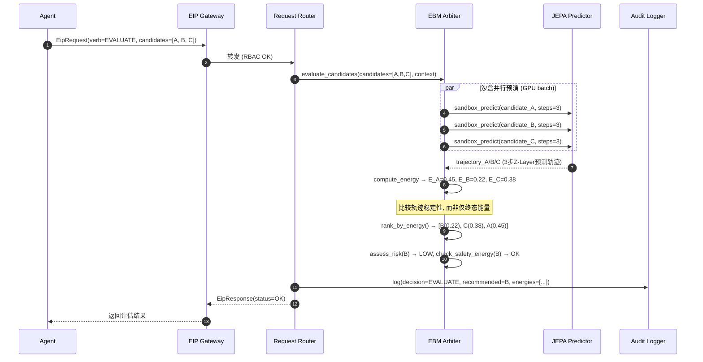
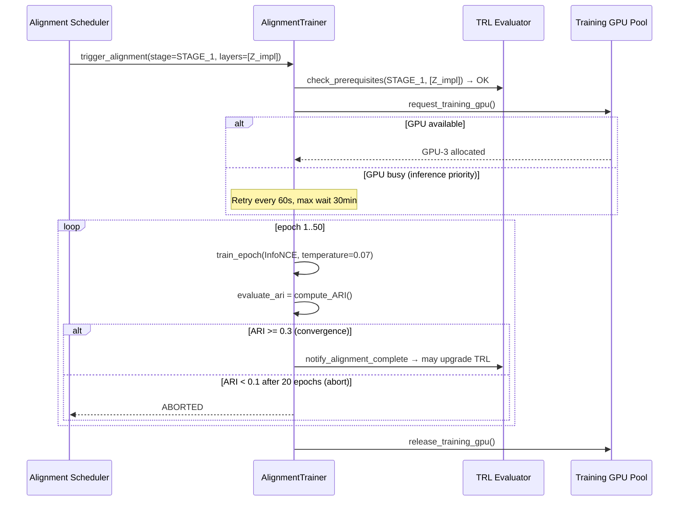
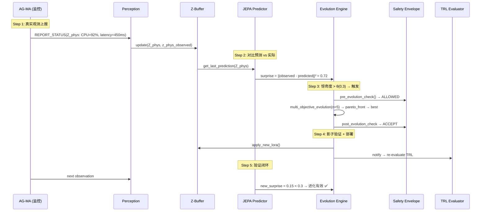
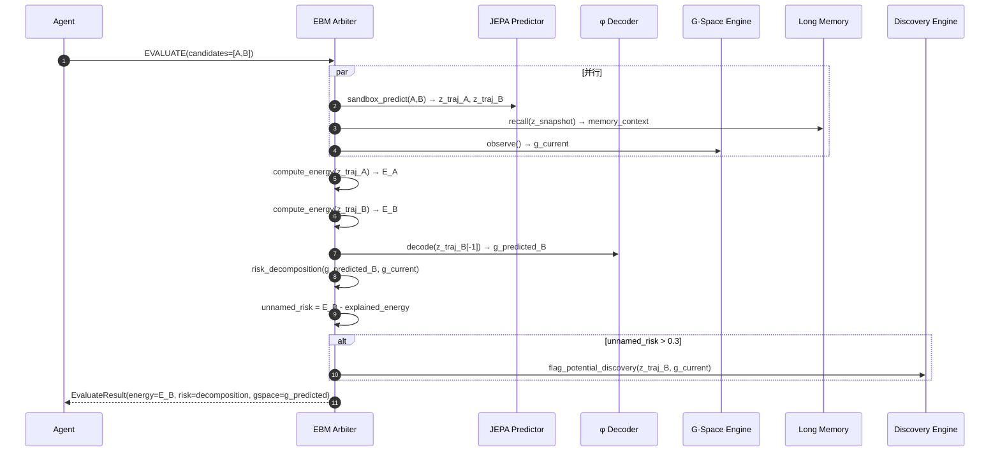
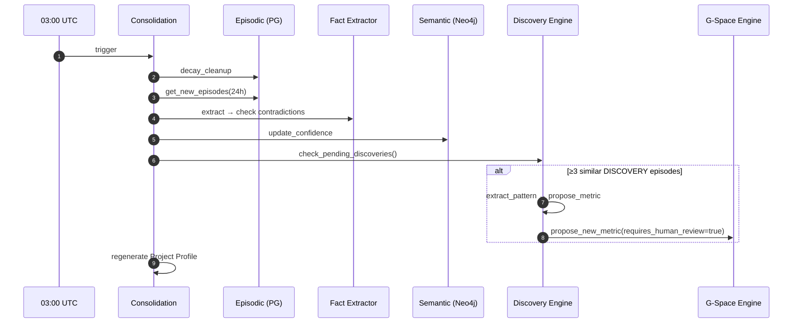
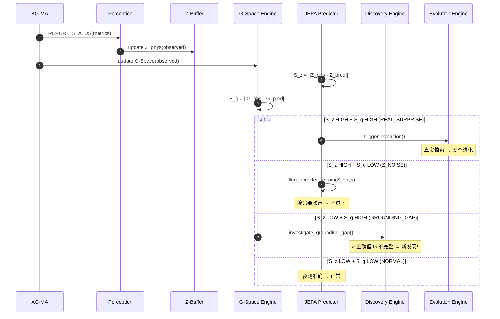
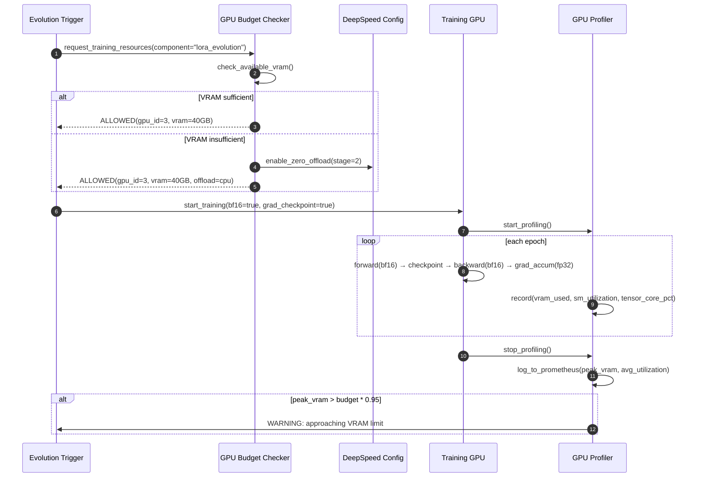
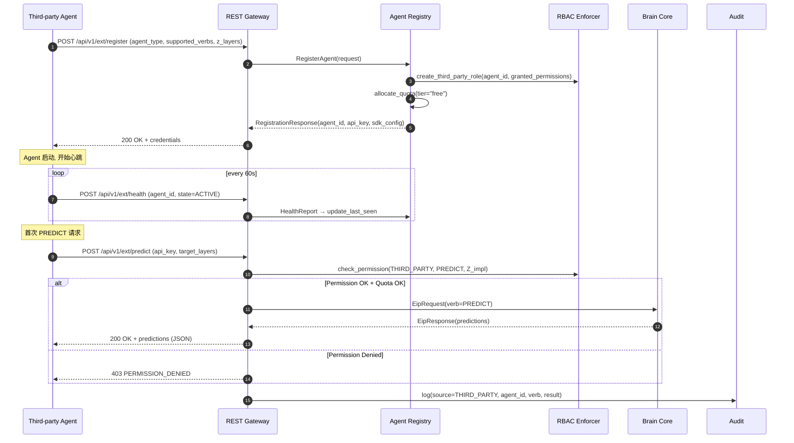

# ⚙️ UEWM 工程规格书

**文档版本：** V2.0.1  
**文档编号：** UEWM-ENG-006  
**最后更新：** 2026-04-03  
**状态：** 设计完成（支撑全部 AC 验证 + 双空间时序图 + GPU 规格 + SIGReg 训练管线 + VoE 验证规格）  
**对标需求：** 全部 R01-R13, GND, GPU, EXT, LIC, LeWM  
**变更历史：**
- Engineering Spec V2-5/deliver-v1.0: 时序图 §2.1-2.13, 组件依赖, 部署产物, 冷启动, 数据管道验证
- V1.0.1: GPU 工程规格 (§8), Standalone 部署 (§8.4), 第三方注册时序图 (§8.3)
- V2.0.0: 双空间时序图 (§2.14-2.16), G-Space 组件依赖, PoC 技术栈
- **V2.0.1: SIGReg/VoE/探测头工程规格, Gate Review 自动化; 全量合并 V1.0.1 内容，消除所有引用依赖**

---

## 1. 概述

实现级工程规格: 关键交互时序图 (18个, 含 V2.0 双空间), 组件依赖矩阵, 部署产物, 配置管理, 冷启动协议, GPU 优化规格, 第三方 Agent 注册流程, PoC 验证规格。

---

## 2. 关键交互时序图

### 2.1 时序图一：PREDICT 请求 (Agent → Brain)

Agent 发送 PREDICT → EIP Gateway RBAC 校验 → Request Router 路由 → JEPA Predictor 从 Z-Buffer 读取当前状态 → 执行预测 → 结果返回 → 审计日志记录。

### 2.2 时序图二：REPORT_STATUS + 惊奇度检测

Agent 上报状态 → Perception Pipeline 编码 → Z-Buffer 更新 → JEPA 对比预测 vs 实际 → 计算惊奇度 → 超阈值→触发进化。

### 2.3 时序图三：EVALUATE 含沙盒并行预演



### 2.4 时序图四：ORCHESTRATE (SCHEDULE)

编排模块从 Z-Layer 派生状态 → 任务依赖排序 → 返回推荐执行顺序。

### 2.5 时序图五：LOA 级联评估

TRL 回退事件 → ALFA 重计算 LOA → 编排模块识别下游 → 评估影响 → Kafka 通知 → 审计。

### 2.6 时序图六：编排模块项目健康度

Cron 每30s → 编排模块从 Z-Buffer/Agent/EBM 读取信号 → 加权综合 → 推送 Dashboard。

### 2.7 时序图七：跨模态对齐训练



### 2.8 时序图八：错误预算检查与自动降级

Prometheus 每10s采集 → Error Budget Engine 计算 burn-rate → 判定级别 → L2: 并行暂停进化+降低优先级 (30s内全部完成) → 恢复后15min稳定期 → 降级为L0 → 恢复进化。

### 2.9 时序图九：定期自反省

Cron 每日03:00 UTC → 5维内省(预测一致性/因果图健康/跨层对齐/决策多样性/盲区检测) → 异常→注入进化引擎定向LoRA → 审计。

### 2.10 时序图十：人工反馈学习

Human OVERRIDE → Brain EBM 评估(current vs suggestion) → 计算 r_human → Buffer 存储 → 50经验累积 → 偏见检查(单用户≤30%, ≥3角色) → 专项LoRA训练(lr=50%) → 安全包络检查 → ACCEPT/ROLLBACK。

### 2.11 时序图十一：产物版本一致性检测

Agent SUBMIT_ARTIFACT → Z-Buffer 记录版本 → 编排模块检查上游引用 → 版本不匹配 → Kafka ARTIFACT_ALERT → PM Dashboard + 上下游Agent通知 → ≤60s告警。

### 2.12 时序图十二：外部工具故障降级

Adapter health_check 失败 → 必选依赖故障 → ALFA 强制 LOA≤4 → EIP LOA_UPDATE 事件 → 编排模块 LOA 级联评估 → Agent 切换降级模式。

### 2.13 完整闭环追踪：观测→惊奇→进化→验证



### 2.14 时序图十四：记忆增强决策 + G-Space (V2.0 增强)



**[V1.0.1 Long Memory 原版时序图 §2.14]** — 记忆增强决策 (纯记忆, 无G-Space):

EBM 并行: EVAL候选A/B + RECALL(z_snapshot→3 similar Episodes→2 CAUSAL Facts) + Profile.get() → ANTI_PATTERN匹配A → E_A+=20%, PREFERENCE倾向B → E_B-=5% → recommended=B + MemoryInfluence。

### 2.15 时序图十五：记忆巩固 (V2.0 含 Discovery)



### 2.16 时序图十六：双空间惊奇度 → 4 分类处理



### 2.17 时序图十七：GPU 优化训练管线 (V1.0.1 §8.2)



### 2.18 时序图十八：第三方 Agent 注册与首次交互 (V1.0.1 §8.3)



---

## 3. 组件依赖矩阵 (V2.0 更新)

### 3.1 启动顺序

PostgreSQL → Redis → Kafka → Vault → Neo4j → **G-Space Collectors (Prometheus/GitHub/CI API)** → Brain Core (Z-Buffer → Perception → **G-Space Engine** → **Bridging Functions** → JEPA → EBM → **Discovery Engine** → Long Memory → Orchestrator → Evolution → TRL) → EIP Gateway → Agents (内环→中环→外环) → Portal API

### 3.2 组件间依赖

| 组件 | 强依赖 | 弱依赖 |
|------|--------|--------|
| Brain Core | PostgreSQL, Redis | Kafka, Vault |
| **G-Space Engine** | **Prometheus, GitHub API, CI API** | **Jira/Linear (process.*)** |
| **Bridging Functions** | **G-Space Engine, Z-Buffer** | — |
| **Discovery Engine** | **Bridging Functions, Long Memory** | — |
| EIP Gateway | Brain Core | Kafka |
| Agent | EIP Gateway | 外部工具 |
| Long Memory | PostgreSQL+pgvector, Neo4j, Redis | S3 |

---

## 4. 组件映射 (V2.0 更新)

```
uewm/brain-core 容器:
  Z-Buffer + G-Space Engine + Bridging Functions + JEPA + EBM +
  Discovery Engine + Orchestrator + TRL + Error Budget + Request Router

uewm/perception 容器: (无变更)
uewm/evolution 容器: (无变更, 但使用双空间惊奇度)
uewm/eip-gateway 容器: (V2.0: +QUERY_GSPACE, +DISCOVERY event)
uewm/agent-{type} 容器: (V2.0: 含 GSpaceQueryClient)
uewm/portal-api 容器: (V2.0: 含 Discovery Dashboard)
uewm/standalone-api 容器: [V1.0.1, V2.0: 含 G-Space 查询]
```

**V1.0.1 映射参考:**
- `uewm/brain-core`: Z-Buffer + JEPA + EBM + Long Memory + Orchestrator + TRL + Error Budget + Request Router
- `uewm/perception`: Perception Pipeline + 8 Encoders + AlignmentTrainer
- `uewm/evolution`: Evolution Engine + Safety Envelope + Circuit Breaker + Pareto + Bias + Reflection + Knowledge Engine

---

## 5. 关键协议与流程

### 5.1-5.6 EIP 消息流 / 进化触发 / 降级切换

详见 EIP Protocol §4、Self Evolution §11、Agents Design §4。

### 5.7 冷启动协议 (V2.0 增强)

```
阶段 A — 被动观测 + G-Space 采集 (Day 1-7):
  仅 REPORT_STATUS + G-Space 指标采集
  G-Space 从 Day 1 即有价值 (无需 ML)
  Z-Space TRL Evaluator 每6h评估
  测量点 M1: TRL-0 确认时间戳

阶段 B — 知识迁移 (Day 3-10, 与 A 并行):
  编排模块检查可用知识来源(按KSL)。隐私预算管理器控制迁移。
  每次迁移后立即触发 TRL 重评估。

阶段 C — 渐进启用 + 桥接验证 (Day 7+):
  ALFA 根据 TRL 自动计算 LOA。TRL<3→INFORMATION_ONLY。
  测量点 M2: TRL-1 达成 (ARI>0但<0.3)
  测量点 M3: TRL-2 达成 (ARI≥0.3)
  V2.0 增加: φ R² 开始计算 (需 ≥50 观测)
  冷启动期间 unnamed_risk 不触发 Discovery (数据不足)
  cold_start_duration = M3 - M1

阶段 D — 完成判定:
  全 MVLS 层惊奇度 < 0.5 + φ R² > 0.1 → 冷启动完成
  测量点 M4: 冷启动完成
```

### 5.8 数据管道验证集成

训练管道: 采集→清洗→编码→**VectorQualityValidator**→入库→版本化。触发: DVC pre-commit → MLflow post-training → LoRA post-evolution → 月度cron。阻断规则: NaN>0→硬阻断, 全零>1%→硬阻断, L2异常>10%→软阻断。告警: L2异常5-10%, 余弦>0.65, 低方差>5%。

---

## 6. 部署产物规格

### 6.1 容器镜像清单 (V2.0 更新)

| 镜像 | 基础镜像 | GPU | V2.0 变更 |
|------|---------|-----|-----------|
| `uewm/brain-core` | pytorch:2.x-cuda12 | 是 | +G-Space Engine, +Bridging, +Discovery |
| `uewm/perception` | pytorch:2.x-cuda12 | 是 | 无 |
| `uewm/evolution` | pytorch:2.x-cuda12 | 是 | 双空间惊奇度 |
| `uewm/eip-gateway` | golang:1.22-alpine | 否 | +QUERY_GSPACE, +DISCOVERY event |
| `uewm/agent-{type}` | python:3.12-slim | 否(AG-CD可选) | +GSpaceQuery, +DiscoveryAlert |
| `uewm/portal-api` | node:20-alpine | 否 | +Discovery Dashboard |
| `uewm/standalone-api` | python:3.12-slim | 否 | +G-Space 查询端点 [V1.0.1] |

### 6.2 Helm Chart 结构

```
helm/uewm/
├── Chart.yaml
├── values.yaml (Profile-S 默认)
├── values-profile-m.yaml
├── values-profile-l.yaml
├── values-standalone.yaml  [V1.0.1]
├── templates/
│   ├── brain-core/ (2 replicas Active-Standby, 无HPA)
│   ├── eip-gateway/ (3 replicas Active-Active, HPA CPU 80%)
│   ├── agents/ (每 Agent 类型一个 Deployment + HPA)
│   ├── data/ (PostgreSQL/Redis/Kafka/Milvus/Neo4j StatefulSets)
│   ├── monitoring/ (Prometheus/Grafana/OTel)
│   ├── security/ (Vault/cert-manager/NetworkPolicies)
│   └── namespaces.yaml
```

### 6.3 CI/CD Pipeline

CI: Lint+Tests → Protobuf编译+Schema兼容(buf) → 集成测试(EIP闭环) → 安全扫描(Trivy+Semgrep) → 容器构建(multi-arch) → Harbor推送。CD: Staging → 1h soak → 金丝雀10% → 全量 → 5min健康检查。

---

## 7. 配置管理规格

### 7.1 配置层级 (高→低优先级)

Runtime Override (K8s ConfigMap hot-reload) → Profile Override (values-profile-*.yaml) → Default Values (values.yaml) → Code Defaults

### 7.2 Profile 差异化配置

| 配置项 | Profile-S | Profile-M | Profile-L |
|--------|-----------|-----------|-----------|
| brain.replicas | 1 | 2 (Active-Standby) | 2 + 按租户分片 |
| brain.gpu_count | 2 | 4 | 8 |
| agent.{type}.max_replicas | 2 | 5 | 20 |
| slo.brain_p99_ms | 300 | 500 | 1000 |
| evolution.max_per_day | 1 | 5 | 15 |
| llm.monthly_budget_usd | 500 | 5000 | 25000 |
| audit.storage_budget_tb | 1 | 10 | 50 |
| error_budget.shadow_mode | true (Phase 0) | true (Phase 0) | false |

### 7.3 Feature Flags (V2.0 更新)

| Flag | 默认 | 说明 |
|------|------|------|
| FF_EVOLUTION_ENABLED | false (Phase 0初期) | 进化引擎总开关 |
| FF_FEDERATED_LEARNING | false | 联邦学习 (Phase 2+) |
| FF_ERROR_BUDGET_ENFORCE | false (影子) | 错误预算执行vs影子 |
| FF_OUTER_RING_AGENTS | false | 外环 Agent (Phase 2+) |
| FF_MIDDLE_RING_AGENTS | false | 中环 Agent (Phase 1+) |
| FF_LLM_COST_ENFORCE | true | LLM 成本天花板 |
| FF_ALIGNMENT_TRAINING | true | 跨模态对齐训练 |
| **FF_THIRD_PARTY_AGENTS** | **false** | **第三方 Agent 注册 (Phase 1+) [V1.0.1]** |
| **FF_STANDALONE_API** | **false** | **独立 Brain Core API (Phase 1+) [V1.0.1]** |
| **FF_TENSORRT_INFERENCE** | **false** | **TensorRT 推理优化 (Phase 1+) [V1.0.1]** |
| **FF_MIXED_PRECISION** | **true** | **BF16 混合精度训练 [V1.0.1]** |
| **FF_GRADIENT_CHECKPOINT** | **true** | **梯度检查点 [V1.0.1]** |
| **FF_COMMUNITY_EDITION** | **true** | **社区版功能限制 [V1.0.1]** |
| **FF_GSPACE_ENGINE** | **true** | **G-Space 指标采集 [V2.0]** |
| **FF_BRIDGING_FUNCTIONS** | **true** | **Z↔G 桥接和一致性损失 [V2.0]** |
| **FF_DISCOVERY_ENGINE** | **false (Phase 1+)** | **Discovery Engine [V2.0]** |
| **FF_DUAL_SURPRISE** | **true** | **双空间惊奇度 (替代单空间) [V2.0]** |
| **FF_RISK_DECOMPOSITION** | **true** | **EBM 风险分解输出 [V2.0]** |

### 7.4 配置变更审计

所有变更通过 Git (values.yaml) 或 K8s ConfigMap 变更事件记录审计日志: 变更人、diff、时间、关联PR号。

---

## 8. GPU 优化工程规格 [V1.0.1]

### 8.1 GPU 显存预算检查 (启动时)

```python
class GPUMemoryBudgetChecker:
    """启动时检查 GPU 显存预算, 防止 OOM。"""
    
    COMPONENT_BUDGETS = {
        # component: (min_mb, max_mb, description)
        "jepa_predictor": (6000, 10000, "JEPA Predictor FP16 推理"),
        "encoders_phase0": (3000, 6000, "3× MVLS Encoders FP16"),
        "encoders_full": (8000, 14000, "8× Full Encoders FP16"),
        "ebm_arbiter": (1000, 3000, "EBM MLP + 沙盒预演缓存"),
        "z_buffer": (500, 12000, "活跃项目 Z-Buffer, 按项目数缩放"),
        "alignment_trainer": (12000, 20000, "对齐训练 (启用梯度检查点)"),
        "lora_evolution": (2000, 5000, "LoRA 训练"),
        "memory_retrieval": (500, 2000, "pgvector ANN 索引缓存"),
        "system_overhead": (2000, 4000, "CUDA context + PyTorch 开销"),
    }
    
    def check_on_startup(self, device_capabilities):
        total_vram = device_capabilities.max_vram_mb
        inference_budget = sum(b[1] for k, b in self.COMPONENT_BUDGETS.items()
                              if k not in ["alignment_trainer", "lora_evolution"])
        training_budget = sum(b[1] for k, b in self.COMPONENT_BUDGETS.items()
                              if k not in ["encoders_full"])
        
        if inference_budget > total_vram * 0.85:
            raise GPUBudgetExceeded(f"Inference budget {inference_budget}MB > 85% of {total_vram}MB")
        if training_budget > total_vram * 0.90:
            logger.warning(f"Training budget {training_budget}MB > 90% of {total_vram}MB, enable gradient checkpoint")
```

时序图见 §2.17 (GPU Training Pipeline) + §2.18 (第三方 Agent 注册)。

### 8.4 Standalone Brain Core API 部署规格 [V1.0.1]

```
Standalone 部署容器清单 (最小化):

  必需:
    uewm/brain-core        → pytorch:2.x-cuda12, GPU 必需
    uewm/perception        → pytorch:2.x-cuda12, GPU 必需
    uewm/standalone-api    → python:3.12-slim, 无 GPU   [V1.0.1 新增]
    postgresql             → 15+, pgvector 扩展
    redis                  → 7+

  可选:
    uewm/evolution         → 启用进化时需要
    neo4j                  → 启用长期记忆时需要

  不需要:
    uewm/agent-*           → Standalone 模式无 Agent
    uewm/eip-gateway       → Standalone API 直接访问 Brain Core
    uewm/portal-api        → 无 Portal

  Helm values-standalone.yaml:
    agents: { enabled: false }
    eip_gateway: { enabled: false }
    portal: { enabled: false }
    standalone_api: { enabled: true, replicas: 2 }
    brain: { observation_source: "api" }
```

---

## 9. PoC 验证工程规格 (V2.0 新增)

### 9.1 PoC 技术栈

```
PoC 期间 (Phase 0A, 8 weeks):
  语言: Python 3.12
  ML: PyTorch 2.x + HuggingFace (CodeBERT) + scikit-learn + statsmodels
  正则化: SIGReg (自实现, ~50行 PyTorch, per LeWM)  [V2.0.1]
  投影头: 1-layer MLP + BatchNorm (per LeWM 关键发现)  [V2.0.1]
  隐维度: 256-d per Z-Layer (per LeWM 192-d 启示)  [V2.0.1]
  数据: SQLite (PoC 阶段) → PostgreSQL (Phase 0B)
  可视化: matplotlib + t-SNE/UMAP
  版本管理: Git + DVC
  硬件: Mac M5 Max (开发) + RTX 3060 (CUDA 验证)
  
  PoC 代码量预估: ~3500 行 Python (+500 for VoE tests)  [V2.0.1]
  PoC 数据量预估: ~6000 commits × ~80 metrics = ~480K 数据点
  VoE 测试集: 50 正常 + 50 异常 = 100 场景  [V2.0.1]
```

### 9.2 Gate Review 自动化 [V2.0.1 更新]

```python
class PoCGateReview:
    """Phase 0A Gate Review 自动化检查 [V2.0.1: 采用 LeWM 验证方法]。"""
    
    CRITERIA = {
        # V2.0.1 主要指标 (from LeWM)
        "probing_r_linear": {"threshold": 0.6, "method": "Linear probe Pearson r on G-Space metrics"},
        "probing_r_mlp": {"threshold": 0.85, "method": "MLP probe Pearson r on G-Space metrics"},
        "voe_auc": {"threshold": 0.80, "method": "ROC-AUC on normal vs anomalous scenarios"},
        # V2.0.0 保留指标
        "phi_r2_avg": {"threshold": 0.2, "method": "mean R² across G-Space dims"},
        "z_adds_value": {"threshold": 0.05, "method": "p-value of Z+G vs G-only"},
        # 补充指标
        "ari_clustering": {"threshold": 0.2, "method": "k-means ARI (supplementary)"},
        "sigreg_normality": {"threshold": 0.05, "method": "Epps-Pulley p-value (must pass)"},
        # 上限指标
        "noise_rate": {"threshold": 0.30, "method": "Z_NOISE events / total (upper bound)"},
    }
    
    def evaluate(self, results) -> GateDecision:
        # V2.0.1: 主要指标使用 probing + VoE (not just ARI)
        primary_pass = (
            results["probing_r_linear"] >= 0.6 and
            results["voe_auc"] >= 0.80 and
            results["sigreg_normality"] >= 0.05
        )
        secondary_pass = (
            results["phi_r2_avg"] >= 0.2 and
            results["z_adds_value"] <= 0.05  # p-value
        )
        noise_ok = results["noise_rate"] <= 0.30
        
        if primary_pass and secondary_pass and noise_ok:
            return GateDecision.PASS
        elif primary_pass or secondary_pass:
            return GateDecision.PARTIAL
        else:
            return GateDecision.FAIL
```
