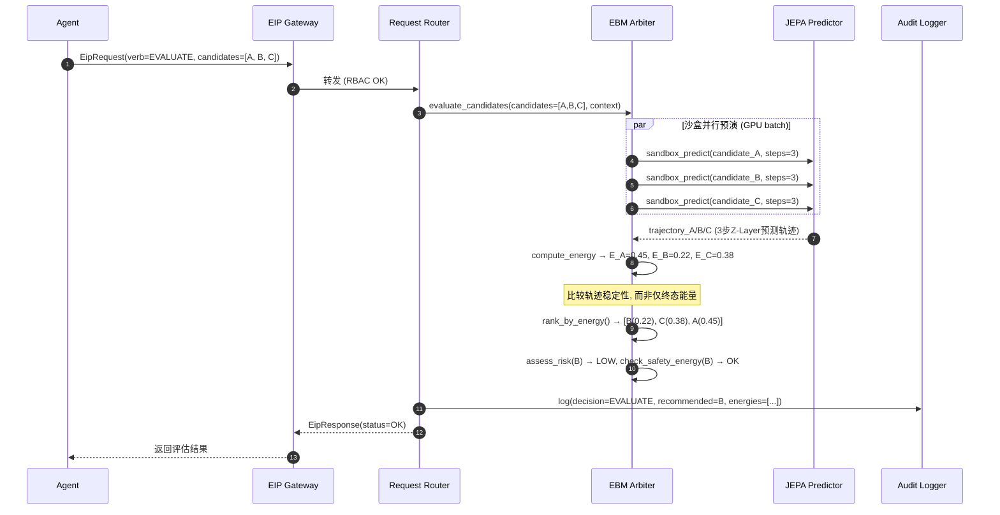
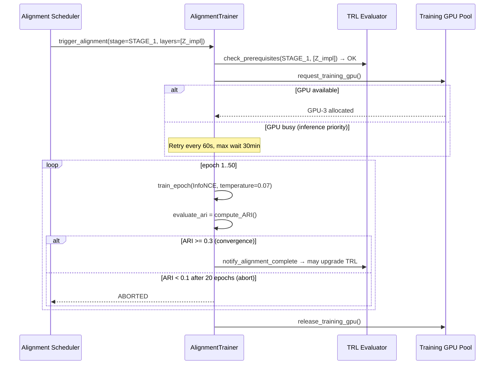
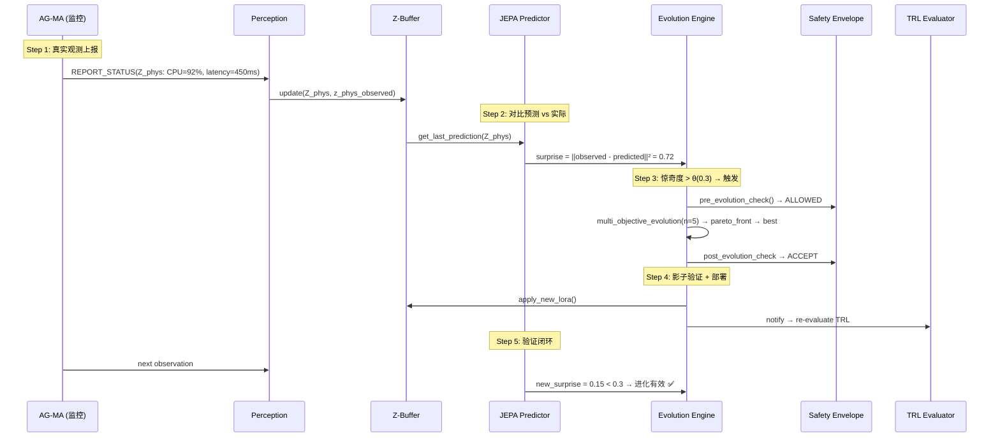
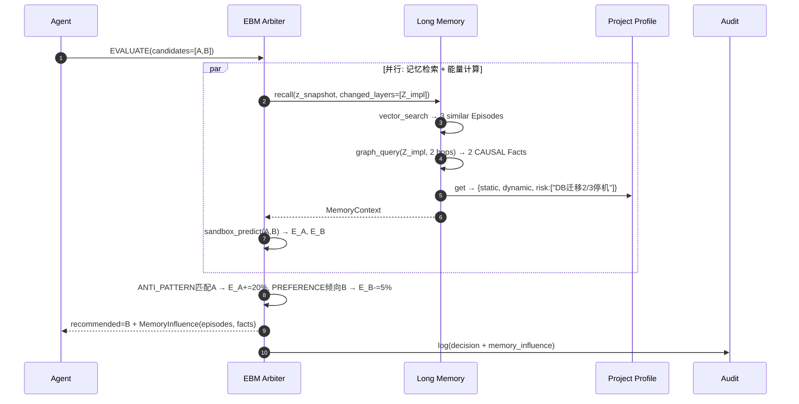
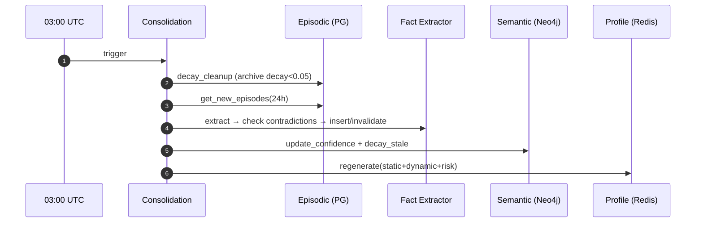

# ⚙️ UEWM 工程规格书

**文档版本：** deliver-v1.1  
**文档编号：** UEWM-ENG-006  
**最后更新：** 2026-03-24  
**状态：** 设计完成（支撑全部 AC 验证 + Long Memory 时序图）  
**合并来源：** Engineering Spec V2.0 + V3.0 + V4.0(时序图/部署/配置) + V5.0(EVALUATE扩展/闭环追踪) — 全量合并  
**对标需求：** 全部 R01-R13 的实现级规格和时序交互

---

## 1. 概述

本文档定义 UEWM 系统的实现级工程规格，包含关键交互时序图、组件依赖矩阵、部署产物规格、配置管理规格和冷启动协议。

---

## 2. 关键交互时序图

### 2.1 时序图一：PREDICT 请求 (Agent → Brain)

Agent 发送 PREDICT → EIP Gateway RBAC 校验 → Request Router 路由 → JEPA Predictor 从 Z-Buffer 读取当前状态 → 执行预测 → 结果返回 → 审计日志记录。

### 2.2 时序图二：REPORT_STATUS + 惊奇度检测

Agent 上报状态 → Perception Pipeline 编码 → Z-Buffer 更新 → JEPA 对比预测 vs 实际 → 计算惊奇度 → 超阈值→触发进化。

### 2.3 时序图三：EVALUATE 含沙盒并行预演



### 2.4 时序图四：ORCHESTRATE (SCHEDULE)

编排模块从 Z-Layer 派生状态 → 任务依赖排序 → 返回推荐执行顺序。

### 2.5 时序图五：LOA 级联评估

TRL 回退事件 → ALFA 重计算 LOA → 编排模块识别下游 → 评估影响 → Kafka 通知 → 审计。

### 2.6 时序图六：编排模块项目健康度

Cron 每30s → 编排模块从 Z-Buffer/Agent/EBM 读取信号 → 加权综合 → 推送 Dashboard。

### 2.7 时序图七：跨模态对齐训练



### 2.8 时序图八：错误预算检查与自动降级

Prometheus 每10s采集 → Error Budget Engine 计算 burn-rate → 判定级别 → L2: 并行暂停进化+降低优先级 (30s内全部完成) → 恢复后15min稳定期 → 降级为L0 → 恢复进化。

### 2.9 时序图九：定期自反省

Cron 每日03:00 UTC → 5维内省(预测一致性/因果图健康/跨层对齐/决策多样性/盲区检测) → 异常→注入进化引擎定向LoRA → 审计。

### 2.10 时序图十：人工反馈学习

Human OVERRIDE → Brain EBM 评估(current vs suggestion) → 计算 r_human → Buffer 存储 → 50经验累积 → 偏见检查(单用户≤30%, ≥3角色) → 专项LoRA训练(lr=50%) → 安全包络检查 → ACCEPT/ROLLBACK。

### 2.11 时序图十一：产物版本一致性检测

Agent SUBMIT_ARTIFACT → Z-Buffer 记录版本 → 编排模块检查上游引用 → 版本不匹配 → Kafka ARTIFACT_ALERT → PM Dashboard + 上下游Agent通知 → ≤60s告警。

### 2.12 时序图十二：外部工具故障降级

Adapter health_check 失败 → 必选依赖故障 → ALFA 强制 LOA≤4 → EIP LOA_UPDATE 事件 → 编排模块 LOA 级联评估 → Agent 切换降级模式。

### 2.13 完整闭环追踪：观测→惊奇→进化→验证



### 2.14 时序图十四：记忆增强决策 (EVALUATE + Memory) [deliver-v1.1 新增]



### 2.15 时序图十五：记忆巩固 (Daily Consolidation) [deliver-v1.1 新增]



---

## 3. 组件依赖矩阵

### 3.1 启动顺序

PostgreSQL → Redis → Kafka → Vault → **Neo4j** → Brain Core (Z-Buffer→Perception→JEPA→EBM→**Long Memory**→Orchestrator→Evolution→TRL) → EIP Gateway → Agents (内环→中环→外环) → Portal API

### 3.2 组件间依赖

| 组件 | 强依赖 | 弱依赖 |
|------|--------|--------|
| Brain Core | PostgreSQL, Redis | Kafka (可缓冲), Vault (可缓存) |
| EIP Gateway | Brain Core | Kafka |
| Agent | EIP Gateway | 外部工具 (降级运行) |
| Evolution Engine | Z-Buffer, MLflow | DVC, GPU (可排队) |
| **Long Memory** | **PostgreSQL+pgvector, Neo4j, Redis** | **S3 (温/冷存储)** |

---

## 4. 组件映射

Architecture 12 组件 → Engineering Spec 模块映射:
- `uewm/brain-core` 容器: Z-Buffer + JEPA + EBM + Orchestrator + TRL + Error Budget + Request Router
- `uewm/perception` 容器: Perception Pipeline + 8 Encoders + AlignmentTrainer
- `uewm/evolution` 容器: Evolution Engine + Safety Envelope + Circuit Breaker + Pareto + Bias + Reflection + Knowledge
- `uewm/eip-gateway` 容器: EIP Gateway + gRPC Router + RBAC Enforcer
- `uewm/agent-{type}` 容器: Agent Framework + ALFA + Adapters + Execution Engine
- `uewm/portal-api` 容器: Portal REST API + WebSocket

---

## 5. 关键协议与流程

### 5.1-5.6 EIP 消息流 / 进化触发 / 降级切换

详见 EIP Protocol §4、Self Evolution §11、Agents Design §4。

### 5.7 冷启动协议

```
阶段 A — 被动观测 (Day 1-7):
  仅 REPORT_STATUS，不做 PREDICT。TRL Evaluator 每6h评估。
  测量点 M1: TRL-0 确认时间戳

阶段 B — 知识迁移 (Day 3-10, 与 A 并行):
  编排模块检查可用知识来源(按KSL)。隐私预算管理器控制迁移。
  每次迁移后立即触发 TRL 重评估。

阶段 C — 渐进启用 (Day 7+):
  ALFA 根据 TRL 自动计算 LOA。TRL<3→INFORMATION_ONLY。
  测量点 M2: TRL-1 达成 (ARI>0但<0.3)
  测量点 M3: TRL-2 达成 (ARI≥0.3)
  cold_start_duration = M3 - M1

阶段 D — 完成判定:
  全 MVLS 层惊奇度 < 0.5 → 冷启动完成
  测量点 M4: 冷启动完成
```

### 5.8 数据管道验证集成

训练管道: 采集→清洗→编码→**VectorQualityValidator**→入库→版本化。触发: DVC pre-commit → MLflow post-training → LoRA post-evolution → 月度cron。阻断规则: NaN>0→硬阻断, 全零>1%→硬阻断, L2异常>10%→软阻断。告警: L2异常5-10%, 余弦>0.65, 低方差>5%。

---

## 6. 部署产物规格

### 6.1 容器镜像清单

| 镜像 | 基础镜像 | GPU |
|------|---------|-----|
| `uewm/brain-core` | pytorch:2.x-cuda12 | 是 |
| `uewm/perception` | pytorch:2.x-cuda12 | 是 |
| `uewm/evolution` | pytorch:2.x-cuda12 | 是 |
| `uewm/eip-gateway` | golang:1.22-alpine | 否 |
| `uewm/agent-{type}` | python:3.12-slim | 否(AG-CD可选) |
| `uewm/portal-api` | node:20-alpine | 否 |

### 6.2 Helm Chart 结构

```
helm/uewm/
├── Chart.yaml
├── values.yaml (Profile-S 默认)
├── values-profile-m.yaml
├── values-profile-l.yaml
├── templates/
│   ├── brain-core/ (2 replicas Active-Standby, 无HPA)
│   ├── eip-gateway/ (3 replicas Active-Active, HPA CPU 80%)
│   ├── agents/ (每 Agent 类型一个 Deployment + HPA)
│   ├── data/ (PostgreSQL/Redis/Kafka/Milvus/Neo4j StatefulSets)
│   ├── monitoring/ (Prometheus/Grafana/OTel)
│   ├── security/ (Vault/cert-manager/NetworkPolicies)
│   └── namespaces.yaml
```

### 6.3 CI/CD Pipeline

CI: Lint+Tests → Protobuf编译+Schema兼容(buf) → 集成测试(EIP闭环) → 安全扫描(Trivy+Semgrep) → 容器构建(multi-arch) → Harbor推送。CD: Staging部署 → 1h soak → 金丝雀10% → 全量发布 → 5min健康检查。

---

## 7. 配置管理规格

### 7.1 配置层级 (高→低优先级)

Runtime Override (K8s ConfigMap hot-reload) → Profile Override (values-profile-*.yaml) → Default Values (values.yaml) → Code Defaults

### 7.2 Profile 差异化配置

| 配置项 | Profile-S | Profile-M | Profile-L |
|--------|-----------|-----------|-----------|
| brain.replicas | 1 | 2 (Active-Standby) | 2 + 按租户分片 |
| brain.gpu_count | 2 | 4 | 8 |
| agent.{type}.max_replicas | 2 | 5 | 20 |
| slo.brain_p99_ms | 300 | 500 | 1000 |
| evolution.max_per_day | 1 | 5 | 15 |
| llm.monthly_budget_usd | 500 | 5000 | 25000 |
| audit.storage_budget_tb | 1 | 10 | 50 |
| error_budget.shadow_mode | true(Phase 0) | true(Phase 0) | false |

### 7.3 Feature Flags

| Flag | 默认 | 说明 |
|------|------|------|
| FF_EVOLUTION_ENABLED | false (Phase 0初期) | 进化引擎总开关 |
| FF_FEDERATED_LEARNING | false | 联邦学习 (Phase 2+) |
| FF_ERROR_BUDGET_ENFORCE | false (影子) | 错误预算执行vs影子 |
| FF_OUTER_RING_AGENTS | false | 外环 Agent (Phase 2+) |
| FF_MIDDLE_RING_AGENTS | false | 中环 Agent (Phase 1+) |
| FF_LLM_COST_ENFORCE | true | LLM 成本天花板 |
| FF_ALIGNMENT_TRAINING | true | 跨模态对齐训练 |

### 7.4 配置变更审计

所有变更通过 Git (values.yaml) 或 K8s ConfigMap 变更事件记录审计日志: 变更人、diff、时间、关联PR号。
