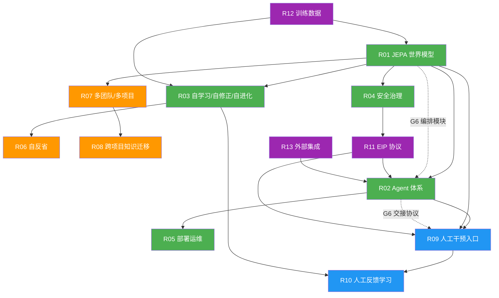

# 📋 UEWM 需求规格文档（整合版）

**文档版本：** V6.1  
**文档编号：** UEWM-REQ-000-R6.1  
**创建日期：** 2026-03-05  
**最后更新：** 2026-03-21  
**状态：** 设计就绪（Design-Ready）  
**整合来源：** UEWM-REQ-000 V1.0 + UEWM-IMPROVE-001 V1.0 + 编排层差距分析 + 设计就绪补充 + 设计门评审终版 + 设计门深度评审补丁 + 终版编辑修正  

---

## 修订历史

| 版本 | 日期 | 变更说明 |
|------|------|---------|
| V1.0 | 2026-03-05 | 初始版本，含 R01–R10 全部需求 |
| V2.0 | 2026-03-19 | 整合可行性差距分析（G1–G5）的设计改进方案，新增子需求与修订验收标准 |
| V3.0 | 2026-03-19 | 新增 G6 跨环编排差距分析：Brain Core 内置编排模块、跨环交接协议、项目经理角色接入 |
| V4.0 | 2026-03-19 | 设计就绪补充：新增 R11 EIP协议规范 / R12 训练数据策略 / R13 外部集成边界；深化 R04 安全治理；量化模糊验收标准；补充可观测性/产物版本管理/基础模型依赖/GPU争用等需求；对齐需求优先级与交付阶段 |
| V5.0 | 2026-03-19 | 设计门评审终版：新增 Agent 执行引擎策略 (R02.10)；完善项目概述 (目标用户/成功标准/范围边界/语言覆盖)；量化 R01 原始验收标准；新增 Z_phys 数据获取风险；新增端到端场景走查 (附录F) |
| V6.0 | 2026-03-21 | 设计门深度评审补丁 (7 项缺口修复)：R05 新增 SLO 违约响应策略与错误预算 (Gap-1)；G6-S1 新增多项目编排并发模型与资源仲裁策略 (Gap-2)；R12 新增数据保留/删除/机器遗忘策略 (Gap-3)；附录 F 新增场景 4 多租户知识迁移走查 (Gap-4)；R05 新增 LLM 推理成本基线 (Gap-5)；R11 新增 EIP 强类型载荷规范 (Gap-6)；NFR-11 新增审计日志容量规划 (Gap-7) |
| V6.1 | 2026-03-21 | 终版编辑修正 (5 项)：E1 修正 EIP 枚举零值为 UNKNOWN=0 (Protobuf 安全默认值)；E2 为旧版 Any-based IDL 添加编辑桥接说明；E3 R07 验收标准新增 AC-5 引用 Gap-2 并发模型；E4 NFR-9 添加与 Tier-1 SLO 关系的脚注；E5 附录 F 新增场景 5 SLO burn-rate 运维演练 |

---

## 1. 项目概述

### 1.1 项目定位

研发一个基础通用的世界模型 UEWM (Universal Engineering World Model)，以及相关 action 的 Agents，用于完成从产品想法构思到系统产品推广的工程全流程落地的闭环研发。

### 1.2 目标用户

拥有 3–50 人软件工程团队的中大型企业，具备 CI/CD 和云原生基础设施（Kubernetes），有多个并行项目需要协调管理。

### 1.3 项目成功标准

| 阶段 | 时间 | 成功标准 |
|------|------|---------|
| Phase 0 | M1–M4 | MVLS 三层达 TRL-3；内环 5 Agent 端到端闭环可演示；EIP 协议集成测试通过 |
| Phase 1 | M5–M7 | 中环 3 Agent 可运行 (LOA ≥ 5)；跨环交接协议可演示；首个外部客户试点接入 |
| Phase 2 | M8–M10 | 全 12 Agent 可运行；多团队多项目并行；知识迁移生效 (冷启动缩短 ≥ 50%) |
| Phase 3 | M11+ | 全部 Z-Layer 达 TRL-4+；自进化闭环稳定运行 30 天；SOC 2 Type II 通过 |

### 1.4 范围边界

**在 UEWM 范围内：**

- Brain Core (JEPA + EBM + 编排模块)
- 12 个工程 Agent 及其与 Brain Core 的 EIP 通信
- Agent 适配器层（封装外部工具调用）
- 自进化引擎（LoRA 训练、安全包络、断路器）
- 人工干预 Portal API（后端接口）
- 安全治理引擎（RBAC、审批工作流、审计日志）
- 训练数据采集与管理流水线

**不在 UEWM 范围内：**

- UEWM 自身的研发 CI/CD 流水线（用标准工程实践即可）
- 用户身份认证（通过外部 SSO/OIDC 对接，不自建 IdP）
- 计费计量系统（若商业化需要，作为独立产品模块）
- Portal 前端 UI 框架（本文档仅定义 API 接口，UI 实现独立交付）
- 外部工具（Git、CI、K8s、Prometheus 等）的安装、配置与运维
- 非软件工程领域的应用（硬件工程、机械工程等）

### 1.5 编程语言与技术覆盖范围

| 阶段 | Agent 代码生成/分析支持语言 | 说明 |
|------|--------------------------|------|
| Phase 0 | Python + Go | 与 MVLS 训练数据对齐，开源数据最充足 |
| Phase 1 | + Java + TypeScript | 覆盖企业主流技术栈 |
| Phase 2+ | 按需扩展 | 基于客户需求和训练数据可用性决定 |

架构文档格式：Markdown + OpenAPI YAML。Agent 间交付产物格式：由 NFR-10 标准化（JSON Schema 或 Protobuf）。

---

## 2. 可行性差距改进总览

本整合版在 V1.0 基础上，针对以下八大可行性差距纳入了具体设计改进方案：

| # | 差距 | 核心矛盾 | 解决策略 | 影响需求 |
|---|------|---------|---------|---------|
| G1 | 统一隐空间编码问题 | 8层Z-Layer语义差异巨大，统一2048-d空间未经验证 | 分层成熟度模型 + 渐进式隐空间对齐 + MVLS | R01 |
| G2 | 12-Agent全生命周期刚性 | 所有Agent同为P0，最弱环节阻塞全链路 | 三环分层交付 + ALFA框架 + Agent降级 | R02 |
| G3 | 自进化失败模式缺失 | 缺乏进化失败的检测、限制和恢复机制 | 安全包络 + 进化断路器 + 帕累托约束 | R03, R06 |
| G4 | 性能需求缺乏负载上下文 | NFR指标无并发/规模参数化 | 负载剖面矩阵 + 分级SLO体系 | R05, NFR |
| G5 | 知识迁移与数据隐私张力 | R08跨项目知识共享与R04/R07数据隔离根本矛盾 | 隐私效用频谱 + 分级知识蒸馏 | R07, R08 |
| G6 | 跨环编排能力缺失 | 12个Agent无人负责跨环协调、任务排序、里程碑跟踪 | Brain Core 内置编排模块 + 跨环交接协议 | R01, R02, R09 |
| G7 | Agent-Brain 通信协议未定义 | 12个Agent与Brain交互的消息格式/路由/错误处理均未规范 | 新增 R11 EIP 协议规范 | R11 (新增) |
| G8 | 训练数据与外部集成边界缺失 | 编码器无数据来源、Agent无外部工具边界、安全治理过于粗线条 | 新增 R12 数据策略 + R13 集成边界 + R04 深化 | R12, R13, R04 |

**V6.0 设计门深度评审补充差距（7 项）：**

| # | 差距 | 核心矛盾 | 解决策略 | 影响需求 |
|---|------|---------|---------|---------|
| Gap-1 | SLO 违约响应策略缺失 | SLO 有目标无违约响应，子系统联动缺失 | 错误预算 + Burn-Rate 四级告警 + 自动保护性降级 + 变更冻结 | R05 |
| Gap-2 | 多项目编排并发模型未定义 | 多项目争用同一 Agent/GPU 时无仲裁规则 | 三级调度模式 (公平共享/优先级抢占/租户隔离) + Per-Tenant 配额 | R07, G6-S1 |
| Gap-3 | 训练数据保留/删除策略缺失 | 客户退出后数据处置和机器遗忘无规范 | 按 KSL 分级的保留/删除/机器遗忘策略 + 删除审计 | R12 |
| Gap-4 | 端到端场景缺多租户覆盖 | 场景 1-3 均为单项目，未验证多租户/知识迁移/隐私预算 | 新增场景 4: 跨 Tenant 知识迁移 + 隐私预算耗尽 + 租户隔离验证 | 附录 F |
| Gap-5 | Agent LLM 推理成本无约束 | 设计团队无成本天花板，可能选用过于昂贵的模型 | Per-Profile 月度成本基线 + Per-Task-Tier 单次成本天花板 | R05, R02.10 |
| Gap-6 | EIP Protobuf Any 类型无编译期安全 | Any 绕过类型检查，集成调试困难 | 定义每个 EipVerb 的强类型载荷消息，禁止最终 IDL 保留 Any | R11 |
| Gap-7 | 审计日志容量无规划 | Profile-L 下日志量可能巨大，无存储分层策略 | 按 Profile 估算日志量 + Hot/Warm/Cold 三层存储 + 查询 SLO | NFR-11 (新增) |

---

## 3. 需求总览

| 编号 | 需求名称 | 来源 | 优先级 | 对应设计文档 | G改进 |
|------|---------|------|-------|------------|------|
| R01 | JEPA 基础世界模型 | 原始需求 | P0-Phase0 | `UEWM_Architecture.md` | G1, G6 |
| R02 | 工程全生命周期 Agent 体系 | 原始需求 | P0-分环 | `UEWM_Agents_Design.md` | G2, G6 |
| R03 | 自学习/自修正/自进化能力 | 原始需求 | P0-Phase0 | `UEWM_Self_Evolution.md` | G3 |
| R04 | 安全治理与审批机制 | 原始需求 | P0-Phase0 | `UEWM_Safety_Governance.md` | G5, G8 |
| R05 | 部署运维与落地方案 | 原始需求 | P0-Phase0 | `UEWM_Deployment_Operations.md` | G4 |
| R06 | 定期自反省自修正进化 | 第二批 | P1-Phase1 | `UEWM_Self_Evolution.md` §6 | G3 |
| R07 | 多团队/多项目通用支持 | 第二批 | P1-Phase1 | `UEWM_Architecture.md` P8 | G5 |
| R08 | 跨团队/项目知识迁移学习 | 第二批 | P2-Phase2 | `UEWM_Self_Evolution.md` §5 | G5 |
| R09 | 角色工程师人工干预入口 | 第三批 | P0-Phase0 | `UEWM_Agents_Design.md` §5 | G2, G6 |
| R10 | 世界模型从人工建议中学习 | 第三批 | P1-Phase1 | `UEWM_Self_Evolution.md` §7 | G3 |
| R11 | 工程智能协议 (EIP) 规范 | V4.0 新增 | P0-Phase0 | `UEWM_EIP_Protocol.md` | G7 |
| R12 | 训练数据策略 | V4.0 新增 | P0-Phase0 | `UEWM_Data_Strategy.md` | G8 |
| R13 | 外部系统集成边界 | V4.0 新增 | P0-分环 | `UEWM_Integration_Map.md` | G8 |

> **优先级说明：** P0-Phase0 = 必须在 Phase 0 前/期间完成; P0-分环 = 随三环分批交付; P1-Phase1 = Phase 1 交付; P2-Phase2 = Phase 2 交付。

---

## 4. 需求详细描述

### R01 — JEPA 基础世界模型（修订版，整合 G1 + G6）

**需求描述：**

参考 Yann LeCun JEPA 相关论文，研发基础通用的世界模型 UEWM。

**具体要求：**

1. 基于 JEPA (Joint Embedding Predictive Architecture) 理论框架构建
2. 采用分层隐空间表示 (Hierarchical Latent Space)
3. 使用基于能量的模型 (EBM) 进行方案仲裁和安全约束
4. 在隐空间（latent space）进行预测和推理，而非像素/文本层面
5. 具备世界状态建模与预测能力
6. 支持因果推理和多步预测
7. **[新增 — G1-S1]** 定义 Z-Layer TRL 成熟度等级 (TRL-0 到 TRL-5)
8. **[新增 — G1-S3]** 首先交付 MVLS (最小可行隐空间: Z_impl + Z_quality + Z_phys) 达到 TRL-3
9. **[新增 — G1-S2]** 提供渐进式跨模态对齐训练协议
10. **[新增 — G1-S1]** 系统根据层 TRL 等级动态调整 Agent 自主度和 EBM 权重
11. **[新增 — G1-S1]** 未成熟层 (TRL<3) 对应 Agent 强制降级为人工辅助模式
12. **[新增 — G6-S1]** Brain Core 内置项目编排模块 (Orchestration Module)，从现有 Z-Layer 派生项目状态（进度风险、资源争用、依赖就绪度），不引入独立 Z-Layer
13. **[新增 — V4.0]** 明确基础模型依赖策略：各编码器优先基于预训练模型微调（如 CodeBERT for Z_impl、TimesFM for Z_phys），而非从零训练；若无合适预训练模型的层允许从零训练，但需在设计阶段论证

#### G1-S1：Z-Layer 成熟度分级模型

**核心思想：** 不再要求8层同时达到可用状态，而是定义每层的成熟度等级，系统根据层成熟度动态调整行为。

```
Z-Layer 成熟度等级定义:

  TRL-0 (概念): 编码器架构已确定，但无训练数据，隐空间无意义
  TRL-1 (原型): 编码器可产出向量，但语义聚类 ARI < 0.3
  TRL-2 (验证): 语义聚类 ARI ≥ 0.3，但跨层因果关系未验证
  TRL-3 (集成): 单向因果关系可检测 (本层→邻居层 格兰杰 p<0.05)
  TRL-4 (成熟): 双向因果传导可靠，预测 MSE < 0.1，可支撑 Agent 决策
  TRL-5 (自优化): 自进化闭环验证通过，惊奇度收敛
```

**系统行为与成熟度关联规则：**

| 系统行为 | TRL-0/1 | TRL-2 | TRL-3 | TRL-4 | TRL-5 |
|---------|---------|-------|-------|-------|-------|
| 该层 Agent 可自主操作 | ❌ | ❌ | ⚠️ 低风险 | ✅ | ✅ |
| 该层参与 EBM 能量计算 | ❌ | ❌ | 降权 (0.1x) | 标准权重 | 标准权重 |
| 该层参与因果回溯 | ❌ | ❌ | 单向 | 双向 | 双向 |
| 该层纳入自进化训练 | ❌ | 数据收集 | 独立训练 | 联合训练 | 在线进化 |
| 人工干预要求 | 全人工 | 全人工 | 必须审批 | 高风险审批 | 标准流程 |

**每层的目标 TRL 时间线：**

```
Phase 0 (M1-M4):  目标 TRL-3+ 的层 → Z_impl, Z_quality, Z_phys
Phase 1 (M5-M7):  目标 TRL-3+ 的层 → Z_arch, Z_logic
Phase 2 (M8-M10): 目标 TRL-2+ 的层 → Z_biz, Z_val, Z_market (合成数据+早期客户)
Phase 3 (M11+):   目标 TRL-4+ 的层 → 全部 (需要充足真实数据积累)
```

#### G1-S2：渐进式跨模态对齐训练协议

**核心思想：** 不依赖单层MLP来对齐9个异构编码器，而是设计一个多阶段对齐训练流程，逐步建立跨模态语义一致性。

```
阶段一: 域内对比学习 (每层独立)
  目标: 确保每个编码器的输出空间内部语义连贯
  方法: 同一项目不同时间点的 Z_impl 应比不同项目的 Z_impl 更近
  损失: InfoNCE 对比损失 (每层独立训练)
  验证: 语义聚类 ARI ≥ 0.3

阶段二: 相邻层对齐 (成对)
  目标: 建立相邻层之间的语义对应关系
  方法: 同一项目同一时间点的 Z_impl 和 Z_quality 应比随机配对更近
  损失: 跨模态对比损失 + 因果预测损失
  验证: 相邻层的跨层预测 MSE 改善 > 30%

阶段三: 全局联合对齐 (需要阶段二通过后)
  目标: 所有层形成统一的语义空间
  方法: 多视角对比学习 + VICReg/SIGReg 正则化
  损失: Σ L_contrastive(i,j) + λ * L_vicreg 对所有层对 (i,j)
  验证: 跨层因果图有效率 > 80%
```

**关键算法：跨模态对齐损失**

```python
class CrossModalAlignmentLoss:
    """
    渐进式跨模态对齐损失。
    
    理论基础: 
    - CLIP-style 对比学习证明异构模态可在共享空间对齐
    - 采用"弱监督对齐"：利用项目上下文作为天然配对信号
    
    核心洞察: 
    - 同一项目、同一时间点的不同Z-Layer是天然正配对
    - 不同项目的Z-Layer是天然负配对
    """
    
    def __init__(self, temperature=0.07):
        self.temperature = temperature
    
    def compute(self, z_layer_a, z_layer_b, project_ids):
        # 归一化到单位球面
        z_a = F.normalize(z_layer_a, dim=-1)
        z_b = F.normalize(z_layer_b, dim=-1)
        
        # 相似度矩阵 [batch, batch]
        sim_matrix = z_a @ z_b.T / self.temperature
        
        # 正样本掩码: 同项目同时间点
        positive_mask = (project_ids.unsqueeze(0) == project_ids.unsqueeze(1)).float()
        
        # InfoNCE (双向)
        loss_a2b = -torch.log(
            (torch.exp(sim_matrix) * positive_mask).sum(dim=1) / 
            torch.exp(sim_matrix).sum(dim=1)
        ).mean()
        
        loss_b2a = -torch.log(
            (torch.exp(sim_matrix.T) * positive_mask).sum(dim=1) / 
            torch.exp(sim_matrix.T).sum(dim=1)
        ).mean()
        
        return (loss_a2b + loss_b2a) / 2
```

**对齐质量验证指标：**

| 指标名 | 计算方式 | 达标阈值 | 未达标动作 |
|--------|---------|---------|----------|
| 域内聚类 ARI | K-means 聚类 vs 已知标签 | ≥ 0.3 | 增加编码器训练数据 |
| 跨层余弦对齐 | 同项目跨层 cos_sim 均值 | ≥ 0.3 | 增加跨层对比训练 |
| 因果信号保真度 | 已知因果链在隐空间中的格兰杰检验 p-value | < 0.05 | 调整对齐损失权重 |
| 投影后信息保留 | 投影前后的互信息估计 | > 0.7 原始信息 | 增加 ProjectionAdapter 容量 |

#### G1-S3：最小可行隐空间 (MVLS)

```
MVLS 定义:
  核心三层: Z_impl (代码实现) + Z_quality (测试质量) + Z_phys (运行指标)
  
  选择理由:
  1. 这三层的编码来源最结构化 (AST/CFG, 测试覆盖率, Prometheus指标)
  2. 它们之间存在最强的因果链 (代码质量→测试结果→运行性能)
  3. 对应的 Agent (AG-CD, AG-CT, AG-DO, AG-MA) 最容易验证
  4. 训练数据从开源项目最容易获取
  
  MVLS 验证标准:
  1. 给定 Z_impl 的变更，JEPA 能预测 Z_quality 变化方向，准确率 > 70%
  2. 给定 Z_quality 的异常，因果回溯能定位到 Z_impl 中的具体子空间，准确率 > 60%
  3. Z_phys 的异常预测 (基于 Z_impl + Z_quality) F1-score > 0.6
  4. 以上指标在 10 个不同项目上的方差 < 20%
```

**MVLS 到完整隐空间的扩展路径：**

```
MVLS (3层)  →  核心五层  →  扩展七层  →  完整八层
                
时间线:        Phase 0        Phase 1       Phase 2        Phase 3
Z_impl         ✅ TRL-3      ✅ TRL-4      ✅ TRL-4       ✅ TRL-5
Z_quality      ✅ TRL-3      ✅ TRL-4      ✅ TRL-4       ✅ TRL-5
Z_phys         ✅ TRL-3      ✅ TRL-4      ✅ TRL-4       ✅ TRL-5
Z_arch         —              ✅ TRL-3      ✅ TRL-4       ✅ TRL-5
Z_logic        —              ✅ TRL-3      ✅ TRL-4       ✅ TRL-5
Z_biz          —              —              ✅ TRL-2       ✅ TRL-4
Z_val          —              —              ✅ TRL-2       ✅ TRL-4
Z_market       —              —              —              ✅ TRL-3
```

#### G6-S1：项目编排模块 (Orchestration Module)

**核心思想：** 三环分层架构（G2）解决了 Agent 的分期交付问题，但没有回答"谁来协调三环之间的任务排序、交接时机、资源争用和里程碑跟踪"。这些职责不应由一个独立的第 13 个 Agent 承担——项目编排是 Brain Core 的"执行功能"，而非一个独立的工程执行域。

**为什么不是一个新 Agent：**

```
AG-PM (项目管理 Agent) 被否决的原因:

  1. 无对应 Z-Layer: 项目健康度是从所有 Z-Layer 派生的元信号，
     而非独立的可编码工程信号，增加 Z-Layer 会加剧 G1 模态差距
  2. 协调瓶颈: PM Agent 需干预全部 12 个 Agent (类似 SECURITY)，
     但 SECURITY 是低频审计，PM 是高频调度——会成为吞吐瓶颈
  3. 架构冲突: 12 个 Agent 是"做事者"，Brain 是"决策者"——
     编排属于决策，放在 Brain 内部是正确的抽象层次
```

**编排模块的架构定位：**

```
Brain Core 内部结构:
  ├── JEPA Predictor      — 状态预测 (现有)
  ├── EBM Evaluator       — 决策质量评估 (现有)
  └── Orchestrator (新增) — 项目编排
      ├── 任务依赖排序器 (Task Dependency Scheduler)
      ├── 跨环交接评估器 (Cross-Ring Handoff Evaluator)
      ├── 资源争用仲裁器 (Resource Contention Arbiter)
      ├── 里程碑跟踪器 (Milestone Tracker)
      ├── LOA 级联影响评估器 (LOA Cascade Assessor)
      ├── 项目状态综合器 (Project Status Synthesizer)
      └── 跨 Agent 冲突协调器 (Cross-Agent Conflict Resolver)
```

**编排模块的输入信号（从现有 Z-Layer 派生，不引入新 Z-Layer）：**

```python
class OrchestratorInputSignals:
    """
    编排模块从现有 Z-Layer 信号中派生项目级元信号。
    不需要独立的 Z_project 层——项目健康度是其他层的函数。
    """
    
    def derive_project_health(self, project_id):
        signals = {}
        
        # 从 Z-Layer TRL 进度派生进度风险
        for layer in self.get_project_layers(project_id):
            trl = self.get_trl(layer)
            target_trl = self.get_target_trl(layer, current_phase)
            signals[f"{layer}_progress_gap"] = target_trl - trl
        
        # 从 Agent 历史表现派生交付风险
        for agent_id in self.get_project_agents(project_id):
            perf = self.get_performance(agent_id)
            signals[f"{agent_id}_reliability"] = perf.success_rate
            signals[f"{agent_id}_current_loa"] = self.alfa.compute_effective_loa(agent_id, None)
        
        # 从 EBM 能量变化趋势派生质量风险
        energy_trend = self.get_energy_trend(project_id, window_days=7)
        signals["energy_trend"] = energy_trend  # 上升=质量下降
        
        # 综合评分 (加权)
        signals["project_health_score"] = self.weighted_aggregate(signals)
        
        return signals
```

**编排模块的核心能力：**

| 能力 | 输入信号 | 输出 | 消费者 |
|------|---------|------|--------|
| 任务依赖排序 | Agent 当前状态 + 任务 DAG | 推荐执行顺序 | 所有 Agent |
| 跨环交接评估 | 上游 Agent 输出质量 (EBM 能量) | 交接就绪/阻塞 + 原因 | 下游 Agent |
| 资源争用仲裁 | 多项目 GPU/CPU 请求队列 | 资源分配优先级 | Kubernetes Scheduler |
| 里程碑跟踪 | TRL 进度 + 计划时间线 | 偏差报告 + 风险预警 | 项目经理 (Portal) |
| LOA 级联评估 | Agent LOA 变化事件 | 下游影响分析 + 调整建议 | 受影响 Agent + 人工 |
| 项目状态综合 | 全部以上信号 | 结构化状态报告 | 项目经理 (Portal) |
| 跨 Agent 冲突协调 | Agent 间矛盾决策 | 仲裁方案或升级给人工 | 冲突双方 Agent |

**[新增 — V6.0 Gap-2] 多项目编排并发模型：**

当多个项目同时请求同一 Agent 或 GPU 资源时，编排模块需按以下策略仲裁：

```
多项目资源仲裁策略:

  调度模式 (三级):
  ├── L1 加权公平共享 (Weighted Fair Share) — 默认模式
  │   ├── 每个 Tenant 获得与其 SLA 等级成比例的资源份额
  │   ├── 同一 Tenant 内项目按优先级权重分配 (项目创建时设定, 可运行时调整)
  │   ├── 空闲份额可被其他项目临时借用 (preemptible, 借用延迟 ≤ 5s 归还)
  │   └── 适用: 常态运行, Profile-S/M
  │
  ├── L2 优先级抢占 (Priority Preemption) — 高压力模式
  │   ├── 触发条件: Agent 请求队列深度 > 3x 正常值 或 SLO burn-rate > 5%/h
  │   ├── 高优先级项目可抢占低优先级项目的 Agent 时间片
  │   ├── 被抢占的 Agent 任务挂起 (非丢弃), 资源释放后自动恢复
  │   ├── 同优先级项目之间不可互相抢占 → 排队等待
  │   └── 适用: 突发负载, 生产事故响应
  │
  └── L3 租户隔离 (Tenant Isolation) — 强隔离模式
      ├── 触发条件: 任一 Tenant 的 SLO 连续 10min 未达标
      ├── 各 Tenant 的 Agent 实例和 GPU 配额完全隔离, 不共享
      ├── 资源利用率下降, 但保证 SLO 隔离
      └── 适用: Profile-L, 或合同要求资源隔离的 Tenant

  Agent 并发分配规则:
  ├── 每个 Agent 类型 (如 AG-CD) 在 Profile-M 下最多 5 个并行实例
  ├── 实例分配: 
  │   ├── 每个项目独占至少 1 个实例 (若有活跃任务)
  │   ├── 剩余实例按项目优先级权重分配
  │   └── 若实例不足, 低优先级项目排队, 最大等待 = Tier 2 SLO
  ├── GPU 资源分配:
  │   ├── 推理 GPU 池: 按 NFR-9 永远优先于训练
  │   ├── 训练 GPU 池: 各项目 LoRA 进化按公平共享调度
  │   └── 跨项目 GPU 争用: 编排模块按 进化紧急度 (惊奇度高低) 排序
  └── 冲突升级:
      ├── 同优先级项目争用同一 Agent → 编排模块自动仲裁 (先到先服务 + 预估完成时间短者优先)
      ├── 仲裁失败 (双方预估时间相同) → 通知 PROJECT_MANAGER 角色人工决策
      └── 人工未在 SLA 内响应 → 按项目 ID 字典序 (确定性兜底)
```

**多项目编排的 Per-Tenant 配额模型：**

```python
class TenantResourceQuota:
    """
    每个 Tenant 的资源配额定义。
    编排模块在任务调度前检查配额, 超配额则排队或降级。
    """
    
    PROFILE_QUOTAS = {
        "Profile-S": {
            "max_concurrent_agent_tasks": 5,
            "max_projects": 1,
            "gpu_share_pct": 100,       # 单租户独占
            "evolution_slots_per_day": 1,
        },
        "Profile-M": {
            "max_concurrent_agent_tasks": 50,
            "max_projects": 10,
            "gpu_share_pct": None,      # 按权重动态分配
            "evolution_slots_per_day": 5,
        },
        "Profile-L": {
            "max_concurrent_agent_tasks": 200,
            "max_projects": 50,
            "gpu_share_pct": None,      # 按 SLA 等级分配
            "evolution_slots_per_day": 15,
        },
    }
    
    def can_schedule(self, tenant_id, agent_type, project_id):
        quota = self.get_tenant_quota(tenant_id)
        current_usage = self.get_current_usage(tenant_id)
        
        if current_usage.concurrent_tasks >= quota["max_concurrent_agent_tasks"]:
            return ScheduleVerdict.QUEUED(reason="tenant_quota_exceeded")
        
        return ScheduleVerdict.ALLOWED
```

- AC-1: **[量化]** H-JEPA 架构实现：8 层 Z-Layer 编码器全部可加载并输出 2048-d 向量（Phase 0 仅需 MVLS 三层可运行）
- AC-2: **[量化]** EBM 能量函数可计算：给定任意两个方案的隐空间表示，EBM 在 50ms 内输出可比较的能量分，且能量排序与人工专家排序的 Kendall τ ≥ 0.5（在标准测试集上）
- AC-3: **[量化]** Predictor 模块可进行多步预测：给定当前 Z-Layer 状态，可预测 1/3/5 步后的状态，1 步预测 MSE < 0.15，3 步预测 MSE < 0.3（在 MVLS 三层验证集上）
- AC-4: **[新增]** MVLS 三层 (Z_impl, Z_quality, Z_phys) 全部达到 TRL-3 (Phase 0 验收)
- AC-5: **[新增]** 跨层因果信号保真度测试通过 (格兰杰检验 p<0.05)
- AC-6: **[新增]** 各层 TRL 等级可自动评估并动态降级未成熟层的影响权重
- AC-7: **[新增 — G6]** 编排模块可从 Z-Layer 信号派生项目健康度评分，并输出任务排序建议
- AC-8: **[新增 — V4.0]** 每个编码器的预训练模型选型或从零训练论证文档已完成
- AC-9: **[新增 — V6.0 Gap-2]** 多项目并发请求同一 Agent 时，编排模块按加权公平共享策略正确分配，无饥饿现象
- AC-10: **[新增 — V6.0 Gap-2]** Per-Tenant 配额超限时，新任务正确排队且排队延迟不超过对应 Tier SLO

---

### R02 — 工程全生命周期 Agent 体系（修订版，整合 G2 + G6）

**需求描述：**

世界模型需对接覆盖完整软件工程生命周期的若干 Agents，形成端到端闭环。

**具体要求：**

1. 必须覆盖以下 12 个环节的 Agent：

| 序号 | 环节 | Agent |
|------|------|-------|
| 1 | 产品分析 | AG-PA |
| 2 | 产品设计 | AG-PD |
| 3 | 系统架构设计 | AG-SA |
| 4 | 具体功能拆解设计 | AG-FD |
| 5 | 代码开发 | AG-CD |
| 6 | 代码测试 | AG-CT |
| 7 | 系统产品部署上线 | AG-DO |
| 8 | 系统产品测试 | AG-ST |
| 9 | 系统产品监控与告警 | AG-MA |
| 10 | 系统产品分析 (BI) | AG-BI |
| 11 | 系统产品推广 | AG-PR |
| 12 | 安全审计 | AG-AU |

2. **[新增 — G2-S1]** Agent 分三环分层交付：

```
┌─────────────────────────────────────────────────────────────────┐
│                                                                   │
│   外环 (Outer Ring): 商业决策域 — Phase 2 交付, LOA 3-5           │
│   ┌─────────────────────────────────────────────────────────┐   │
│   │  AG-PA (产品分析)  AG-PD (产品设计)                       │   │
│   │  AG-BI (BI分析)    AG-PR (推广运营)                       │   │
│   │                                                           │   │
│   │   中环 (Middle Ring): 架构逻辑域 — Phase 1 交付, LOA 5-7    │   │
│   │   ┌─────────────────────────────────────────────────┐   │   │
│   │   │  AG-SA (系统架构)  AG-FD (功能拆解)               │   │   │
│   │   │  AG-AU (安全审计)                                 │   │   │
│   │   │                                                   │   │   │
│   │   │   内环 (Inner Ring): 技术执行域 — Phase 0 交付      │   │   │
│   │   │   ┌─────────────────────────────────────────┐   │   │   │
│   │   │   │  AG-CD (代码开发)   AG-CT (代码测试)     │   │   │   │
│   │   │   │  AG-DO (部署上线)   AG-ST (系统测试)     │   │   │   │
│   │   │   │  AG-MA (监控告警)                        │   │   │   │
│   │   │   │  LOA: 7-9 (高度自主)                     │   │   │   │
│   │   │   └─────────────────────────────────────────┘   │   │   │
│   │   └─────────────────────────────────────────────────┘   │   │
│   └─────────────────────────────────────────────────────────┘   │
└─────────────────────────────────────────────────────────────────┘
```

**每环详细定义：**

```
内环 Agent (Phase 0 — 技术执行域):
  ├── Agent: AG-CD, AG-CT, AG-DO, AG-ST, AG-MA
  ├── 目标 LOA: 7-9
  ├── 对应 Z-Layer: Z_impl, Z_quality, Z_phys (MVLS)
  ├── 人工介入: 仅高风险操作需审批
  ├── 验收: 端到端 Code→Test→Deploy→Monitor 闭环自动运行
  └── 降级模式: Brain 不可用时 → 规则引擎接管

中环 Agent (Phase 1 — 架构逻辑域):
  ├── Agent: AG-SA, AG-FD, AG-AU
  ├── 目标 LOA: 5-7
  ├── 对应 Z-Layer: Z_arch, Z_logic
  ├── 人工介入: 所有架构决策需人工确认
  ├── 验收: 架构设计→功能拆解可自动生成草案，人审批后流入内环
  └── 降级模式: 生成建议供人选择，不自动执行

外环 Agent (Phase 2 — 商业决策域):
  ├── Agent: AG-PA, AG-PD, AG-BI, AG-PR
  ├── 目标 LOA: 3-5
  ├── 对应 Z-Layer: Z_biz, Z_val, Z_market
  ├── 人工介入: 人主导，Agent辅助
  ├── 验收: 能生成分析报告和建议供人决策
  └── 降级模式: 完全人工操作，Agent仅提供信息查询
```

3. **[新增 — G2-S2]** 每个 Agent 实现 ALFA 自动化等级框架 (LOA 1-10)
4. **[新增 — G2-S2]** LOA 由 Z-Layer TRL + 历史表现 + 风险上下文动态计算
5. **[新增 — G2-S3]** 每个 Agent 定义降级模式和恢复条件
6. **[新增 — G2-S3]** 全链路中断任一环节时，整体不停止，降级运行
7. **[新增 — G6-S2]** 定义跨环交接协议 (Cross-Ring Handoff Protocol)：环间交接由 Brain Core 编排模块评估就绪度并触发
8. **[新增 — G6-S2]** 当任一 Agent LOA 发生动态降级时，编排模块自动评估下游级联影响并调整项目计划
9. **[新增 — V4.0]** Agent 间交付产物 (需求文档、架构文档、功能分解、代码、测试报告等) 实行版本化管理，编排模块负责检测上下游 Agent 间的产物版本不一致并告警
10. **[新增 — V5.0]** Agent 任务执行引擎策略声明：Agent 执行工程任务的智能引擎可采用以下模式之一或组合：
    - a. **LLM 驱动**：调用大语言模型（外部 API 或自部署）生成文本/代码/文档
    - b. **规则引擎**：基于预定义规则和模板执行确定性操作（如 K8s YAML 生成、CI 触发）
    - c. **混合模式**：Brain Core 提供决策上下文 + LLM 提供生成能力 + 规则引擎处理确定性部分
    - d. 具体选择在设计阶段按 Agent 逐一确定，但须满足以下约束：
      - 若依赖外部 LLM API，该依赖纳入 R13 外部集成管理，适用故障降级规则
      - LLM 调用成本纳入 R05 负载剖面的资源基线
      - Agent 推理过程须满足 NFR-8 可追溯要求
      - Phase 0 内环 5 个 Agent 须在设计文档中明确选型并论证

> **设计约束说明：** Brain Core 决定 WHAT（做什么决策），外部工具执行 HOW-mechanical（Git commit、K8s deploy 等机械操作），Agent 执行引擎负责 HOW-intelligent（代码生成、架构设计、测试策略制定等需要智能的中间步骤）。三者的边界在 R13 系统边界声明中定义。

#### G2-S2：Agent 自动化等级框架 (ALFA)

```
LOA = Level of Automation (Sheridan & Verplank 10-level scale)
  LOA 1:  机器不提供帮助
  LOA 3:  机器提供一组备选方案
  LOA 5:  机器推荐一个方案，人确认后执行
  LOA 7:  机器自动执行，但通知人
  LOA 9:  机器自动执行，人可以选择是否被通知
  LOA 10: 机器完全自主
```

**LOA 动态计算：**

```python
class AgentAutomationLevelFramework:
    """
    根据三个维度动态计算每个 Agent 的当前自动化等级 (LOA 1-10):
      1. Z-Layer 成熟度 (TRL)
      2. 历史表现 (Performance) — 过去决策的采纳率和成功率
      3. 风险上下文 (Risk) — 当前操作的风险等级
    """
    
    TRL_TO_BASE_LOA = {
        0: 1, 1: 2, 2: 4, 3: 6, 4: 8, 5: 9,
    }
    
    def compute_effective_loa(self, agent_id, operation):
        # base_LOA = 依赖 Z-Layer 的最低 TRL 映射
        dependent_layers = self.get_agent_layers(agent_id)
        min_trl = min(self.get_trl(layer) for layer in dependent_layers)
        base_loa = self.TRL_TO_BASE_LOA[min_trl]
        
        # 历史表现调整: ±2
        perf = self.get_performance(agent_id)
        if perf.adoption_rate > 0.8 and perf.success_rate > 0.9:
            perf_bonus = +2
        elif perf.adoption_rate < 0.5 or perf.success_rate < 0.6:
            perf_bonus = -2
        else:
            perf_bonus = 0
        
        # 风险上限
        RISK_LOA_CAP = {"LOW": 10, "MEDIUM": 8, "HIGH": 6, "CRITICAL": 4}
        risk_cap = RISK_LOA_CAP[self.assess_risk(operation)]
        
        # effective_LOA = min(base + bonus, risk_cap), clamp [1, 10]
        return max(1, min(10, min(base_loa + perf_bonus, risk_cap)))
```

**LOA 到 Agent 行为的映射：**

| LOA | 行为模式 | 说明 |
|-----|---------|------|
| 1-2 | INFORMATION_ONLY | Agent 仅收集展示信息，所有决策由人做 |
| 3-4 | OPTIONS_FOR_HUMAN | Agent 生成 3-5 个方案供人选择 |
| 5-6 | RECOMMEND_AND_WAIT | Agent 推荐最佳方案，等人确认 |
| 7-8 | AUTO_EXECUTE_NOTIFY | Agent 自动执行，事后异步通知人 |
| 9-10 | FULLY_AUTONOMOUS | Agent 完全自主 |

#### G2-S3：Agent 降级框架

```
降级策略矩阵:

当 AG-PA 不可用时:
  ├── AG-PD 降级: 接受人工输入的产品需求（跳过自动化竞品分析）
  ├── 全局影响: 低 (AG-PA 是输入端，人可替代)
  └── 恢复条件: Z_market 达到 TRL-3

当 AG-SA 不可用时:
  ├── AG-FD 降级: 接受人工提供的架构文档
  ├── AG-CD 降级: 使用默认架构模板
  ├── 全局影响: 中 (架构决策质量下降，但不阻塞开发)
  └── 恢复条件: Z_arch 达到 TRL-3

当 AG-CD 不可用时:
  ├── 全局影响: 高 (核心生产力环节)
  ├── 降级模式: Brain 仅提供代码建议，开发者手动编写
  └── 恢复条件: Z_impl 达到 TRL-4

当 Brain Core 不可用时:
  ├── 所有 Agent 降级: 切换到规则引擎模式
  ├── 规则引擎: 基于预定义规则的简化决策（无 EBM、无因果推理）
  ├── 全局影响: 极高 (但系统不停止)
  └── 恢复条件: Brain Core 恢复在线
```

#### G6-S2：跨环交接协议 (Cross-Ring Handoff Protocol)

**核心思想：** 三环之间的工作交接不应依赖隐式假设（如"AG-PD 完成后自动触发 AG-SA"），而应由 Brain Core 编排模块基于质量评估显式控制。

**交接就绪度评估：**

```python
class CrossRingHandoffEvaluator:
    """
    评估上游环输出是否达到下游环可接收的质量阈值。
    
    核心原则:
    - 交接不是"完成了"就交，而是"够好"才交
    - "够好"由 EBM 能量评估 + 结构化检查清单共同决定
    - 未达标时给出具体差距，而非简单阻塞
    """
    
    # 交接门定义: 源环 → 目标环 → 门条件
    HANDOFF_GATES = {
        ("outer", "middle"): {
            "name": "产品→架构交接门",
            "source_agents": ["AG-PA", "AG-PD"],
            "target_agents": ["AG-SA", "AG-FD"],
            "energy_threshold": 0.3,      # EBM 评估分 < 0.3 方可交接
            "required_artifacts": [
                "product_requirements_doc",
                "user_story_list",
                "acceptance_criteria",
            ],
            "human_approval_required": True,  # 外→中 始终需人工确认
        },
        ("middle", "inner"): {
            "name": "架构→执行交接门",
            "source_agents": ["AG-SA", "AG-FD"],
            "target_agents": ["AG-CD", "AG-CT"],
            "energy_threshold": 0.25,
            "required_artifacts": [
                "architecture_design_doc",
                "feature_decomposition",
                "api_contracts",
            ],
            "human_approval_required": True,  # 中→内 高风险需人工
        },
        ("inner", "outer"): {
            "name": "执行→商业反馈升级",
            "source_agents": ["AG-MA", "AG-ST"],
            "target_agents": ["AG-PA", "AG-PD", "AG-BI"],
            "trigger": "production_issue_or_metric_anomaly",
            "human_approval_required": False,  # 内→外 信息传递可自动
        },
    }
    
    async def evaluate_handoff_readiness(self, source_ring, target_ring, project_id):
        gate = self.HANDOFF_GATES[(source_ring, target_ring)]
        
        # 1. 检查必要产出物是否存在
        missing_artifacts = self.check_artifacts(gate["required_artifacts"], project_id)
        
        # 2. EBM 能量评估产出物质量
        energy = await self.brain.evaluate_artifacts(project_id, source_ring)
        
        # 3. 综合判定
        if missing_artifacts:
            return HandoffVerdict.BLOCKED(reason=f"缺少: {missing_artifacts}")
        if energy > gate.get("energy_threshold", 0.3):
            return HandoffVerdict.QUALITY_GAP(energy=energy, threshold=gate["energy_threshold"])
        if gate.get("human_approval_required"):
            return HandoffVerdict.AWAITING_APPROVAL(gate=gate["name"])
        
        return HandoffVerdict.READY
```

**LOA 级联影响评估：**

```
当 Agent LOA 动态变化时的级联处理:

  触发事件: AG-SA 从 LOA 7 降至 LOA 4 (因 Z_arch TRL 回退)
  
  编排模块自动执行:
  ├── 1. 识别下游依赖: AG-FD, AG-CD 依赖 AG-SA 输出
  ├── 2. 评估影响范围: AG-FD 当前任务是否已接收 AG-SA 的有效输出?
  │   ├── 已接收且未过期 → 下游不受影响，仅标记风险
  │   └── 未接收或已过期 → 下游任务暂停，切换为等待人工架构输入
  ├── 3. 通知相关角色工程师: 架构师 (ARCHITECT) 收到干预请求
  ├── 4. 更新里程碑预测: 预估延期天数
  └── 5. 记录事件: 写入审计日志 + 编排决策日志
```

**验收标准（修订版）：**

- AC-1: **[修改]** Phase 0: 内环 5 个 Agent 端到端闭环, LOA ≥ 7
- AC-2: **[修改]** Phase 1: 中环 3 个 Agent 可运行, LOA ≥ 5
- AC-3: **[修改]** Phase 2: 外环 4 个 Agent 可运行, LOA ≥ 3
- AC-4: **[新增]** 每个 Agent 可在 LOA 3 和 LOA 8 之间自动切换
- AC-5: **[新增]** Brain Core 完全不可用时，内环 Agent 可规则引擎模式运行
- AC-6: (原) 每个 Agent 通过统一协议与 Brain Core 交互
- AC-7: **[新增 — G6]** 跨环交接门可配置，交接就绪度评估可自动执行
- AC-8: **[新增 — G6]** Agent LOA 降级时，编排模块在 30s 内完成级联影响评估并通知相关方
- AC-9: **[新增 — V4.0]** 上下游 Agent 间产物版本不一致时，编排模块在 60s 内检测并告警
- AC-10: **[新增 — V5.0]** Phase 0 内环 5 个 Agent 的执行引擎选型（LLM/规则/混合）已在设计文档中明确并论证，且 LLM 依赖已纳入 R13 适配器管理

---

### R03 — 自学习/自修正/自进化能力（修订版，整合 G3）

**需求描述：**

基础通用世界模型需具备自学习、自修正、自进化的能力。通过对接不同的 Agent 应用场景进行持续进化。

**具体要求：**

1. **自学习**：从 Agent 交互中学习新知识（惊奇度驱动）
2. **自修正**：检测预测漂移并执行因果根因分析定位修正
3. **自进化**：通过 LoRA 增量更新持续优化模型参数
4. 支持经验回放机制
5. 具备版本管理和回滚能力
6. **[新增 — G3-S1]** 定义进化安全包络 (Evolution Safety Envelope)：
   - a. 单次进化约束: 单层回归 ≤ 10%, 总体回归 ≤ 5%
   - b. LoRA 权重变化幅度: ΔW Frobenius 范数上限 0.1
   - c. 因果图保护: 进化后有效因果边丢失 ≤ 5%
   - d. 进化频率: ≤ 5 次/24h, ≤ 15 次/周
   - e. 过去 7 天累积回归 ≤ 15%
7. **[新增 — G3-S2]** 实现进化断路器 (Evolution Circuit Breaker)：
   - a. 连续 3 次进化回滚 → 自动暂停 48h
   - b. 暂停后以半开模式 (降低学习率, 限制范围) 试探恢复
8. **[新增 — G3-S3]** 帕累托改进约束：
   - a. 只接受不导致任何层退化的 LoRA 更新
   - b. 多候选并行训练 + 帕累托前沿选择
9. **[新增 — G3-S1]** 偏见检测：
   - a. 单用户反馈占比 ≤ 30%
   - b. 至少 3 种角色的反馈
   - c. 进化后决策多样性熵 ≥ 0.6
10. **[新增]** 进化失败根因分析：
    - a. 每次回滚自动生成失败分析报告
    - b. 累积 3+ 次失败触发进化策略自省

#### G3-S1：进化安全包络

```python
class EvolutionSafetyEnvelope:
    """
    自进化安全包络。定义进化允许的操作空间边界。
    超出包络 → 立即回滚 + 暂停进化 + 告警
    """
    
    class SingleEvolutionConstraints:
        MAX_SINGLE_LAYER_REGRESSION_PCT = 10   # 单层最多退化 10%
        MAX_TOTAL_REGRESSION_PCT = 5           # 总体最多退化 5%
        MAX_LORA_WEIGHT_DELTA_NORM = 0.1       # ΔW Frobenius 范数上限
        MAX_CAUSAL_EDGE_LOSS_PCT = 5           # 最多丢失 5% 有效因果边
    
    class CumulativeEvolutionConstraints:
        MAX_EVOLUTIONS_PER_24H = 5
        MAX_EVOLUTIONS_PER_WEEK = 15
        CONSECUTIVE_ROLLBACK_LIMIT = 3
        PAUSE_DURATION_HOURS = 48
        MAX_CUMULATIVE_REGRESSION_7D_PCT = 15
    
    class BiasDetectionConstraints:
        MIN_DECISION_ENTROPY = 0.6             # 决策熵下限
        MAX_SINGLE_USER_FEEDBACK_RATIO = 30    # 单用户反馈不超 30%
        MIN_FEEDBACK_ROLE_DIVERSITY = 3        # 至少 3 种角色反馈
```

#### G3-S2：进化断路器

```python
class EvolutionCircuitBreaker:
    """
    状态机:
      CLOSED  → 正常进化
      OPEN    → 进化暂停 (触发了安全包络)
      HALF_OPEN → 试探性恢复 (冷静期结束后小范围试探)
    
    pre_evolution_check:  进化前检查频率、状态
    post_evolution_check: 进化后验证回归、因果边、决策多样性
    → ACCEPT / ROLLBACK / ROLLBACK_AND_OPEN
    """
    
    class State(Enum):
        CLOSED = "closed"
        OPEN = "open"
        HALF_OPEN = "half_open"
    
    async def pre_evolution_check(self, trigger):
        """OPEN→等待冷静期; HALF_OPEN→限制范围+降低学习率; CLOSED→检查频率"""
    
    async def post_evolution_check(self, before_metrics, after_metrics):
        """检查: 单层回归 → 总体回归 → 因果边保持 → 决策多样性"""
    
    def _handle_failure(self, reason):
        """连续失败 ≥ 3 → OPEN + 告警; 否则 → ROLLBACK"""
```

#### G3-S3：帕累托改进约束

```python
class SeesawDetector:
    """
    将进化从单目标优化改为多目标帕累托优化。
    
    方法:
    1. 用不同超参数训练 N 个候选 LoRA
    2. 在验证集上评估每个候选的多层表现
    3. 找到帕累托前沿
    4. 从帕累托前沿中选择"最均衡"的候选 (距理想点最近)
    
    is_pareto_improvement(before, after, tolerance=0.02):
      → True 当且仅当没有任何层退化超过 tolerance 且至少一层显著改善
    
    multi_objective_evolution(training_data, n_candidates=5):
      → 生成多候选 LoRA → 帕累托前沿 → 选最均衡 → 返回或 None
    """
```

**验收标准（修订版）：**

- AC-1: (原) 惊奇度触发 → LoRA 更新 → 惊奇度下降 可验证
- AC-2: (原) 漂移检测准确率 > 90%
- AC-3: (原) 模型版本可追溯和回滚
- AC-4: **[新增]** 安全包络约束 100% 执行，无违反
- AC-5: **[新增]** 连续失败熔断机制可演示
- AC-6: **[新增]** 帕累托改进检查通过率 > 80%
- AC-7: **[新增]** 30 天内无跷跷板效应 (任一层连续退化 > 3 次)

---

### R04 — 安全治理与审批机制（修订版，深化 G5 + G8）

**需求描述：**

系统需具备完善的安全治理体系，防止有害操作，确保合规运行。作为一个自进化、多租户、跨项目知识共享的 AI 系统，安全治理需覆盖传统 InfoSec 和 AI 特有的攻击面。

**具体要求：**

1. RBAC 权限控制（Agent 能力边界）
2. 基于风险等级的审批工作流
3. 操作审计日志
4. 能量阈值安全约束
5. 模型更新安全门禁
6. **[关联 G5]** 与 KSL 等级体系联动，KSL-0 项目执行零泄露审计
7. **[新增 — V4.0]** 威胁模型定义与防御策略
8. **[新增 — V4.0]** RBAC 细化模型：角色-权限-Agent 三维映射
9. **[新增 — V4.0]** 合规标准目标声明
10. **[新增 — V4.0]** 密钥与证书管理策略
11. **[新增 — V4.0]** 进化过程的安全审计维度

#### V4.0-S1：威胁模型

```
UEWM 威胁模型 — 按攻击面分类:

  T1. Agent 注入/劫持:
  ├── 威胁: 恶意 Agent 向 Brain Core 发送伪造数据，污染世界模型状态
  ├── 攻击向量: 被劫持的 AG-CD 提交恶意代码特征, 使 Z_impl 编码偏移
  ├── 防御: Agent 身份 mTLS 双向认证 + 消息签名 + 输入异常检测
  └── 检测: EBM 能量突变告警 (单 Agent 输入导致全局能量跳变 > 2σ)

  T2. LoRA 投毒 (通过 R10 人工反馈):
  ├── 威胁: 恶意用户通过持续提交偏见性反馈，驱动模型向错误方向进化
  ├── 攻击向量: 单一架构师持续推荐微服务架构, 使模型对单体架构产生盲区
  ├── 防御: R03 偏见检测 (单用户 ≤30%) + 反馈来源多样性强制 + 反馈异常检测
  └── 检测: 进化安全包络中的决策多样性熵监控

  T3. 跨租户信息泄露:
  ├── 威胁: 通过联邦学习梯度或知识图谱逆向推断其他项目数据
  ├── 攻击向量: 梯度逆向攻击 (Gradient Inversion) 恢复训练数据
  ├── 防御: KSL 分级隐私 + 差分隐私 (ε预算) + Secure Aggregation
  └── 检测: 隐私预算管理器 + 定期隐私审计

  T4. 提权攻击:
  ├── 威胁: 低 LOA Agent 尝试执行高 LOA 操作, 绕过审批
  ├── 攻击向量: 伪造 LOA 等级或利用 Brain Core 接口直接下发高权限指令
  ├── 防御: LOA 在 Brain Core 侧强制验证, Agent 侧不可自行声明 LOA
  └── 检测: 操作与 LOA 不匹配的实时告警

  T5. Brain Core 被攻击时的安全降级:
  ├── 威胁: Brain Core 本身被攻击/注入后, 可能下发危险指令给所有 Agent
  ├── 防御: Agent 侧硬编码操作边界 (即使 Brain 指令也不可越界) + 双签名机制
  └── 降级: Brain Core 健康检查失败 → 全体 Agent 自动切换规则引擎模式
```

#### V4.0-S2：RBAC 细化模型

```
RBAC 三维映射: 角色 × 权限类型 × Agent 范围

权限粒度定义:
  ├── READ:     查看 Agent 状态、任务队列、决策记录
  ├── SUGGEST:  提交 suggestion 类型干预
  ├── REQUIRE:  提交 requirement 类型干预 (需审批)
  ├── OVERRIDE: 提交 override 类型干预 (需高级审批)
  ├── ABORT:    中止 Agent 当前任务 (需安全审批)
  ├── ADMIN:    修改 Agent 配置、审批流程、KSL 等级
  └── EVOLVE:   触发/审批模型进化 (需安全工程师 + 另一角色双人确认)

角色权限矩阵 (精简表示):

  PM:             READ(全部) + SUGGEST/REQUIRE(AG-PA,PD,BI,PR) + READ(编排仪表盘)
  ARCHITECT:      READ(全部) + SUGGEST/REQUIRE/OVERRIDE(AG-SA,FD,CD)
  DEVELOPER:      READ(内环) + SUGGEST/REQUIRE(AG-CD,CT,FD)
  QA:             READ(内环) + SUGGEST/REQUIRE(AG-CT,ST)
  DEVOPS:         READ(内环) + SUGGEST/REQUIRE/OVERRIDE(AG-DO,MA,ST)
  MARKETING:      READ(外环) + SUGGEST(AG-PR,BI)
  SECURITY:       READ(全部) + OVERRIDE/ABORT(全部) + EVOLVE(审批)
  PROJECT_MANAGER:READ(全部+编排仪表盘) + SUGGEST/REQUIRE(编排模块,AG-PA,PD,BI,PR)
  SYSTEM_ADMIN:   ADMIN(全部)

动态权限规则:
  ├── LOA ≤ 4 的 Agent: 所有干预自动降级为 SUGGEST (无 OVERRIDE 权限)
  ├── CRITICAL 风险操作: 强制需 SECURITY 角色联合审批
  └── 跨租户操作: 一律禁止, 无例外
```

#### V4.0-S3：合规标准与密钥管理

```
合规目标:
  ├── Phase 0 目标: SOC 2 Type I 就绪 (控制点设计完成)
  ├── Phase 2 目标: SOC 2 Type II 合规 (运营验证通过)
  ├── 数据驻留: Z-Layer 数据与训练数据不跨区域, 部署区域可配置
  ├── 日志保留: 审计日志 ≥ 1 年, 操作日志 ≥ 90 天, 进化日志永久保留
  └── 适用法规: 根据部署地区选择 GDPR / CCPA / 中国《数据安全法》

密钥与证书管理:
  ├── mTLS 证书: 自动轮换周期 ≤ 90 天, 由内置 CA 或 Vault 管理
  ├── LoRA 权重签名: 每次进化产出的 LoRA 权重文件附带 SHA-256 签名
  ├── 审计日志防篡改: append-only 存储 + 每日签名链校验
  └── 密钥存储: HashiCorp Vault 或 K8s Secrets (加密 at-rest)

进化安全审计维度 (与 R03 联动):
  ├── 每次进化触发前: 需 EVOLVE 权限 (安全工程师 + 另一角色双人确认)
  ├── 每次进化产出: LoRA 权重签名 + 进化日志 + 前后对比报告
  ├── 紧急回滚: 任何持有 SECURITY 角色的人可单人触发回滚
  └── 进化审计报告: 每周自动生成, 包含进化次数/回滚次数/安全包络触发次数
```

**验收标准（修订版）：**

- AC-1: 越权操作 100% 被拦截
- AC-2: 高风险操作全部须审批
- AC-3: 审计日志完整可查
- AC-4: **[新增]** KSL-0 项目信息零泄露 (安全审计验证)
- AC-5: **[新增 — V4.0]** 威胁模型 T1-T5 的防御措施全部实现并通过渗透测试
- AC-6: **[新增 — V4.0]** RBAC 细化模型 8 种角色的权限矩阵全部可配置并可审计
- AC-7: **[新增 — V4.0]** mTLS 证书自动轮换 + LoRA 权重签名 + 审计日志签名链全部运行
- AC-8: **[新增 — V4.0]** SOC 2 Type I 控制点在 Phase 0 结束时完成设计

---

### R05 — 部署运维与落地方案（修订版，整合 G4）

**需求描述：**

提供完整的技术选型、部署架构、CI/CD 流水线、监控方案和高可用设计。

**具体要求：**

1. 基于 Kubernetes 的容器化部署
2. CI/CD 自动化流水线
3. 全链路可观测（Prometheus + Grafana + Jaeger）
4. 高可用和灾备方案
5. 分阶段落地里程碑
6. **[新增 — G4-S1]** 定义负载剖面矩阵 (Profile S/M/L)
7. **[新增 — G4-S2]** 实现分级 SLO 体系 (Tier 1/2/3)

#### G4-S1：负载剖面矩阵

```
Profile-S (Small): 单团队单项目
  ├── 并发 Agent 请求: 5
  ├── 活跃项目数: 1
  ├── 活跃团队数: 1
  ├── 活跃人工用户: 3
  ├── EIP RPC QPS: 10 req/s
  ├── 进化频率: 1 次/天
  └── 数据量: 100GB (所有存储总计)

Profile-M (Medium): 多团队多项目
  ├── 并发 Agent 请求: 50
  ├── 活跃项目数: 10
  ├── 活跃团队数: 5
  ├── 活跃人工用户: 30
  ├── EIP RPC QPS: 100 req/s
  ├── 进化频率: 5 次/天
  └── 数据量: 1TB

Profile-L (Large): 企业级
  ├── 并发 Agent 请求: 200
  ├── 活跃项目数: 50
  ├── 活跃团队数: 20
  ├── 活跃人工用户: 100
  ├── EIP RPC QPS: 500 req/s
  ├── 进化频率: 15 次/天
  └── 数据量: 10TB
```

#### G4-S2：分级 SLO 体系

```
Tier 1 SLO (核心路径 — Brain 推理):
  ├── Profile-S: P50 < 100ms, P99 < 300ms,  P99.9 < 1s
  ├── Profile-M: P50 < 200ms, P99 < 500ms,  P99.9 < 2s
  ├── Profile-L: P50 < 300ms, P99 < 1000ms, P99.9 < 3s
  └── 测量点: EIP Gateway 入口到 Brain 响应返回

Tier 2 SLO (Agent 端到端任务):
  ├── 简单任务 (代码格式化, 单元测试运行): P99 < 30s
  ├── 中等任务 (代码审查, 功能拆解): P99 < 5min
  ├── 复杂任务 (架构评估, 全量系统测试): P99 < 30min
  └── 需要人工审批的任务: 审批队列中 SLA < 4h

Tier 3 SLO (后台流程):
  ├── 自进化单次迭代: < 15min (Profile-S), < 30min (Profile-L)
  ├── 自反省报告生成: < 5min
  ├── 跨项目知识聚合: < 1h (每日批量)
  └── 模型版本回滚: < 2min

可用性 SLO (分组件):
  ├── Brain Core (JEPA+EBM): 99.95% (≤ 22 min/月 停机)
  ├── EIP Gateway: 99.99% (≤ 4 min/月)
  ├── Agent 集群 (每 Agent): 99.9% (≤ 44 min/月)
  ├── 端到端可用性 (Idea→Deploy): 99.5% (考虑长链路)
  └── 数据层 (Redis+PG+Kafka): 99.99%

资源基线 (对应 Profile):
  ├── Profile-S: 2 GPU (A100), 32 CPU, 128GB RAM, 100GB SSD
  ├── Profile-M: 4 GPU (A100), 96 CPU, 384GB RAM, 1TB SSD
  └── Profile-L: 8 GPU (A100), 256 CPU, 1TB RAM, 10TB SSD
```

#### V6.0-S1：SLO 违约响应策略与错误预算 (Gap-1)

**核心思想：** SLO 定义了目标，但未定义违约时的系统行为。错误预算 (Error Budget) 将可用性目标转化为可消耗的"容错额度"，当预算耗尽时自动触发保护性降级。

```
错误预算定义 (30 天滚动窗口):

  Brain Core (目标 99.95%):
  ├── 月错误预算: 30天 × 24h × 60min × 0.05% = 21.6 min
  ├── 预算单位: 每次 P99 超标的请求计入"错误时间"
  └── 实时可查: 编排仪表盘显示剩余预算百分比

  EIP Gateway (目标 99.99%):
  ├── 月错误预算: 30天 × 24h × 60min × 0.01% = 4.3 min
  └── 极低容忍, 任何超标立即告警

  Agent 集群 (目标 99.9%):
  ├── 月错误预算: 30天 × 24h × 60min × 0.1% = 43.2 min (每 Agent)
  └── 各 Agent 独立计算

  端到端 (目标 99.5%):
  ├── 月错误预算: 30天 × 24h × 60min × 0.5% = 216 min
  └── 包含所有组件级故障的端到端影响
```

**Burn-Rate 告警分级：**

```
Burn-Rate 定义: 当前错误消耗速率 / 正常速率
  正常速率 = 月预算 / 30天 (线性消耗假设)

告警分级:

  Level-1 (观察):
  ├── 触发: 1h burn-rate > 2x (即 1 小时消耗了 2 小时的预算)
  ├── 动作: Grafana 告警 → DEVOPS Slack 通知
  ├── 自动响应: 无
  └── 响应 SLA: 1h 内确认

  Level-2 (警告):
  ├── 触发: 6h burn-rate > 5x (即 6 小时消耗了 30 小时的预算)
  ├── 动作: PagerDuty 告警 → DEVOPS + SECURITY 通知
  ├── 自动响应: 
  │   ├── 暂停所有 LoRA 进化训练 (释放 GPU 给推理)
  │   ├── 编排模块降低非关键 Agent 任务优先级
  │   └── Agent HPA 触发扩容 (若 CPU/内存为瓶颈)
  └── 响应 SLA: 30min 内人工介入

  Level-3 (危急):
  ├── 触发: 月错误预算剩余 < 20% 或 1h burn-rate > 14x
  ├── 动作: 全通道告警 (PagerDuty + Slack + 邮件 + Portal 横幅)
  ├── 自动响应:
  │   ├── Level-2 全部动作 +
  │   ├── 新项目创建冻结 (不接受新负载)
  │   ├── 外环 Agent (AG-PA/PD/BI/PR) 暂停 (释放资源给内环)
  │   ├── 全部 Agent LOA 自动降低 1-2 级 (减少自动执行, 降低 Brain 负载)
  │   └── 编排模块进入"保守模式": 仅处理当前进行中的任务, 不启动新任务
  └── 响应 SLA: 15min 内人工介入

  Level-4 (预算耗尽):
  ├── 触发: 月错误预算剩余 = 0%
  ├── 动作: 进入"变更冻结" (Change Freeze)
  │   ├── 禁止所有 LoRA 进化 (直到下个预算周期)
  │   ├── 禁止部署新版本 (AG-DO 进入只读模式)
  │   ├── 仅允许故障修复类部署 (需 SECURITY + DEVOPS 双人审批)
  │   └── 编排模块仅维持监控和告警, 不下发新任务
  └── 解除条件: 月度预算重置 或 SYSTEM_ADMIN 手动解除并记录原因
```

**SLO 违约与子系统联动：**

```
SLO 违约对其他子系统的影响:

  Brain P99 超标 → 影响链:
  ├── R03 自进化: 暂停 (NFR-9 推理优先)
  ├── R02 Agent LOA: 全局降低 1 级 (减少 Brain 调用频率)
  ├── R06 自反省: 推迟到非高峰时段
  └── G6 编排: 降低任务排序刷新频率 (从实时降至 30s 一次)

  Agent 集群超标 → 影响链:
  ├── 受影响 Agent: LOA 降至 ≤ 4 (RECOMMEND_AND_WAIT)
  ├── 编排模块: 标记该 Agent 为"受限", 不分配新任务
  └── 下游 Agent: 交接门阻塞, 等待恢复

  EIP Gateway 超标 → 影响链:
  ├── 全系统: 所有 Agent 通信受影响
  ├── 编排模块: 切换到本地缓存模式 (使用最近一次同步的状态)
  └── 人工干预: Portal 显示"通信降级"横幅
```

**错误预算仪表盘要求 (纳入 R09 编排仪表盘)：**

```
错误预算仪表盘显示内容:
  ├── 各组件当前月剩余错误预算 (百分比 + 剩余分钟数)
  ├── 过去 24h / 7d / 30d burn-rate 趋势图
  ├── 当前告警级别 (Level 0-4)
  ├── 自动触发的保护性动作列表 (含触发时间和解除条件)
  └── 预测: 按当前 burn-rate, 预算将在 N 天后耗尽
```

#### V6.0-S2：LLM 推理成本基线 (Gap-5)

**核心思想：** R02.10 声明 Agent 执行引擎可依赖外部 LLM API，但未约束成本上限。设计团队在选型时需要明确的成本天花板，否则可能选择过于昂贵的模型方案。

```
LLM 推理成本基线 (月度, 按 Profile):

  Profile-S (单团队单项目):
  ├── Agent LLM 调用预算: ≤ $500/月
  ├── 预期调用分布: AG-CD 占 60%, AG-CT 占 20%, 其余 20%
  ├── 约束: 所有 Agent LLM 调用总 token 数 ≤ 5M tokens/月
  └── 参考: 约等于 GPT-4o 级模型 250K 请求 (平均 20 token/请求)

  Profile-M (多团队多项目):
  ├── Agent LLM 调用预算: ≤ $5,000/月 (全部 Tenant 合计)
  ├── 每 Tenant 默认配额: 总预算 / Tenant 数 (可按 SLA 加权)
  ├── 约束: 所有 Agent LLM 调用总 token 数 ≤ 50M tokens/月
  └── 超额控制: 达到 80% 预算时告警; 达到 100% 时 LLM 调用降级为小模型或规则引擎

  Profile-L (企业级):
  ├── Agent LLM 调用预算: ≤ $25,000/月 或客户自部署 (成本由客户承担)
  ├── 约束: 所有 Agent LLM 调用总 token 数 ≤ 250M tokens/月
  └── 建议: Profile-L 强烈建议自部署 LLM (Llama 3/Mixtral 等) 以降低变动成本

  Per-Agent Per-Task-Tier 成本天花板:
  ├── 简单任务 (代码格式化, CI 触发): ≤ $0.01/次
  ├── 中等任务 (代码审查, 功能拆解): ≤ $0.10/次
  ├── 复杂任务 (架构评估, 全量代码生成): ≤ $1.00/次
  └── 超天花板任务自动降级: 切换到更小模型或拆分为多个子任务

  成本监控要求:
  ├── 每个 Agent 的 LLM 调用成本实时可查 (纳入编排仪表盘)
  ├── 每日成本报告自动生成 (按 Agent × 项目 × Tenant 三维)
  ├── 成本异常检测: 单 Agent 单日成本 > 3x 历史均值 → 告警
  └── 设计阶段交付: 每个 Agent 的 LLM 选型须包含成本估算 (单次/日/月)
```

**设计约束：** 设计团队在为每个 Agent 选择执行引擎时 (R02.10)，须将上述成本天花板作为选型约束之一。若预估成本超出天花板，须论证原因并提出降本方案 (如 prompt 优化、缓存、模型降级路径)。

**验收标准（修订版）：**

- AC-1: **[修改]** Profile-M 下满足 Tier 1 SLO (Brain P99 < 500ms @ 50 并发)
- AC-2: (原) 单节点故障 < 30s 自愈
- AC-3: (原) CI/CD 全自动化
- AC-4: **[新增]** 负载剖面 S/M/L 下分别通过 SLO 验收
- AC-5: **[新增]** 从 Profile-S 到 Profile-L 仅需增加资源，不改架构
- AC-6: **[新增 — V6.0 Gap-1]** 错误预算仪表盘可显示各组件剩余预算、burn-rate 趋势和当前告警级别
- AC-7: **[新增 — V6.0 Gap-1]** Level-2 告警触发时, LoRA 进化自动暂停, 暂停延迟 < 30s
- AC-8: **[新增 — V6.0 Gap-1]** Level-3 告警触发时, 外环 Agent 暂停 + 全局 LOA 降级可在 60s 内完成
- AC-9: **[新增 — V6.0 Gap-5]** LLM 推理成本在 Profile-M 下不超过成本基线 (见 V6.0-S2 成本矩阵)

---

### R06 — 定期自反省自修正进化（关联 G3）

**需求描述：**

自学习、修正、自进化的能力，除了通过对接不同的 Agent 应用场景进行进化（被动学习），还需**定期自我反省思考**，进行自我修正进化的能力（主动学习）。

**具体要求：**

1. 定期（每日/每周/每月/里程碑）自动触发自反省
2. 能够审视自身的系统性偏差和认知盲区
3. 从多维度进行内省（预测一致性、因果图健康度、跨层对齐等）
4. 产出结构化的反省报告
5. 对发现的问题自动生成改进动作或提交人工审阅

**验收标准：**

- AC-1: 定时自反省报告可自动生成
- AC-2: **[量化]** 在注入的已知偏差测试集上，系统性偏差检出率 > 80%
- AC-3: 反省结果可注入自进化引擎进行定向 LoRA 更新
- AC-4: **[新增]** 自反省误报率 < 20%

---

### R07 — 多团队/多项目通用支持（关联 G5）

**需求描述：**

核心基础世界模型需要满足可以对接**不同团队**的**不同项目**的若干 Agents。一个 Brain Core 实例服务多团队多项目。

**具体要求：**

1. 支持 Tenant → Team → Project → Agent 的多层级组织结构
2. 共享 Base Model + 团队独立 LoRA 适配器
3. 项目级别的 Agent 配置隔离
4. 数据隔离（不同团队/项目数据不交叉泄露）
5. 统一管理面板
6. **[新增 — G5]** 每个项目可独立选择知识共享等级 (KSL 0-4)

**验收标准：**

- AC-1: 多团队多项目 Agent 可独立运行
- AC-2: 团队级 LoRA 适配互不干扰
- AC-3: 数据隔离通过安全审计验证
- AC-4: **[新增]** 不同 KSL 等级的项目共存时隔离机制有效
- AC-5: **[新增 — V6.1 E3]** 多项目并发请求同一 Agent 时，按 V6.0 Gap-2 三级调度策略 (加权公平共享/优先级抢占/租户隔离) 正确仲裁，无饥饿现象
- AC-6: **[新增 — V6.1 E3]** Per-Tenant 资源配额超限时，超限项目正确排队且不影响其他 Tenant 的 SLO

---

### R08 — 跨团队/项目知识迁移学习（修订版，整合 G5）

**需求描述：**

具备通过对接**不同团队项目**的 Agents 进行自我学习修正进化的能力。不同项目的经验和知识可以跨项目迁移。

**具体要求：**

1. 跨项目知识提取器（脱敏 → 抽象 → 普适性检验 → 去重）
2. 联邦学习机制（差分隐私保护 + 质量加权聚合）
3. 跨项目知识图谱（Pattern / AntiPattern / Decision / Metric 节点）
4. 新项目冷启动加速（利用已有知识图谱加速 3-10x）
5. 保护各项目的数据隐私
6. **[新增 — G5-S1]** 定义知识共享等级 (KSL 0-4)，每个项目可独立选择：
   - KSL-0: 完全隔离，零信息泄露
   - KSL-1: 统计级共享, ε ≤ 0.5
   - KSL-2: 模式级共享, ε ≤ 1.0, 需脱敏审核
   - KSL-3: 联邦级共享, ε ≤ 2.0, Secure Aggregation
   - KSL-4: 完全共享 (仅限同一 Tenant 内)
7. **[新增 — G5-S3]** 实现隐私预算管理器：
   - 每项目每月 ε 预算上限
   - 预算耗尽则当期暂停知识共享
8. **[新增 — G5-S2]** 知识脱敏流水线：
   - 项目名/服务名/具体数值自动脱敏
   - KSL-2 级共享需人工审核脱敏结果

#### G5-S1：知识共享等级 (KSL) 定义

```
KSL-0 (完全隔离):
  ├── 策略: 该项目的任何信息不参与跨项目学习
  ├── 隐私保证: 完全隔离，零信息泄露
  ├── 知识迁移: 不贡献也不受益
  ├── 适用场景: 高机密项目 (金融合规, 政府项目)
  └── 隐私预算 ε: N/A

KSL-1 (统计级共享):
  ├── 策略: 仅共享聚合统计量 (均值, 方差, 分布形状)
  ├── 隐私保证: (ε, δ)-差分隐私, ε ≤ 0.5
  ├── 知识迁移: 可获得"业界平均水平"参考
  ├── 适用场景: 一般企业项目
  └── 所需项目数: ≥ 10

KSL-2 (模式级共享):
  ├── 策略: 共享脱敏后的模式和反模式 (概念级知识)
  ├── 隐私保证: (ε, δ)-差分隐私, ε ≤ 1.0 + 脱敏审核
  ├── 知识迁移: 可获得"行业最佳实践"和"常见陷阱"
  ├── 适用场景: 愿意贡献行业知识的团队
  └── 脱敏流程: 自动脱敏 + 人工审核

KSL-3 (联邦级共享):
  ├── 策略: 参与联邦学习 (梯度共享, 不共享数据)
  ├── 隐私保证: Secure Aggregation + (ε, δ)-DP, ε ≤ 2.0
  ├── 知识迁移: 可获得"跨项目联合训练"的模型改进
  ├── 适用场景: 同一企业内的不同团队
  └── 所需项目数: ≥ 5

KSL-4 (开放共享):
  ├── 策略: 完全开放共享 (仅限同一 Tenant 内)
  ├── 隐私保证: 无跨 Tenant 泄露, 内部无差分隐私
  ├── 知识迁移: 最大化知识迁移效率
  ├── 适用场景: 同一团队内的不同项目
  └── 数据隔离: 仅在 Tenant 边界
```

#### G5-S2：分级知识蒸馏协议

```python
class TieredKnowledgeDistillation:
    """
    根据 KSL 等级决定知识迁移的具体方式。
    
    核心原则:
    - 知识抽象度 ↑ → 隐私风险 ↓ → 适用于低 KSL
    - 知识具体度 ↑ → 迁移效果 ↑ → 需要高 KSL
    """
    
    async def extract_transferable_knowledge(self, source_project_id, ksl):
        if ksl == 0: return TransferableKnowledge.empty()
        elif ksl == 1: # 仅统计级别, DP 噪声 ε=0.5
        elif ksl == 2: # 模式级别: 脱敏→抽象→DP(ε=1.0), 需人工审核
        elif ksl == 3: # 联邦学习梯度: Secure Aggregation + DP(ε=2.0)
        else:          # KSL-4: 完全共享 (同 Tenant 内)
    
    def anonymize_patterns(self, patterns):
        """
        脱敏规则:
          1. 替换项目名 → [Project]
          2. 替换服务名 → [微服务/数据库/缓存]
          3. 替换具体数值 → 区间
          4. 保留模式结构 (因果关系, 反模式类型)
        """
```

#### G5-S3：隐私预算管理器

```python
class PrivacyBudgetManager:
    """
    追踪每个项目的累积隐私消耗。
    
    理论基础: 差分隐私组合定理
    超出预算 → 该项目当期不再参与任何知识共享
    """
    
    BUDGET_ALLOCATION = {
        "KSL-1": {"epsilon_per_query": 0.5,  "monthly_budget": 5.0},
        "KSL-2": {"epsilon_per_query": 1.0,  "monthly_budget": 10.0},
        "KSL-3": {"epsilon_per_query": 2.0,  "monthly_budget": 20.0},
        "KSL-4": {"epsilon_per_query": 0,     "monthly_budget": float('inf')},
    }
    
    def can_share(self, project_id, ksl) -> bool:
        """检查剩余预算是否足够"""
    
    def consume(self, project_id, epsilon_spent):
        """消耗预算，耗尽则告警"""
    
    def reset_monthly(self):
        """每月重置预算"""
```

**验收标准（修订版）：**

- AC-1: (原) 跨项目知识可迁移复用
- AC-2: **[量化]** 新项目冷启动到 TRL-2 的时间相比无知识迁移基线缩短 ≥ 50%
- AC-3: (原) 联邦学习不泄露单项目原始数据
- AC-4: **[新增]** KSL-0 项目信息零泄露 (安全审计验证)
- AC-5: **[新增]** KSL-1/2/3 满足 (ε,δ)-差分隐私证明
- AC-6: **[新增]** 隐私预算追踪精确，超支自动阻断
- AC-7: **[新增]** 在 KSL-3 且 ≥ 10 项目时，联邦学习效果 ≥ 无隐私约束的 85%

---

### R09 — 角色工程师人工干预入口（修订版，整合 G2 ALFA + G6）

**需求描述：**

所有的 Agents 需要具备对于角色（如产品经理、架构师、开发者、运维、市场等相关工程师）进行**人工干预的入口**。角色工程师可对正在进行或即将进行的 task 提出相关建议需求，Agents 将建议发送给世界模型，世界模型进行分析决策，将决策结果返还给相应的 Agents，Agents 通过返回的结果返回给相关角色工程师，并等待其下一步命令往下执行。

**具体要求：**

1. 所有 12 个 Agent 均提供人工干预入口
2. 支持角色映射（每种角色可干预特定 Agent）：
   - 产品经理 (PM) → AG-PA, AG-PD, AG-BI, AG-PR
   - 架构师 (ARCHITECT) → AG-SA, AG-FD, AG-CD
   - 开发者 (DEVELOPER) → AG-CD, AG-CT, AG-FD
   - 测试工程师 (QA) → AG-CT, AG-ST
   - 运维工程师 (DEVOPS) → AG-DO, AG-MA, AG-ST
   - 市场运营 (MARKETING) → AG-PR, AG-BI
   - 安全工程师 (SECURITY) → AG-AU, 全部 Agent
   - **[新增 — G6-S3] 项目经理 (PROJECT_MANAGER) → 编排仪表盘 (只读跨 Agent 状态) + AG-PA, AG-PD, AG-BI, AG-PR (干预权限)**
3. 干预流程：建议提交 → Agent 转发 Brain → Brain 分析决策 → 返回结果 → 等待下一步命令
4. 支持 4 种干预类型：suggestion / requirement / override / abort
5. Agent 状态机增加 `AWAITING_HUMAN_INPUT` 状态
6. 提供面向角色工程师的 Portal API
7. 所有人工干预操作记录在审计日志中
8. **[新增 — G6-S3]** 项目经理 (PROJECT_MANAGER) 角色通过编排仪表盘获取跨 Agent 全局视图

#### G6-S3：项目经理角色与编排仪表盘

**核心思想：** 项目经理不需要一个专属 Agent 来"操控"，而需要一个跨 Agent 的全局可观测视图，以及对编排模块输出的干预能力。

```
PROJECT_MANAGER 角色能力矩阵:

  可观测 (只读):
  ├── 所有 12 个 Agent 的当前状态、LOA、任务队列
  ├── 编排模块输出: 任务排序建议、交接就绪度、里程碑偏差
  ├── 跨 Agent 冲突记录与仲裁历史
  ├── TRL 进度仪表盘 (各 Z-Layer 的成熟度实时状态)
  └── 项目健康度评分 (由编排模块从 Z-Layer 信号派生)

  可干预 (需通过 Portal API):
  ├── 调整任务优先级排序 (通过 suggestion 类型干预编排模块)
  ├── 手动触发/阻塞跨环交接门 (通过 override 类型)
  ├── 调整里程碑目标时间线 (通过 requirement 类型)
  ├── 对 AG-PA, AG-PD, AG-BI, AG-PR 发起标准 R09 干预
  └── 请求编排模块生成项目状态报告 (按需/定期)

  不可干预 (权限边界):
  ├── 不可直接修改 Agent LOA (由 ALFA 框架自动计算)
  ├── 不可直接修改 Z-Layer TRL (由 TRL 评估器自动计算)
  ├── 不可跳过安全审批流程 (受 R04 安全治理约束)
  └── 不可访问其他团队/项目数据 (受 R07 数据隔离约束)
```

**编排仪表盘 SLO (纳入 R05 Tier 2)：**

```
编排仪表盘响应要求:
  ├── 项目健康度评分刷新: ≤ 30s
  ├── 交接就绪度查询: P99 < 5s
  ├── 里程碑偏差报告生成: < 1min
  └── LOA 级联影响评估完成通知: < 30s
```

**验收标准（修订版）：**

- AC-1: 角色工程师可通过 Portal 向对应 Agent 提交建议
- AC-2: Agent 正确转发 Brain 并返回分析结果
- AC-3: Agent 在收到工程师下一步命令前保持等待状态
- AC-4: 权限校验生效（非授权角色无法干预）
- AC-5: **[新增]** LOA 自动调整可演示（与 ALFA 框架联动）
- AC-6: **[新增 — G6]** PROJECT_MANAGER 角色可通过编排仪表盘查看全部 12 个 Agent 状态
- AC-7: **[新增 — G6]** PROJECT_MANAGER 可通过 Portal 干预编排模块的任务优先级和交接门
- AC-8: **[新增 — G6]** PROJECT_MANAGER 权限边界校验生效（不可修改 LOA/TRL/安全策略）

---

### R10 — 世界模型从人工建议中学习（关联 G3 偏见检测）

**需求描述：**

通用的世界模型也需要通过 R09 中的相关建议与需求进行**自我学习、修正、进化**。人工干预的全过程（建议内容、Brain 决策、人工命令、最终结果）都应成为世界模型的学习信号。

**具体要求：**

1. 人工干预全流程记录为学习经验
2. 计算人工奖励信号 r_human（能量差异、事后验证、角色权威、新颖度 4 因素）
3. 建立 Human Feedback Experience Buffer（优先级回放缓冲区）
4. Buffer 累积足够经验后触发专项 LoRA 微调
5. 训练目标：让 Brain 预测向人工专家判断对齐 + 校准能量评估函数
6. 具备安全护栏：能量门禁、双人确认、学习率限制、VICReg 保护、回滚机制
7. 效果度量：人机一致率 ↑、干预频率 ↓、建议采纳率 >70%

**验收标准：**

- AC-1: 人工干预经验正确录入 Buffer
- AC-2: **[量化]** 人机一致率: Phase 1 结束时 ≥ 60%, Phase 2 结束时 ≥ 75%
- AC-3: **[量化]** 干预频率: Phase 2 结束时相比 Phase 1 基线下降 ≥ 30%
- AC-4: 恶意/错误建议拦截率 > 95%
- AC-5: 人工反馈 LoRA 更新后若整体能量上升可自动回滚
- AC-6: **[新增]** 单用户反馈占比 ≤ 30%（与 G3 偏见检测联动）

---

### R11 — 工程智能协议 (EIP) 规范（V4.0 新增，G7）

**需求描述：**

定义 Agent 与 Brain Core 之间的统一通信协议 (Engineering Intelligence Protocol)，作为系统的"中枢神经"。所有 Agent 交互、人工干预、编排指令均通过此协议传输。

**具体要求：**

1. 定义 4 种消息类型：请求 (Request) / 响应 (Response) / 事件 (Event) / 流式 (Stream)
2. 定义 Agent→Brain 请求动词：
   - `PREDICT`: 请求世界模型预测（输入当前状态 → 输出预测状态）
   - `EVALUATE`: 请求 EBM 方案能量评估（输入方案 → 输出能量分）
   - `ORCHESTRATE`: 请求编排模块的任务排序 / 交接评估 / 冲突仲裁
   - `REPORT_STATUS`: Agent 状态上报（心跳 + 任务进度 + 当前 LOA）
   - `SUBMIT_ARTIFACT`: 提交交付产物（带版本号和 Schema 校验）
3. 定义 Brain→Agent 指令动词：
   - `DECISION`: 决策结果返回
   - `DIRECTIVE`: 编排指令（开始 / 暂停 / 交接 / 降级）
   - `LOA_UPDATE`: LOA 等级变更通知
   - `ARTIFACT_ALERT`: 产物版本不一致告警
4. 定义人工干预消息类型（关联 R09）：
   - `HUMAN_INTERVENTION`: 角色工程师建议 / 需求 / 覆写 / 中止
   - `BRAIN_ANALYSIS`: Brain 分析决策结果返回给角色工程师
   - `AWAITING_COMMAND`: Agent 等待下一步人工指令
5. 传输层选型：gRPC 双向流 (同步决策) + Kafka (异步事件/状态上报) 混合架构
6. 消息路由模式：单播 (Agent↔Brain) / 广播 (Brain→全Agent) / 环级广播 (Brain→某环全Agent)
7. 协议版本管理：Protobuf IDL 定义 + 语义版本号 + 向后兼容策略
8. 错误处理规范：超时 (可配置, 默认 30s) / 重试 (指数退避, 最多 3 次) / 死信队列 / 熔断

```protobuf
// EIP 消息 IDL 核心定义 (简化示意)
// ⚠️ 编辑说明 (V6.1): 以下 IDL 为需求阶段占位符, 其中 google.protobuf.Any 
// 将在设计阶段替换为强类型载荷。设计阶段须使用下方 V6.0-S1 节的强类型定义。
// 本段保留仅为展示 EIP 消息信封结构 (request_id, agent_id, verb 等)。

message EipRequest {
  string request_id = 1;          // UUID
  string agent_id = 2;            // 来源 Agent 标识
  string project_id = 3;          // 项目上下文
  EipVerb verb = 4;               // PREDICT / EVALUATE / ORCHESTRATE / ...
  google.protobuf.Any payload = 5;// 请求体 (类型由 verb 决定)
  int64 timestamp_ms = 6;
  string eip_version = 7;         // 协议版本 "1.0.0"
}

message EipResponse {
  string request_id = 1;
  EipStatus status = 2;           // OK / ERROR / PARTIAL / AWAITING_HUMAN
  google.protobuf.Any result = 3;
  EnergyReport energy = 4;        // EBM 能量报告 (如适用)
  int64 latency_ms = 5;
}

message EipEvent {
  string event_id = 1;
  EipEventType type = 2;          // LOA_CHANGED / TRL_UPDATED / HANDOFF_READY / ...
  string source = 3;              // 事件来源 (Agent ID 或 "brain_core")
  google.protobuf.Any data = 4;
  RoutingScope scope = 5;         // UNICAST / BROADCAST / RING_BROADCAST
}

enum EipVerb {
  EIP_VERB_UNKNOWN = 0;
  PREDICT = 1;
  EVALUATE = 2;
  ORCHESTRATE = 3;
  REPORT_STATUS = 4;
  SUBMIT_ARTIFACT = 5;
  HUMAN_INTERVENTION = 10;
}
```

#### V6.0-S1：EIP 强类型载荷规范 (Gap-6)

**核心思想：** 上述 IDL 中 `google.protobuf.Any` 是需求阶段的占位符，在设计阶段必须替换为强类型的具体消息定义。`Any` 类型绕过了 Protobuf 的编译期类型检查，会导致集成调试困难和运行时类型错误。

**设计阶段必须交付的强类型载荷 (替换 `Any`)：**

```protobuf
// EIP 强类型载荷定义 — 需求级规范, 设计阶段须细化字段

// === Agent → Brain 请求载荷 ===

message PredictRequest {
  repeated ZLayerSnapshot current_state = 1;  // 当前 Z-Layer 状态快照
  int32 prediction_steps = 2;                  // 预测步数 (1/3/5)
  repeated string target_layers = 3;           // 目标预测层 (如 ["Z_quality", "Z_phys"])
}

message EvaluateRequest {
  repeated bytes candidate_embeddings = 1;     // 候选方案的隐空间表示
  string evaluation_context = 2;               // 评估上下文 (如 "architecture_decision")
  bool return_ranking = 3;                     // 是否返回全排序
}

message OrchestrateRequest {
  OrchestrateAction action = 1;                // SCHEDULE / HANDOFF_CHECK / RESOLVE_CONFLICT
  string project_id = 2;
  repeated string involved_agents = 3;
}

message ReportStatusPayload {
  AgentState state = 1;                        // IDLE / EXECUTING / AWAITING_HUMAN / ERROR
  float current_loa = 2;
  TaskProgress task_progress = 3;              // 当前任务进度
  map<string, float> metrics = 4;              // Agent 自报指标
}

message SubmitArtifactPayload {
  string artifact_type = 1;                    // "code" / "test_report" / "architecture_doc" / ...
  string artifact_version = 2;                 // 语义版本号
  bytes artifact_content = 3;                  // 产物内容 (序列化后)
  string schema_ref = 4;                       // JSON Schema 或 Protobuf 消息类型引用
  repeated string upstream_artifact_refs = 5;  // 依赖的上游产物版本引用
}

// === Brain → Agent 响应载荷 ===

message PredictResult {
  repeated ZLayerPrediction predictions = 1;
  float confidence = 2;
  repeated CausalPathway causal_explanations = 3;  // 因果解释链
}

message EvaluateResult {
  repeated CandidateScore scores = 1;          // 各候选能量分
  int32 recommended_index = 2;                 // 推荐候选索引
  string reasoning = 3;                        // EBM 评估推理过程摘要
}

message DirectivePayload {
  DirectiveType type = 1;                      // START / PAUSE / HANDOFF / DEGRADE / RESUME
  string target_agent_id = 2;
  map<string, string> parameters = 3;          // 指令参数
  string reason = 4;                           // 指令原因 (用于审计)
}

message LoaUpdatePayload {
  string agent_id = 1;
  float old_loa = 2;
  float new_loa = 3;
  string trigger_reason = 4;                   // TRL变化 / 性能变化 / 外部故障 / 人工干预
  repeated CascadeImpact downstream_impacts = 5;
}

// === 人工干预载荷 ===

message HumanInterventionPayload {
  InterventionType type = 1;                   // SUGGESTION / REQUIREMENT / OVERRIDE / ABORT
  string role = 2;                             // 干预者角色
  string target_agent_id = 3;
  string content = 4;                          // 干预内容 (结构化 JSON)
  string justification = 5;                    // 干预理由
}

message BrainAnalysisPayload {
  string original_intervention_id = 1;
  EvaluateResult analysis = 2;                 // Brain 对干预的分析
  repeated string recommended_actions = 3;
  float alignment_score = 4;                   // 干预与 Brain 当前判断的一致度
}

// === 枚举与子消息 ===

message ZLayerSnapshot {
  string layer_name = 1;                       // "Z_impl" / "Z_quality" / ...
  bytes embedding = 2;                         // 2048-d 向量 (序列化)
  int32 trl = 3;                               // 当前 TRL 等级
  int64 timestamp_ms = 4;
}

enum OrchestrateAction {
  ORCHESTRATE_ACTION_UNKNOWN = 0;
  SCHEDULE = 1;
  HANDOFF_CHECK = 2;
  RESOLVE_CONFLICT = 3;
  STATUS_REPORT = 4;
}

enum DirectiveType {
  DIRECTIVE_TYPE_UNKNOWN = 0;
  START = 1;
  PAUSE = 2;
  HANDOFF = 3;
  DEGRADE = 4;
  RESUME = 5;
}

enum InterventionType {
  INTERVENTION_TYPE_UNKNOWN = 0;
  SUGGESTION = 1;
  REQUIREMENT = 2;
  OVERRIDE = 3;
  ABORT = 4;
}
```

**设计阶段约束：**

```
EIP 载荷类型设计规则:
  ├── 禁止在最终 IDL 中保留 google.protobuf.Any (需求阶段占位符不可入代码)
  ├── 每个 EipVerb 对应唯一的 Request 和 Result 消息类型 → 使用 oneof 替代 Any
  ├── 所有枚举值的第一个条目必须为 UNKNOWN = 0 (Protobuf 默认值安全)
  ├── 新增消息类型须向后兼容 (仅追加字段, 不删除/重编号)
  ├── 每个消息类型须在 EIP 设计文档中附带至少一个 JSON 示例
  └── Agent 集成测试须验证: 错误的载荷类型 → EIP Gateway 返回 INVALID_PAYLOAD 错误码
```

**验收标准：**

- AC-1: Protobuf IDL 完整定义全部消息类型，并通过 Schema 兼容性测试
- AC-2: 12 个 Agent 均通过 EIP 协议集成测试（请求→响应闭环）
- AC-3: gRPC 同步请求 P99 < Brain 推理 SLO (Profile-M: 500ms)
- AC-4: Kafka 异步事件端到端延迟 P99 < 2s
- AC-5: 协议支持灰度升级（新旧版本 Agent 共存，版本协商自动降级）
- AC-6: 死信队列消息可人工重放
- AC-7: **[新增 — V6.0 Gap-6]** 最终 IDL 不含 `google.protobuf.Any`, 每个 EipVerb 对应强类型载荷消息
- AC-8: **[新增 — V6.0 Gap-6]** 错误载荷类型的请求被 EIP Gateway 拒绝并返回 INVALID_PAYLOAD 错误码

---

### R12 — 训练数据策略（V4.0 新增，G8）

**需求描述：**

定义 JEPA 世界模型各编码器的训练数据来源、获取方式、质量要求、标注策略和生命周期管理，确保设计团队有明确的数据供给规范。

**具体要求：**

1. 每个 Z-Layer 编码器的数据来源定义：

```
Z-Layer 编码器数据来源矩阵:

  Z_impl (代码实现):
  ├── 数据来源: 开源 GitHub Top-10K 仓库 (按 star 排序, 覆盖 Java/Python/Go/JS/TS)
  ├── 数据格式: AST + CFG (由 Tree-sitter 解析)
  ├── 预训练基座: CodeBERT / StarCoder (微调)
  ├── 最小样本量: 100K 个代码变更 (commit-level diff)
  ├── 标注方式: 自监督 (同仓库不同 commit 为正样本)
  └── 更新频率: 每月增量抓取

  Z_quality (测试质量):
  ├── 数据来源: 同上仓库的 CI/CD 日志 (GitHub Actions / GitLab CI)
  ├── 数据格式: 测试通过率 + 覆盖率报告 (Cobertura/JaCoCo XML) + 测试执行时间
  ├── 预训练基座: 无现成基座, 从零训练 (结构化表格数据)
  ├── 最小样本量: 50K 个 CI pipeline 运行记录
  ├── 标注方式: 自监督 (同项目时序对比)
  └── 更新频率: 与 Z_impl 同步

  Z_phys (运行指标):
  ├── 数据来源: 开源项目的 Prometheus 公开 dashboard + 合成数据
  ├── 数据格式: Prometheus 时序格式 (metric_name + labels + timestamp + value)
  ├── 预训练基座: TimesFM / Chronos (微调)
  ├── 最小样本量: 10M 个时序数据点 (覆盖 CPU/内存/延迟/错误率)
  ├── 标注方式: 自监督 (时序预测) + 弱监督 (已知故障事件标注)
  └── 更新频率: 实时采集 (生产环境)

  Z_arch (系统架构) — Phase 1:
  ├── 数据来源: 开源项目架构文档 (README/ARCHITECTURE.md) + 依赖图 (pom.xml/go.mod)
  ├── 数据格式: 依赖图 (GraphSAGE 输入) + 架构描述文本 (NLP 编码)
  ├── 预训练基座: GraphSAGE 预训练图编码器 + BERT (文本部分)
  └── 挑战: 架构文档质量参差, 需人工筛选高质量样本

  Z_logic (功能逻辑) — Phase 1:
  ├── 数据来源: 需求文档 / User Story / Jira Issue (需脱敏)
  ├── 数据格式: 结构化文本 (标题 + 描述 + 验收标准)
  ├── 预训练基座: BERT / RoBERTa (微调)
  └── 挑战: 需要合作企业提供脱敏需求数据

  Z_biz / Z_val / Z_market — Phase 2:
  ├── 数据来源: 公开财报 + 行业报告 + 产品评测 (需付费数据源)
  ├── 预训练基座: TabNet (表格数据) + FinBERT (文本数据)
  └── 挑战: 数据稀少, Phase 2 前主要依赖合成数据
```

2. 数据质量要求：
   - 去重标准：同一代码仓库的 fork 只保留原始仓库
   - 数据新鲜度：Z_phys 实时; Z_impl/Z_quality 月更; Z_arch+ 季更
   - 清洗规则：移除空仓库、测试覆盖率为 0 的项目、许可证不兼容的仓库
3. 合成数据策略：
   - Phase 0 允许合成数据占比 ≤ 30%（用于数据增强，非主训练集）
   - **[V5.0 例外]** Z_phys 层因公开 Prometheus 数据稀缺，允许合成数据占比提高至 60%，但须在数据版本中特批标注，并优先寻求早期客户真实运行数据替代
   - 合成方法：对真实数据做受控扰动（代码变异、指标噪声注入）
   - 合成数据必须标记为合成，不参与 TRL 评估的"真实数据"指标
4. 数据版本管理：
   - 训练数据集实行版本化（DVC 或类似工具）
   - 每个模型版本关联其训练数据版本，支持联合回溯
   - 数据回滚时自动标记依赖该数据的模型版本为"待验证"
5. 数据合规：
   - 所有开源数据确认许可证兼容性（Apache 2.0 / MIT / BSD 优先）
   - 企业客户数据严格遵循 KSL 等级（R08）+ 数据隔离（R07）
   - 个人身份信息 (PII) 在入库前自动脱敏
6. **[新增 — V6.0 Gap-3]** 数据保留与删除策略：

```
数据保留周期 (按数据类别):

  训练数据 (开源采集):
  ├── 保留: 永久 (开源许可证允许)
  ├── 版本: 每个数据集版本永久保留 (存储成本低, 支持模型回溯)
  └── 清理: 仅删除许可证变更为不兼容的仓库数据

  训练数据 (客户项目产生):
  ├── 保留: 客户合同期 + 90 天 (合同终止后的清理缓冲期)
  ├── 删除触发: 
  │   ├── 客户合同终止 → 90 天后自动删除
  │   ├── 客户主动请求删除 (GDPR Art.17 / 中国《数据安全法》) → 30 天内完成
  │   └── 项目从 KSL-4/3 降级为 KSL-0 → 该项目的共享贡献在下个月度聚合周期中排除
  └── 删除范围: 原始数据 + 该数据产生的编码器嵌入缓存 + DVC 中的版本记录

  LoRA 适配器 (客户级):
  ├── 保留: 客户合同期 + 90 天
  ├── 删除: 与客户训练数据同步删除
  └── 注意: 基础模型权重不受影响 (不含客户数据)

  合成数据:
  ├── 保留: 与对应的模型版本生命周期一致
  └── 清理: 模型版本废弃后 180 天删除对应合成数据

  联邦学习梯度聚合结果:
  ├── 保留: 仅保留聚合后的结果, 不保留单个项目的原始梯度
  └── 说明: 聚合结果理论上不可逆向推导单一项目数据 (含差分隐私噪声)
```

**机器遗忘 (Machine Unlearning) 策略：**

```
场景: 客户要求删除其数据对模型的影响

  KSL-0 项目 (完全隔离):
  ├── 删除方式: 直接删除客户专属 LoRA 适配器 + 训练数据
  ├── 影响范围: 仅该客户
  ├── 遗忘完整性: 100% (该客户数据从未参与任何共享训练)
  └── 完成时限: 30 天内

  KSL-1/2 项目 (统计/模式级共享):
  ├── 删除方式: 删除原始数据 + 客户专属 LoRA
  ├── 共享部分: 已贡献的统计量/模式已被差分隐私保护 (ε ≤ 1.0)
  ├── 遗忘完整性: 近似遗忘 (差分隐私保证单一项目的贡献在统计上不可区分)
  ├── 额外措施: 若客户要求精确遗忘 → 重新训练排除该项目的聚合统计 (成本较高)
  └── 完成时限: 删除原始数据 30 天内; 重新训练 (若要求) 90 天内

  KSL-3 项目 (联邦级共享):
  ├── 删除方式: 删除原始数据 + 客户专属 LoRA
  ├── 联邦贡献: 梯度已被 Secure Aggregation + DP 保护
  ├── 遗忘完整性: 近似遗忘 (ε ≤ 2.0 差分隐私保证)
  ├── 精确遗忘: 若客户要求 → 从该客户加入的 checkpoint 开始重新联邦训练 (不含该客户)
  ├── 成本声明: 精确遗忘需要 O(n) 重新训练, 设计阶段须评估可行性
  └── 完成时限: 近似遗忘 30 天; 精确遗忘 按项目规模协商 (写入合同)

  KSL-4 项目 (开放共享):
  ├── 删除方式: 删除原始数据 + 客户专属 LoRA
  ├── 共享影响: 该客户数据无差分隐私保护 (仅限同 Tenant 内共享)
  ├── 遗忘方式: 从该客户加入的 checkpoint 开始, 用剩余同 Tenant 数据重新微调
  └── 完成时限: 60 天内
```

**删除审计要求：**

```
每次数据删除操作须记录:
  ├── 删除请求来源 (客户请求 / 合同终止 / KSL 变更)
  ├── 删除范围 (原始数据 / 编码缓存 / LoRA / 联邦贡献)
  ├── 删除确认 (文件系统级校验: 存储介质上不可恢复)
  ├── 关联模型版本: 标记依赖已删除数据的模型版本为 "数据已删除-待验证"
  ├── 遗忘完整性声明: 精确 / 近似(ε=X) / 不适用
  └── 完成时间戳 + 操作人 (自动/人工)

  审计日志保留: 删除操作的审计日志本身保留 ≥ 3 年 (满足合规举证要求)
```

**验收标准：**

- AC-1: Phase 0 所需的 MVLS 三层（Z_impl, Z_quality, Z_phys）训练数据已采集并达到最小样本量
- AC-2: 数据版本管理流水线可运行，模型-数据版本关联可追溯
- AC-3: 合成数据占比不超过 30%，且明确标记
- AC-4: 数据合规审查通过（许可证 + PII 脱敏）
- AC-5: 每个编码器的预训练基座选型决策已文档化
- AC-6: **[新增 — V6.0 Gap-3]** 客户合同终止后 90 天内, 客户训练数据 + 专属 LoRA 完成删除, 删除审计日志可查
- AC-7: **[新增 — V6.0 Gap-3]** KSL-0 项目数据删除可在 30 天内完成, 遗忘完整性 = 100%
- AC-8: **[新增 — V6.0 Gap-3]** 机器遗忘策略文档 (含各 KSL 等级的遗忘方式和时限) 在 Phase 0 前完成评审

---

### R13 — 外部系统集成边界（V4.0 新增，G8）

**需求描述：**

定义 12 个 Agent 与外部工程工具链的集成边界，明确系统范围、集成模式和外部依赖故障处理策略。

**具体要求：**

1. 每个 Agent 的外部系统依赖声明：

```
Agent 外部集成矩阵:

  AG-CD (代码开发):
  ├── 必选集成: Git 仓库 (GitHub API v4 / GitLab API v4)
  ├── 可选集成: IDE LSP 协议, 包管理器 (npm/pip/maven)
  ├── 集成模式: REST API + Webhook (push 事件触发)
  └── 故障降级: Git 不可用 → Agent 生成代码 diff 文件供人工提交

  AG-CT (代码测试):
  ├── 必选集成: CI 系统 (GitHub Actions / GitLab CI / Jenkins)
  ├── 可选集成: 覆盖率工具 (Cobertura/JaCoCo), 静态分析 (SonarQube)
  ├── 集成模式: CI 系统 API + 日志解析
  └── 故障降级: CI 不可用 → Agent 在隔离环境本地运行测试子集

  AG-DO (部署上线):
  ├── 必选集成: Kubernetes API, 容器注册表 (Harbor/ECR/GCR)
  ├── 可选集成: Helm/Kustomize, ArgoCD/Flux (GitOps)
  ├── 集成模式: K8s client-go SDK + GitOps reconciliation
  └── 故障降级: K8s API 不可用 → 生成 YAML manifest 供人工 apply

  AG-ST (系统测试):
  ├── 必选集成: 测试环境管理 (K8s namespace / Docker Compose)
  ├── 可选集成: 性能测试 (k6/JMeter), E2E 测试 (Playwright/Cypress)
  ├── 集成模式: API 触发 + 结果轮询
  └── 故障降级: 测试环境不可用 → 切换到 mock 模式运行核心断言

  AG-MA (监控告警):
  ├── 必选集成: Prometheus (指标采集), Grafana (可视化)
  ├── 可选集成: Jaeger (链路追踪), PagerDuty/OpsGenie (告警通知)
  ├── 集成模式: PromQL API + Webhook 告警
  └── 故障降级: Prometheus 不可用 → Agent 从 K8s metrics-server 获取基础指标

  AG-SA (系统架构):
  ├── 必选集成: 无硬依赖 (输入来自 AG-PA/PD 产物)
  ├── 可选集成: 架构图工具 (PlantUML/Mermaid), API 规范 (OpenAPI)
  └── 故障降级: 无外部依赖故障风险

  AG-FD (功能拆解):
  ├── 必选集成: 无硬依赖 (输入来自 AG-SA 产物)
  ├── 可选集成: 项目管理工具 (Jira/Linear API — 写入拆解后的 task)
  └── 故障降级: 项目管理工具不可用 → 输出结构化 JSON 供人工导入

  AG-AU (安全审计):
  ├── 必选集成: SAST 工具 (Semgrep/CodeQL), 依赖扫描 (Snyk/Trivy)
  ├── 可选集成: DAST 工具 (OWASP ZAP), 密钥泄露检测 (GitLeaks)
  ├── 集成模式: CLI 调用 + 结果解析
  └── 故障降级: 扫描工具不可用 → 标记为"未审计"并阻塞交接门

  AG-PA (产品分析):
  ├── 必选集成: 无硬依赖 (Phase 2, 人工主导)
  ├── 可选集成: 市场数据 API (SimilarWeb/Crunchbase), 竞品监控
  └── 故障降级: 外部数据不可用 → 基于人工输入运行

  AG-PD (产品设计):
  ├── 必选集成: 无硬依赖 (Phase 2, 人工主导)
  ├── 可选集成: 设计工具 (Figma API — 读取设计稿), 原型工具
  └── 故障降级: 接受人工上传的设计文档

  AG-BI (BI 分析):
  ├── 必选集成: 数据仓库 (ClickHouse/PostgreSQL — 只读查询)
  ├── 可选集成: BI 工具 (Metabase/Superset API), 日志系统 (ELK)
  └── 故障降级: 数据仓库不可用 → 使用最近一次缓存的聚合数据

  AG-PR (产品推广):
  ├── 必选集成: 无硬依赖 (Phase 2, 人工主导)
  ├── 可选集成: CMS API, SEO 工具 (Ahrefs/SEMrush), 广告平台 (Google Ads API)
  └── 故障降级: 生成推广方案文档供人工执行
```

2. 集成架构模式：
   - 所有外部集成通过 **适配器层 (Adapter Layer)** 隔离，Agent 核心逻辑不直接调用外部 API
   - 适配器接口标准化：每个外部工具一个适配器实现，可替换（如从 GitHub 切换到 GitLab 仅替换适配器）
   - 同步集成 (如 Git commit) 走 REST/gRPC；异步集成 (如 CI 触发) 走 Webhook + 事件队列
3. 系统边界声明：
   - UEWM 不替代外部工具，而是 **编排和决策层**：Agent 决定"做什么"和"何时做"，外部工具负责"怎么做"
   - 外部工具的安装、配置、运维不在 UEWM 范围内
   - Agent 对外部工具的操作权限由 RBAC + Agent LOA 共同约束
4. 外部故障与 Agent 降级联动（关联 R02 G2-S3）：
   - 每个 Agent 的外部依赖标注为"必选"或"可选"
   - "必选"依赖故障 → Agent LOA 自动降至 ≤ 4（需人工介入）
   - "可选"依赖故障 → Agent 功能降级但 LOA 不变

**验收标准：**

- AC-1: Phase 0 所需的内环 5 个 Agent 的"必选"外部集成全部有适配器实现
- AC-2: 适配器层接口标准化，至少一个 Agent 演示工具切换（如 GitHub→GitLab）
- AC-3: 外部工具故障时 Agent 降级行为正确触发
- AC-4: 所有外部集成的认证凭证通过 Vault 管理，不硬编码

---

## 5. 需求依赖关系



**图例：** 🟢 绿色 = 原始需求 | 🟠 橙色 = 第二批新增 | 🔵 蓝色 = 第三批新增 | 🟣 紫色 = V4.0 新增 | 虚线 = G6 编排层依赖

---

## 6. 非功能性需求（修订版，整合 G4）

| 编号 | 类别 | 要求 |
|------|------|------|
| NFR-1 | 性能 | Brain 推理: Profile-S P99<300ms@5并发; Profile-M P99<500ms@50并发; Profile-L P99<1000ms@200并发 |
| NFR-2 | 可用性 | Brain Core 99.95%; EIP Gateway 99.99%; 端到端(含全Agent) 99.5% |
| NFR-3 | 可扩展 | Brain 按租户分片(≤10租户/分片); Agent HPA弹性(Profile-L下200并发); S→L仅加资源不改架构 |
| NFR-4 | 安全 | 数据传输全链路加密 (mTLS); 证书自动轮换 ≤ 90 天; LoRA 权重签名 |
| NFR-5 | 合规 | 审计日志保留 ≥ 1 年; 操作日志 ≥ 90 天; 进化日志永久保留; Phase 0 SOC 2 Type I 就绪 |
| NFR-6 | 恢复 | 单节点故障 < 30s 自愈; 模型版本回滚 < 2min |
| NFR-7 | 隔离 | 多团队数据完全隔离; KSL-0 项目零泄露 |
| NFR-8 | 可观测 | **[新增]** Brain Core 每次决策记录: 输入Z-Layer信号 + EBM能量分 + 编排建议 + 最终决策; 决策可追溯可解释; 决策审计日志支持按时间/Agent/项目/能量值多维查询 |
| NFR-9 | GPU争用 | **[新增]** 训练 (LoRA进化) 与推理 (Brain决策) 资源隔离: 推理永远优先; 进化训练仅使用已分配GPU的剩余算力或独立训练GPU; Profile-M下进化训练不可使推理P99超过600ms (即 Tier-1 SLO 500ms + 100ms 进化训练降级容差; 超过 600ms 视为进化影响推理, 须立即暂停进化) |
| NFR-10 | 产物管理 | **[新增]** Agent间交付产物 (文档/代码/测试报告) 实行版本化存储; 产物保留策略: 当前版本 + 最近5个历史版本; 产物格式标准化 (JSON Schema 或 Protobuf) |
| NFR-11 | 审计日志容量 | **[新增 — V6.0 Gap-7]** 审计日志容量按 Profile 规划; 分层存储 (热/温/冷); 查询性能 SLO; 详见 V6.0 审计日志容量规划 |

#### V6.0 NFR-11 审计日志容量规划 (Gap-7)

**核心思想：** R04 + NFR-5 + NFR-8 要求大量日志存储 (审计日志 ≥1 年, 操作日志 ≥90 天, 进化日志永久, 每次 Brain 决策全链路审计)。在 Profile-L 下这些日志的存储量可能很大，需提前规划容量和存储分层策略。

```
审计日志容量估算 (按 Profile):

  日志类型与单条大小估算:
  ├── Brain 决策审计日志 (NFR-8): ~2KB/条 (输入信号+EBM能量+编排建议+决策)
  ├── Agent 操作日志: ~0.5KB/条 (状态变更+任务进度)
  ├── EIP 消息日志: ~1KB/条 (请求+响应摘要, 不含完整载荷)
  ├── 人工干预日志: ~3KB/条 (干预内容+Brain分析+结果)
  ├── 进化审计日志: ~10KB/条 (训练参数+候选评估+前后对比+权重签名)
  └── 安全事件日志: ~1KB/条 (RBAC校验+告警事件)

  Profile-S (单团队单项目, 5 并发):
  ├── Brain 决策: ~5 QPS × 2KB × 86400s/天 = ~864 MB/天
  ├── Agent 操作: ~10 事件/min × 0.5KB × 1440min/天 = ~7 MB/天
  ├── EIP 消息: ~10 QPS × 1KB × 86400 = ~864 MB/天
  ├── 人工干预: ~20 条/天 × 3KB = ~0.06 MB/天
  ├── 进化: ~1 条/天 × 10KB = ~0.01 MB/天
  ├── 日合计: ~1.7 GB/天
  ├── 月合计: ~52 GB/月
  ├── 年合计 (含保留): ~620 GB
  └── 存储预算: 1TB (含 60% 余量)

  Profile-M (多团队多项目, 50 并发):
  ├── Brain 决策: ~50 QPS × 2KB × 86400 = ~8.6 GB/天
  ├── Agent 操作: ~100 事件/min × 0.5KB × 1440 = ~72 MB/天
  ├── EIP 消息: ~100 QPS × 1KB × 86400 = ~8.6 GB/天
  ├── 人工干预: ~200 条/天 × 3KB = ~0.6 MB/天
  ├── 进化: ~5 条/天 × 10KB = ~0.05 MB/天
  ├── 日合计: ~17 GB/天
  ├── 月合计: ~520 GB/月
  ├── 年合计 (含保留): ~6.2 TB
  └── 存储预算: 10TB (含 60% 余量)

  Profile-L (企业级, 200 并发):
  ├── Brain 决策: ~200 QPS × 2KB × 86400 = ~34.5 GB/天
  ├── Agent 操作: ~400 事件/min × 0.5KB × 1440 = ~288 MB/天
  ├── EIP 消息: ~500 QPS × 1KB × 86400 = ~43 GB/天
  ├── 日合计: ~78 GB/天
  ├── 月合计: ~2.3 TB/月
  ├── 年合计 (含保留): ~28 TB
  └── 存储预算: 50TB (含 80% 余量, 含压缩)
```

**分层存储策略 (Hot / Warm / Cold)：**

```
存储分层:

  Hot (热存储) — 实时查询, 低延迟:
  ├── 存储介质: SSD (Elasticsearch / ClickHouse)
  ├── 保留窗口: 最近 7 天
  ├── 查询 SLO: 
  │   ├── 按时间范围查询 (1h 窗口): P99 < 2s
  │   ├── 按 Agent/项目 过滤: P99 < 5s
  │   └── 按能量值范围过滤 (NFR-8): P99 < 10s
  ├── 索引: timestamp + agent_id + project_id + event_type + energy_score
  └── 适用: 实时监控、实时告警、编排仪表盘

  Warm (温存储) — 分析查询, 中等延迟:
  ├── 存储介质: HDD / 对象存储 + 列式索引 (Parquet on S3 + Athena/Trino)
  ├── 保留窗口: 7 天 ~ 90 天
  ├── 查询 SLO: 
  │   ├── 聚合查询 (日/周报表): P99 < 30s
  │   └── 明细查询: P99 < 60s
  ├── 数据从 Hot 层自动降温: 超过 7 天的日志自动归档到 Warm 层
  └── 适用: 周报/月报、趋势分析、进化审计报告

  Cold (冷存储) — 合规归档, 高延迟:
  ├── 存储介质: 对象存储 (S3 Glacier / 类似) + 压缩 (zstd, 预期 5:1 压缩比)
  ├── 保留窗口: 90 天 ~ 合规要求期限 (审计日志 ≥1年, 进化日志永久)
  ├── 查询 SLO: P99 < 5min (需恢复请求)
  ├── 数据从 Warm 层自动降温: 超过 90 天的日志归档到 Cold 层
  ├── 进化日志特殊处理: 永久保留, 不删除, 不压缩签名字段
  └── 适用: 合规审计、安全事件回溯、SOC 2 Type II 审计

  自动降温流水线:
  ├── Hot → Warm: Cron 每日 02:00 UTC, 将 >7 天数据转移 + 转为 Parquet 列式
  ├── Warm → Cold: Cron 每周日 02:00 UTC, 将 >90 天数据压缩归档
  ├── Cold → Delete: 审计日志超 3 年 / 操作日志超 1 年 → 自动删除 (可配置)
  │   └── 例外: 进化日志永不自动删除
  └── 监控: 每层存储使用率 > 80% → 告警; > 90% → 自动加速降温
```

**日志查询性能验收标准：**

| 查询类型 | Hot (≤7天) | Warm (7-90天) | Cold (90天+) |
|---------|-----------|--------------|-------------|
| 单条按 ID 查询 | < 100ms | < 5s | < 1min |
| 时间范围 (1h) | < 2s | < 30s | < 5min |
| 聚合统计 (日报) | < 5s | < 30s | < 5min |
| 多维交叉查询 | < 10s | < 60s | 不支持 (需先恢复到 Warm) |

---

## 7. 修订后的完整需求矩阵

| 编号 | 需求名称 | 关键修订内容 | 新增验收标准 |
|------|---------|------------|------------|
| R01 | JEPA 世界模型 | +TRL成熟度分级, +MVLS, +跨模态对齐协议, +编排模块, +基础模型依赖策略, **+AC量化** | MVLS三层达TRL-3, EBM Kendall τ≥0.5, Predictor 1步MSE<0.15, 编排模块可输出任务排序 |
| R02 | Agent 体系 | +三环分层交付, +ALFA自动化等级, +降级框架, +跨环交接协议, +产物版本管理, **+执行引擎策略** | 内环LOA≥7, 交接门可自动评估, 产物版本60s告警, 内环5Agent执行引擎选型论证完成 |
| R03 | 自进化 | +安全包络, +进化断路器, +帕累托约束, +偏见检测 | 安全包络100%执行, 无跷跷板效应30天 |
| R04 | 安全治理 | **+威胁模型T1-T5, +RBAC细化8角色, +合规SOC2, +密钥管理, +进化安全审计** | 渗透测试通过, RBAC可配置可审计, SOC2 Type I Phase 0就绪 |
| R05 | 部署运维 | +负载剖面矩阵(S/M/L), +分级SLO, **+SLO违约响应策略, +错误预算, +LLM成本基线** | Profile-M下Brain P99<500ms, **错误预算仪表盘可用, Level-2/3自动降级可演示, LLM成本合规** |
| R06 | 自反省 | +关联R03修订, 误报检测, **+偏差检出率量化** | 偏差检出率>80%, 误报率<20% |
| R07 | 多团队 | +KSL等级选择, **+V6.1多项目并发仲裁AC** | 不同KSL项目共存时隔离有效, **多项目并发仲裁无饥饿, Per-Tenant 配额超限正确排队** |
| R08 | 知识迁移 | +KSL 0-4分级, +隐私预算管理, +脱敏流水线, **+冷启动量化** | 冷启动缩短≥50%, KSL-3效果≥85% |
| R09 | 人工干预 | +ALFA框架, +PROJECT_MANAGER角色, +编排仪表盘 | PM可查看全Agent状态, PM权限边界校验 |
| R10 | 人工反馈 | +偏见检测, **+人机一致率/干预频率量化** | Phase1一致率≥60%, Phase2干预下降≥30% |
| R11 | **EIP协议** | **V4.0新增: 消息类型/动词/传输层/路由/版本管理/错误处理; V6.0: 强类型载荷规范** | **IDL完整, 12Agent集成测试通过, 灰度升级可演示, 无Any类型, 错误载荷拒绝** |
| R12 | **训练数据** | **V4.0新增: 8层数据来源/质量要求/合成策略/版本管理/合规; V5.0: Z_phys合成数据60%例外; V6.0: 数据保留/删除/机器遗忘策略** | **MVLS三层数据达标, 模型-数据版本可追溯, 合规审查通过, 数据删除30天内完成, 机器遗忘策略文档完成** |
| R13 | **外部集成** | **V4.0新增: 12 Agent外部依赖/适配器层/系统边界/故障降级联动** | **内环适配器实现, 工具切换演示, 外部故障降级正确** |

---

## 8. 实施优先级与阶段规划

### 8.1 实施优先级

```
紧急实施 (在 Phase 0 开始前必须完成):
  ├── G1-S3: MVLS 定义 (决定 Phase 0 的范围)
  ├── G2-S1: 三环分层 (决定 Phase 0 的 Agent 范围)
  ├── G4-S1: 负载剖面 (决定基础设施规划)
  ├── G6-S1: 编排模块架构设计 (决定 Brain Core 内部接口)
  ├── R11:   EIP 协议 IDL 定义 (全系统通信基础, 阻塞所有 Agent 设计)
  ├── R11:   EIP 强类型载荷消息定义 (V6.0 Gap-6, 与 IDL 同步交付)
  ├── R12:   MVLS 三层训练数据采集启动 (阻塞编码器训练)
  ├── R12:   机器遗忘策略文档评审 (V6.0 Gap-3, 影响合同条款)
  └── R04:   威胁模型 T1-T5 评审 + RBAC 角色矩阵确认

Phase 0 期间实施:
  ├── G1-S1: TRL 成熟度模型 (动态评估各层)
  ├── G1-S2: 跨模态对齐训练 (阶段一: 域内对比)
  ├── G2-S2: ALFA 框架 (内环 Agent)
  ├── G3-S1: 安全包络 (基础约束)
  ├── G4-S2: SLO 体系 (监控 + 告警)
  ├── V6.0:  错误预算体系上线 (Gap-1, 影子模式运行, 记录但不执行冻结)
  ├── V6.0:  审计日志 Hot/Warm 层存储上线 (Gap-7)
  ├── V6.0:  LLM 成本监控仪表盘上线 (Gap-5)
  ├── G6-S1: 编排模块 MVP (任务排序 + 里程碑跟踪)
  ├── G6-S3: PROJECT_MANAGER 角色接入 (只读仪表盘)
  ├── R11:   EIP gRPC+Kafka 实现 + 内环 5 Agent 集成测试
  ├── R12:   Z_impl/Z_quality/Z_phys 编码器训练数据达标 + 数据版本管理上线
  ├── R13:   内环 5 Agent 适配器层实现 (Git/CI/K8s/Prometheus)
  └── R04:   mTLS + LoRA 签名 + 审计日志签名链上线

Phase 1 期间实施:
  ├── G1-S2: 跨模态对齐训练 (阶段二: 相邻层对齐)
  ├── G2-S2: ALFA 框架 (中环 Agent)
  ├── G3-S2: 进化断路器
  ├── G3-S3: 帕累托进化
  ├── G5-S1: KSL 等级体系
  ├── V6.0:  错误预算体系正式启用 (Gap-1, 从影子模式切换到执行模式)
  ├── V6.0:  多项目编排并发模型上线 (Gap-2, 随多项目支持一起交付)
  ├── V6.0:  数据删除流水线上线 (Gap-3, KSL-0/1 删除能力)
  ├── G6-S2: 跨环交接协议 (外→中, 中→内交接门)
  ├── G6-S1: 编排模块完整版 (资源仲裁 + LOA 级联评估 + 冲突协调)
  ├── R12:   Z_arch/Z_logic 训练数据采集 + 编码器训练
  ├── R13:   中环 3 Agent 适配器层实现 (安全扫描工具)
  └── R04:   SOC 2 Type I 控制点审计

Phase 2 期间实施:
  ├── G1-S2: 跨模态对齐训练 (阶段三: 全局联合)
  ├── G2-S2: ALFA 框架 (外环 Agent)
  ├── G5-S2: 分级知识蒸馏
  ├── G5-S3: 隐私预算管理
  ├── V6.0:  KSL-3/4 机器遗忘方案可行性评估 (Gap-3)
  ├── V6.0:  审计日志 Cold 层归档上线 + 自动降温流水线 (Gap-7)
  ├── V6.0:  租户隔离模式调度上线 (Gap-2 L3 调度)
  ├── G6-S2: 跨环交接协议 (内→外反馈升级通道)
  ├── R12:   Z_biz/Z_val/Z_market 数据来源对接 (含付费数据源评估)
  ├── R13:   外环 4 Agent 适配器层实现 (BI/CMS/广告平台)
  └── R04:   SOC 2 Type II 运营验证
```

### 8.2 残余风险评估

| 风险 | 描述 | 可能性 | 影响 | 缓解策略 |
|------|------|-------|------|---------|
| R-1 | MVLS 三层都达不到 TRL-3 | 中 | 极高 | 增加编码器容量, 增加训练数据, 降低 TRL-3 标准 |
| R-2 | 跨模态对齐在高层失败 | 高 | 高 | 高层长期停留在 TRL-2, 靠人工操作替代 |
| R-3 | 帕累托约束过严导致几乎无法进化 | 中 | 中 | 调大容忍度 tolerance, 或放宽为"弱帕累托" |
| R-4 | 联邦学习在 <5 项目时效果差 | 高 | 中 | Phase 2 前暂用 KSL-2 模式级共享 |
| R-5 | 安全包络参数设置不当 | 中 | 高 | Phase 0 在影子模式下标定参数, 再投入生产 |
| R-6 | 编排模块成为 Brain Core 性能瓶颈 | 中 | 中 | 编排决策异步化, 非阻塞内环 Agent 的 LOA 7+ 自主操作 |
| R-7 | 跨环交接门阈值过严导致全链路阻塞 | 中 | 高 | Phase 1 先以宽松阈值试运行, 根据数据逐步收紧 |
| R-8 | 开源训练数据许可证合规风险 | 中 | 高 | 入库前自动扫描许可证; 不确定的仓库排除; 法务预审 |
| R-9 | EIP 协议设计不足导致后期大规模重构 | 中 | 极高 | Phase 0 前完成 IDL 评审; 预留扩展字段; 版本协商机制 |
| R-10 | 外部工具 API 频繁变更导致适配器维护成本高 | 高 | 中 | 适配器层抽象隔离; 外部 API 版本锁定; 变更检测告警 |
| R-11 | 威胁模型遗漏导致生产安全事件 | 低 | 极高 | Phase 0 前完成安全评审; 上线后定期红队演练 |
| R-12 | Z_phys 公开 Prometheus 数据稀缺，训练数据不足 | 高 | 高 | 允许 Z_phys 层合成数据占比提高至 60%（需在 R12 中特批标注）；优先与早期客户签订数据合作协议获取真实运行指标；TimesFM 预训练基座可部分弥补数据不足 |
| R-13 | **[V6.0]** 机器遗忘在 KSL-3/4 下需 O(n) 重新训练，成本可能不可接受 | 中 | 高 | Phase 0 仅需支持 KSL-0/1 遗忘（成本低）；KSL-3/4 精确遗忘方案在 Phase 2 前完成可行性评估；合同中预先声明精确遗忘的时限和费用 |
| R-14 | **[V6.0]** 错误预算机制导致变更冻结频繁，影响交付节奏 | 中 | 中 | Phase 0 在影子模式下运行错误预算（记录但不执行冻结），标定合适的预算阈值；Level-4 冻结设置 SYSTEM_ADMIN 手动解除兜底 |
| R-15 | **[V6.0]** LLM API 成本超出基线预算，导致被迫降级为小模型影响质量 | 中 | 中 | 设计阶段每个 Agent 必须提供"降级模型路径"（如 GPT-4o → GPT-4o-mini → 本地 7B）；prompt 优化和结果缓存可降低 30-50% 调用量 |

---

## 附录 A：新增子需求条目清单

以下为历次迭代新增的所有子需求条目汇总：

```
R01 新增子需求:
  R01.7  Z-Layer TRL 成熟度等级定义
  R01.8  MVLS (最小可行隐空间) 定义与 Phase 0 验收
  R01.9  渐进式跨模态对齐训练协议
  R01.10 TRL 动态降级机制
  R01.11 Brain Core 项目编排模块 (Orchestration Module) [G6-S1]
  R01.12 基础模型依赖策略 (预训练微调优先) [V4.0]
  R01.13 多项目编排并发模型 (三级调度+Per-Tenant配额+Agent并发分配) [V6.0]
  R01.AC 原始验收标准量化 (AC-1 向量输出验证, AC-2 EBM Kendall τ, AC-3 Predictor MSE) [V5.0]

R02 新增子需求:
  R02.2  三环分层交付策略
  R02.3  ALFA 自动化等级框架
  R02.4  Agent 降级框架 (Graceful Degradation)
  R02.5  LOA 到 Agent 行为的映射规则
  R02.6  跨环交接协议 (Cross-Ring Handoff Protocol) [G6-S2]
  R02.7  LOA 级联影响评估机制 [G6-S2]
  R02.8  Agent 间交付产物版本化管理 [V4.0]
  R02.9  Agent 任务执行引擎策略 (LLM/规则/混合 + Brain-Agent-Tool 三层边界) [V5.0]

R03 新增子需求:
  R03.6  进化安全包络 (9 项约束)
  R03.7  进化断路器 (CLOSED/OPEN/HALF_OPEN)
  R03.8  帕累托改进约束与多候选进化
  R03.9  偏见检测 (反馈多样性要求)
  R03.10 进化失败根因分析协议

R04 新增子需求 [V4.0]:
  R04.7  威胁模型 (T1-T5: Agent注入/LoRA投毒/跨租户泄露/提权/Brain被攻击)
  R04.8  RBAC 细化模型 (8角色 × 7权限类型 × Agent范围 三维矩阵)
  R04.9  合规标准目标 (SOC 2 Type I/II + 数据驻留)
  R04.10 密钥与证书管理策略 (mTLS轮换 + LoRA签名 + 日志防篡改)
  R04.11 进化过程安全审计维度 (EVOLVE权限 + 双人确认 + 进化审计报告)

R05 新增子需求:
  R05.6  负载剖面矩阵 (Profile S/M/L)
  R05.7  分级 SLO 体系 (Tier 1/2/3)
  R05.8  SLO 违约响应策略 (错误预算 + 四级 Burn-Rate 告警 + 自动降级) [V6.0]
  R05.9  LLM 推理成本基线 (Per-Profile 月度预算 + Per-Task-Tier 天花板) [V6.0]

R08 新增子需求:
  R08.6  知识共享等级 (KSL 0-4)
  R08.7  分级知识蒸馏协议
  R08.8  隐私预算管理器
  R08.9  知识脱敏流水线

R09 新增子需求:
  R09.8  PROJECT_MANAGER 角色定义与权限边界 [G6-S3]
  R09.9  编排仪表盘 (跨 Agent 全局视图 + PM 干预入口) [G6-S3]

R11 (V4.0 整体新增):
  R11.1  EIP 消息类型定义 (Request/Response/Event/Stream)
  R11.2  Agent→Brain 请求动词 (PREDICT/EVALUATE/ORCHESTRATE/REPORT_STATUS/SUBMIT_ARTIFACT)
  R11.3  Brain→Agent 指令动词 (DECISION/DIRECTIVE/LOA_UPDATE/ARTIFACT_ALERT)
  R11.4  人工干预消息类型 (HUMAN_INTERVENTION/BRAIN_ANALYSIS/AWAITING_COMMAND)
  R11.5  传输层选型 (gRPC双向流 + Kafka异步混合)
  R11.6  消息路由模式 (单播/广播/环级广播)
  R11.7  协议版本管理与向后兼容
  R11.8  错误处理规范 (超时/重试/死信/熔断)
  R11.9  强类型载荷规范 (每个 EipVerb 的具体 Request/Result 消息定义) [V6.0]

R12 (V4.0 整体新增):
  R12.1  8层 Z-Layer 编码器数据来源矩阵
  R12.2  数据质量要求 (去重/新鲜度/清洗)
  R12.3  合成数据策略 (≤30%占比 + 标记; Z_phys 例外 ≤60%) [V5.0 修订]
  R12.4  数据版本管理 (DVC + 模型-数据联合追溯)
  R12.5  数据合规 (许可证审查 + PII脱敏)
  R12.6  数据保留与删除策略 (按 KSL 分级的保留周期/删除触发/删除审计) [V6.0]
  R12.7  机器遗忘策略 (按 KSL 分级的精确/近似遗忘方式与时限) [V6.0]

R13 (V4.0 整体新增):
  R13.1  12 Agent 外部系统依赖声明 (必选/可选)
  R13.2  适配器层 (Adapter Layer) 架构模式
  R13.3  系统边界声明 (UEWM = 编排决策层, 外部工具 = 执行层)
  R13.4  外部故障与 Agent LOA 降级联动规则
```

**NFR 新增条目 [V4.0]:**

```
NFR-8   可观测: Brain Core 决策审计 (输入信号+EBM能量+编排建议+最终决策 全链路可追溯)
NFR-9   GPU争用: 推理优先 + 进化训练不可使推理P99超标
NFR-10  产物管理: Agent间交付产物版本化存储 + 格式标准化 (JSON Schema/Protobuf)
NFR-11  审计日志容量: 按Profile估算日志量 + Hot/Warm/Cold三层存储 + 查询性能SLO [V6.0]
```

---

## 附录 B：术语表

| 术语 | 全称 | 说明 |
|------|------|------|
| ALFA | Agent Level of Automation Framework | Agent 自动化等级框架 |
| ARI | Adjusted Rand Index | 聚类质量指标 |
| DVC | Data Version Control | 数据版本管理工具 |
| EBM | Energy-Based Model | 基于能量的模型 |
| EIP | Engineering Intelligence Protocol | Agent↔Brain 统一通信协议 |
| H-JEPA | Hierarchical JEPA | 分层联合嵌入预测架构 |
| IDL | Interface Definition Language | 接口定义语言 (如 Protobuf) |
| JEPA | Joint Embedding Predictive Architecture | 联合嵌入预测架构 |
| KSL | Knowledge Sharing Level | 知识共享等级 (0-4) |
| LOA | Level of Automation | 自动化等级 (1-10, Sheridan & Verplank) |
| LoRA | Low-Rank Adaptation | 低秩适配 |
| MVLS | Minimum Viable Latent Space | 最小可行隐空间 (Z_impl+Z_quality+Z_phys) |
| OM | Orchestration Module | Brain Core 内置编排模块 |
| PII | Personally Identifiable Information | 个人身份信息 |
| RBAC | Role-Based Access Control | 基于角色的访问控制 |
| SLO | Service Level Objective | 服务等级目标 |
| SOC 2 | Service Organization Control 2 | 信息安全合规标准 |
| TRL | Technology Readiness Level | 技术成熟度等级 (0-5) |
| VICReg | Variance-Invariance-Covariance Regularization | 方差-不变-协方差正则化 |

---

## 附录 C：G6 编排层差距分析摘要

**差距识别：** G2 三环分层架构解决了 Agent 的分期交付和自动化等级问题，但引入了一个新的二阶问题——三环之间的工作流编排。12 个 Agent 各自负责一个工程执行域，但无人负责以下跨域协调职责：

```
已识别的 7 项编排差距:
  1. 跨环交接时机判断 — 谁决定"产品设计够好可以交给架构师"?
  2. 任务依赖排序 — 12 个 Agent 的并行/串行执行顺序谁决定?
  3. 资源争用仲裁 — 多项目同时请求 GPU 进化资源时谁分配?
  4. 里程碑跟踪 — TRL 进度与计划的偏差谁监测?
  5. LOA 级联影响 — 一个 Agent 降级后下游影响谁评估?
  6. 跨 Agent 冲突 — AG-SA 和 AG-DO 决策矛盾时谁协调?
  7. 项目状态报告 — 跨 Agent 全局状态谁综合?
```

**解决方案选择依据：** 经过分析，独立的第 13 个 Agent (AG-PM) 方案被否决，理由为：无对应 Z-Layer、会成为高频调度瓶颈、编排本质上属于 Brain Core 的决策职责而非独立的工程执行域。最终选择在 Brain Core 内部增设编排模块 (Orchestration Module)，从现有 Z-Layer 派生项目状态，通过 R09 的 PROJECT_MANAGER 角色接口向项目经理暴露可观测性和有限干预能力。

---

## 附录 D：V4.0 设计就绪检查清单

V3.0 评估中识别的 10 项设计阻塞/改进项，V4.0 解决状态，V5.0 补充状态：

| # | 问题 | 严重度 | V4.0 解决方式 | 状态 |
|---|------|--------|-------------|------|
| B1 | EIP 协议未定义 | 阻塞 | 新增 R11 完整协议规范 (消息类型/动词/传输层/路由/错误处理/IDL) | ✅ V4.0 |
| B2 | 训练数据策略缺失 | 阻塞 | 新增 R12 完整数据策略 (8层数据源/质量/合成/版本/合规) | ✅ V4.0 |
| B3 | R04 安全治理过于粗线条 | 阻塞 | 扩展 R04: 威胁模型T1-T5 + RBAC细化 + SOC2 + 密钥管理 + 进化安全审计 | ✅ V4.0 |
| B4 | 外部集成边界未定义 | 阻塞 | 新增 R13 完整集成矩阵 (12 Agent外部依赖/适配器层/系统边界/故障联动) | ✅ V4.0 |
| I5 | 7项验收标准模糊 | 改进 | R06/R08/R10 的模糊 AC 已量化 (检出率>80%, 冷启动≥50%, 一致率≥60%等) | ✅ V4.0 |
| I6 | 无可观测性/可解释性需求 | 改进 | 新增 NFR-8: Brain Core 决策全链路审计 | ✅ V4.0 |
| I7 | 基础模型依赖未声明 | 改进 | R01 新增第13条: 预训练微调优先策略 + AC-8 | ✅ V4.0 |
| I8 | Agent间产物无版本管理 | 改进 | R02 新增第9条 + NFR-10 + AC-9 | ✅ V4.0 |
| I9 | GPU训练/推理争用未规范 | 改进 | 新增 NFR-9: 推理优先 + 进化训练不可使推理P99超标 | ✅ V4.0 |
| I10 | 全部需求同为P0 | 改进 | 优先级重新对齐: P0-Phase0 / P0-分环 / P1-Phase1 / P2-Phase2 | ✅ V4.0 |

**V5.0 设计门评审补充项：**

| # | 问题 | 严重度 | V5.0 解决方式 | 状态 |
|---|------|--------|-------------|------|
| M1 | Agent 执行引擎未声明 (LLM/规则/混合) | 必须 | R02 新增第10条: 执行引擎策略 + Brain-Agent-Tool 三层边界 + AC-10 | ✅ V5.0 |
| IA | Section 1 缺少范围边界和成功标准 | 重要 | Section 1 扩展: 目标用户/成功标准/范围边界/语言覆盖范围 | ✅ V5.0 |
| IB | 无端到端场景走查 | 重要 | 新增附录 F: 3 个完整场景 (正常/降级/进化路径) | ✅ V5.0 |
| MA | R01 AC-1/2/3 是交付物非可测标准 | 次要 | AC-1/2/3 量化: 向量输出验证/EBM Kendall τ≥0.5/Predictor MSE<0.15 | ✅ V5.0 |
| MB | Z_phys 公开数据稀缺风险未识别 | 次要 | 风险表新增 R-12; R12 合成数据策略为 Z_phys 设定 60% 例外 | ✅ V5.0 |

**V6.0 设计门深度评审补充项：**

| # | 问题 | 严重度 | V6.0 解决方式 | 状态 |
|---|------|--------|-------------|------|
| G1 | SLO 违约无响应策略, 无错误预算 | 重要 | R05 新增: 错误预算定义 + 四级 Burn-Rate 告警 + 自动保护性降级 + 变更冻结 + 子系统联动 | ✅ V6.0 |
| G2 | 多项目编排并发模型未定义 | 重要 | G6-S1 新增: 三级调度模式 (公平共享/优先级抢占/租户隔离) + Per-Tenant 配额 + Agent 并发分配 | ✅ V6.0 |
| G3 | 训练数据无保留/删除/遗忘策略 | 重要 | R12 新增: 按 KSL 分级的保留周期/删除触发/机器遗忘策略/删除审计 | ✅ V6.0 |
| G4 | 端到端场景无多租户覆盖 | 改进 | 附录 F 新增场景 4: 跨 Tenant 知识迁移 + 隐私预算耗尽 + 租户隔离 + 资源仲裁 | ✅ V6.0 |
| G5 | Agent LLM 推理成本无约束 | 改进 | R05 新增: Per-Profile 月度成本基线 + Per-Task-Tier 单次天花板 + 成本监控要求 | ✅ V6.0 |
| G6 | EIP Protobuf Any 无编译期安全 | 改进 | R11 新增: 每个 EipVerb 的强类型载荷消息定义 + 设计阶段禁止保留 Any | ✅ V6.0 |
| G7 | 审计日志容量无规划 | 改进 | 新增 NFR-11: 按 Profile 估算日志量 + Hot/Warm/Cold 三层存储 + 查询 SLO + 自动降温流水线 | ✅ V6.0 |

**V6.1 终版编辑修正项：**

| # | 问题 | 严重度 | V6.1 解决方式 | 状态 |
|---|------|--------|-------------|------|
| E1 | EIP 枚举零值与 UNKNOWN=0 规则矛盾 | 编辑 | 全部 4 个枚举类型修正为 XXX_UNKNOWN=0, 现有值后移 | ✅ V6.1 |
| E2 | 旧版 Any-based IDL 与新版强类型 IDL 共存无说明 | 编辑 | 旧版 IDL 上方添加编辑桥接注释, 明确为占位符 | ✅ V6.1 |
| E3 | R07 验收标准未引用 Gap-2 并发模型 | 编辑 | R07 新增 AC-5/AC-6: 多项目并发仲裁 + Per-Tenant 配额 | ✅ V6.1 |
| E4 | NFR-9 600ms 与 Tier-1 SLO 500ms 关系隐含 | 编辑 | NFR-9 添加括注: "Tier-1 SLO 500ms + 100ms 进化训练降级容差" | ✅ V6.1 |
| E5 | 无场景覆盖 SLO burn-rate/错误预算机制 | 编辑 | 附录 F 新增场景 5: SLO 违约级联响应 (Level-1→2→恢复 + Level-3/4 影子测试) | ✅ V6.1 |

---

## 附录 E：设计文档映射

从本需求文档到下游设计文档的映射关系，供设计团队参考：

```
需求 → 设计文档映射:

  UEWM_Architecture.md (系统架构设计):
  ├── 输入需求: R01 (JEPA+EBM+编排模块), R11 (EIP协议), NFR-1/2/3/8/9
  ├── 核心交付: Brain Core 内部架构, Z-Layer 编码器架构, EIP 消息流
  └── 设计决策: 编码器预训练选型, 隐空间维度, EBM 能量函数形式

  UEWM_Agents_Design.md (Agent 体系设计):
  ├── 输入需求: R02 (三环+ALFA+降级), R09 (人工干预), R11 (EIP协议), R13 (外部集成)
  ├── 核心交付: 12 Agent 接口定义, 状态机设计, 适配器层架构, 产物 Schema
  └── 设计决策: Agent 运行时框架选型, 适配器抽象粒度

  UEWM_Self_Evolution.md (自进化设计):
  ├── 输入需求: R03 (安全包络+断路器+帕累托), R06 (自反省), R10 (人工反馈), R12 (训练数据)
  ├── 核心交付: LoRA 训练流水线, 进化调度器, 反省报告引擎, RLHF 对齐模块
  └── 设计决策: LoRA rank 选择, 训练超参, 惊奇度阈值标定

  UEWM_Safety_Governance.md (安全治理设计):
  ├── 输入需求: R04 (威胁模型+RBAC+合规+密钥), R11 (EIP安全层)
  ├── 核心交付: RBAC 引擎, 审批工作流引擎, 审计日志系统, 证书管理
  └── 设计决策: Vault 部署模式, 审计日志存储选型, SOC 2 控制点清单

  UEWM_Deployment_Operations.md (部署运维设计):
  ├── 输入需求: R05 (SLO+负载剖面+错误预算+LLM成本基线), NFR全部
  ├── 核心交付: K8s 部署拓扑, CI/CD 流水线, 监控告警规则, 灾备方案, 错误预算仪表盘, LLM 成本监控
  └── 设计决策: GPU 调度策略 (推理vs训练), 节点池规划, 自愈机制, Burn-Rate 阈值标定, LLM 降级路径

  UEWM_EIP_Protocol.md (EIP 协议设计) [V4.0 新增]:
  ├── 输入需求: R11 (含 V6.0 强类型载荷规范)
  ├── 核心交付: Protobuf IDL 完整定义 (强类型, 无 Any), gRPC 服务接口, Kafka topic 规划, 错误码表
  └── 设计决策: 序列化格式, 消息压缩, 流控策略, 载荷类型 oneof 设计

  UEWM_Data_Strategy.md (数据策略设计) [V4.0 新增]:
  ├── 输入需求: R12 (含 V6.0 数据保留/删除/机器遗忘策略)
  ├── 核心交付: 数据采集流水线, DVC 工作流, 数据质量检查器, 合规审查清单, 数据删除流水线, 机器遗忘实现方案
  └── 设计决策: 开源数据集筛选标准, 合成数据生成方法, PII 脱敏规则, 遗忘方案选型 (精确 vs 近似)

  UEWM_Integration_Map.md (外部集成设计) [V4.0 新增]:
  ├── 输入需求: R13
  ├── 核心交付: 适配器层接口定义, 每个外部工具的适配器实现规范, 故障降级决策表
  └── 设计决策: 适配器框架选型, API 版本锁定策略, 凭证轮换流程
```

---

## 附录 F：端到端场景走查（V5.0 新增）

以下两个场景覆盖正常路径和降级路径，第三个场景覆盖进化路径，第四个场景覆盖多租户路径，第五个场景覆盖 SLO 运维路径，共同验证 R01–R13 及 NFR 的接口组合正确性。可直接作为 Phase 0/1 集成测试规格。

### 场景 1 — 正常路径：从架构到生产监控（内环闭环）

```
前置条件:
  - Brain Core 在线, MVLS 三层 TRL ≥ 3
  - 内环 5 Agent (AG-CD/CT/DO/ST/MA) LOA ≥ 7
  - 架构师已通过 Portal 提交经审核的架构文档和功能分解

步骤:

  1. [R09 人工干预] 架构师通过 Portal 向 AG-SA 提交架构文档
     → EIP 消息: HUMAN_INTERVENTION(type=requirement, role=ARCHITECT, agent=AG-SA)
     → R04 RBAC 校验: ARCHITECT 对 AG-SA 有 REQUIRE 权限 ✅

  2. [R11 EIP] AG-SA 通过 EIP SUBMIT_ARTIFACT 将架构文档提交 Brain Core
     → 产物版本: architecture_v1, 格式: JSON Schema (NFR-10)
     → Brain Core 通过 EBM 评估架构质量, 能量分 = 0.22

  3. [G6-S2 交接门] 编排模块评估中→内交接就绪度
     → required_artifacts: [architecture_design_doc ✅, feature_decomposition ✅, api_contracts ✅]
     → energy 0.22 < threshold 0.25 ✅
     → human_approval_required: True → 等待架构师确认
     → 架构师通过 Portal 确认 → HandoffVerdict.READY

  4. [G6-S1 编排] 编排模块通过 EIP DIRECTIVE(开始开发) 指示 AG-CD
     → 任务 DAG: AG-CD → AG-CT → AG-DO → AG-MA (串行)
     → 同时通知 AG-ST 准备测试环境

  5. [R02 Agent执行 + R02.10 执行引擎] AG-CD 执行开发任务
     → AG-CD 执行引擎 (混合模式): Brain 提供功能需求上下文 → LLM 生成代码 → 规则引擎补充 import/格式化
     → R13 适配器: Git Adapter 调用 GitHub API 创建分支并提交 commit
     → AG-CD 通过 EIP SUBMIT_ARTIFACT 提交代码产物 (code_v1)
     → AG-CD 通过 EIP REPORT_STATUS 上报任务完成 + LOA=8

  6. [R02 + NFR-10] 编排模块检测产物版本一致性
     → AG-CD 引用 architecture_v1, AG-FD 引用 architecture_v1 → 一致 ✅

  7. [R11 EIP] Brain Core 通过 DIRECTIVE 指示 AG-CT 开始测试
     → AG-CT 执行引擎 (规则引擎): 根据代码变更范围自动选择测试套件
     → R13 适配器: CI Adapter 触发 GitHub Actions 运行测试
     → 测试通过率 98%, 覆盖率 85%
     → AG-CT 通过 EIP REPORT_STATUS 上报结果

  8. [R01 世界模型] Brain Core 更新 Z_impl (code_v1 编码) 和 Z_quality (测试结果编码)
     → JEPA Predictor 预测 Z_phys 变化: 预计延迟无显著影响
     → NFR-8: 决策过程 (输入信号 + EBM能量 + 预测结果) 写入决策审计日志

  9. [编排→部署] AG-DO 收到 DIRECTIVE(灰度部署)
     → AG-DO 执行引擎 (规则引擎): 生成 K8s Deployment YAML + 灰度策略
     → R13 适配器: K8s Adapter 执行 kubectl apply, 灰度 10% → 50% → 100%
     → AG-DO 通过 REPORT_STATUS 上报部署完成

  10. [R02 + R05] AG-MA 持续监控
      → R13 适配器: Prometheus Adapter 采集 CPU/内存/延迟/错误率
      → AG-MA 通过 EIP REPORT_STATUS 每 30s 上报 Z_phys 指标
      → Brain Core 实时更新 Z_phys 编码
      → MVLS 三层 (Z_impl + Z_quality + Z_phys) 状态更新完成 ✅

  11. [R03 自学习] Brain Core 计算惊奇度
      → 预测 Z_phys vs 实际 Z_phys 偏差 < 阈值 → 无惊奇, 不触发进化
      → 若偏差 > 阈值 → 触发 LoRA 更新流程 (R03.6 安全包络检查 → R03.7 断路器检查 → 训练)

端到端耗时预期 (Profile-M):
  - 步骤 1-3 (交接评估): < 5s (不含人工审批等待)
  - 步骤 4-5 (代码生成): < 5min (Tier 2 中等任务 SLO)
  - 步骤 6-7 (测试): < 30s (Tier 2 简单任务 SLO)
  - 步骤 8 (Brain推理): < 500ms (Tier 1 SLO)
  - 步骤 9 (部署): < 30min (Tier 2 复杂任务 SLO)
  - 步骤 10 (监控): 持续, 30s 上报间隔
```

### 场景 2 — 降级路径：Agent LOA 降级与级联处理

```
前置条件:
  - 场景 1 正常运行中
  - AG-CD 当前 LOA = 8 (AUTO_EXECUTE_NOTIFY)

触发事件: Z_impl 跨模态对齐检测到编码偏移, TRL 从 3 回退到 2

步骤:

  1. [G1-S1 TRL 评估] Brain Core 自动评估 Z_impl TRL
     → 语义聚类 ARI = 0.28 < 0.3 阈值 → TRL 降至 2
     → 触发 EIP Event: TRL_UPDATED(layer=Z_impl, old=3, new=2)

  2. [G2-S2 ALFA] ALFA 框架重算 AG-CD 的 LOA
     → dependent_layers = [Z_impl] → min_trl = 2
     → base_loa = TRL_TO_BASE_LOA[2] = 4
     → perf_bonus = +1 (历史表现良好但不是顶级)
     → risk_cap = 8 (当前操作 MEDIUM 风险)
     → effective_loa = min(4+1, 8) = 5
     → Brain Core 通过 EIP LOA_UPDATE(agent=AG-CD, old=8, new=5) 通知

  3. [R02.10 行为切换] AG-CD 行为从 AUTO_EXECUTE_NOTIFY 切换为 RECOMMEND_AND_WAIT
     → AG-CD 不再自动提交代码, 改为生成方案推荐 + 等待人工确认

  4. [G6-S2 级联评估] 编排模块在 30s 内 (R02 AC-8) 完成级联影响评估:
     → 下游依赖识别: AG-CT 依赖 AG-CD 输出, AG-DO 依赖 AG-CT 输出
     → AG-CT 当前任务: 已接收 code_v1 (AG-CD LOA 降级前提交) → 未过期 → 不受影响
     → AG-CT 后续任务: 需等待 AG-CD 新产出 → 标记为"待人工确认后继续"
     → AG-DO: 无当前任务 → 不受影响, 但标记为"上游风险"

  5. [R09 通知] 编排模块通过 Portal 通知相关角色:
     → DEVELOPER 角色: "AG-CD LOA 已降至 5, 代码生成需您审核确认"
     → DEVOPS 角色: "上游 AG-CD 降级, AG-DO 后续部署可能受影响"
     → PROJECT_MANAGER 角色: 编排仪表盘更新项目健康度评分 (下调)

  6. [G6-S1 里程碑] 里程碑跟踪器更新:
     → 预估延期: 取决于人工介入响应速度 (审批 SLA < 4h)
     → 如 4h 内未响应 → 自动升级给 PROJECT_MANAGER

  7. [R09 人工介入] 开发者通过 Portal 审核 AG-CD 推荐的代码方案
     → EIP: HUMAN_INTERVENTION(type=suggestion, role=DEVELOPER, agent=AG-CD)
     → 开发者选择方案 A 并确认
     → EIP: BRAIN_ANALYSIS → AG-CD 收到确认 → 提交代码

  8. [恢复监控] Brain Core 持续监控 Z_impl TRL
     → 随着更多数据积累, ARI 回升到 0.32 > 0.3 → TRL 恢复到 3
     → ALFA 重算 AG-CD LOA → 恢复到 7+
     → EIP LOA_UPDATE → AG-CD 恢复 AUTO_EXECUTE_NOTIFY 模式
     → 编排模块取消下游风险标记

  9. [R04 审计] 全过程记录在审计日志:
     → TRL 变化事件, LOA 变化事件, 人工介入记录, 级联评估结果
     → NFR-8: 决策审计链完整 ✅
     → R10: 人工选择方案 A 的经验记入 Human Feedback Buffer
```

### 场景 3 — 进化路径：自学习触发与安全包络

```
前置条件:
  - 系统稳定运行, Z_impl TRL=4, AG-CD LOA=8
  - 过去 24h 内已进化 2 次 (频率限制: ≤5次/24h)

触发事件: AG-MA 上报的 Z_phys 实际值与 Brain 预测值偏差 > 惊奇度阈值

步骤:

  1. [R03 惊奇度检测] Brain Core 检测到 Z_phys 预测偏差
     → 惊奇度 = 0.35 > 阈值 0.2 → 触发自学习流程

  2. [G3-S2 断路器] 进化断路器 pre_evolution_check:
     → state = CLOSED ✅
     → 24h 内已进化 2 次 < 5 ✅ → 允许进化

  3. [R03 + R04] 进化权限检查:
     → EVOLVE 权限: 需安全工程师 + 另一角色双人确认
     → 自动通知 SECURITY 角色 + DEVOPS 角色审批
     → 两人在 Portal 确认 → 进化授权

  4. [G3-S3 帕累托] 多候选 LoRA 训练:
     → 生成 5 个候选 (不同学习率)
     → 评估每个候选在 Z_impl/Z_quality/Z_phys 三层的表现
     → 帕累托前沿: 候选 2 和候选 4
     → 选择距理想点最近的候选 2

  5. [G3-S1 安全包络] post_evolution_check:
     → 单层回归: Z_impl +2%, Z_quality -1%, Z_phys +5% → 均未超 10% ✅
     → 总体回归: +2% (改善) ✅
     → 因果边保持: 0% 丢失 ✅
     → 决策多样性熵: 0.72 > 0.6 ✅
     → LoRA 权重 ΔW 范数: 0.07 < 0.1 ✅
     → Verdict: ACCEPT

  6. [R04 进化审计] 进化结果记录:
     → LoRA 权重签名 (SHA-256) → 存储
     → 前后对比报告 → 存储
     → 审计日志: 触发原因 + 审批人 + 训练参数 + 候选评估 + 最终选择

  7. [验证] Brain Core 用更新后的模型重新预测 Z_phys
     → 惊奇度: 0.35 → 0.12 < 阈值 → 进化有效 ✅
```

### 场景 4 — 多租户路径：跨项目知识迁移与隐私预算 (V6.0 新增, Gap-4)

```
前置条件:
  - 系统 Profile-M, 2 个 Tenant (TenantA, TenantB)
  - TenantA 有 3 个项目:
    ├── ProjectAlpha: KSL-3 (联邦级共享), 已运行 3 个月, Z_impl TRL=4
    ├── ProjectBeta:  KSL-1 (统计级共享), 已运行 1 个月, Z_impl TRL=3
    └── ProjectGamma: KSL-0 (完全隔离), 金融合规项目
  - TenantB 有 1 个项目:
    └── ProjectDelta: KSL-3 (联邦级共享), 新项目, Z_impl TRL=1 (冷启动中)
  - 月度隐私预算:
    ├── KSL-1: ε 月预算 = 5.0, 当前剩余 = 1.2
    └── KSL-3: ε 月预算 = 20.0, 当前剩余 = 6.5

步骤:

  === Part A: 新项目冷启动加速 ===

  1. [R08 冷启动] ProjectDelta (TenantB) 请求冷启动加速
     → Brain Core 编排模块检查可用知识来源:
     → ProjectAlpha (KSL-3, TenantA): 可参与联邦学习 ✅ (跨 Tenant 联邦允许)
     → ProjectBeta (KSL-1, TenantA): 仅统计级共享 ✅
     → ProjectGamma (KSL-0, TenantA): 完全隔离 ❌ → 排除

  2. [R08 G5-S2 知识蒸馏] Brain Core 为 ProjectDelta 准备迁移知识:
     → 从 ProjectAlpha (KSL-3): 发起联邦学习梯度聚合请求
       → Secure Aggregation 对 ProjectAlpha 梯度加密
       → 差分隐私噪声注入 ε=2.0
       → R08 G5-S3 隐私预算管理器: ProjectAlpha KSL-3 剩余 6.5 - 2.0 = 4.5 ✅
     → 从 ProjectBeta (KSL-1): 提取聚合统计量
       → 差分隐私 ε=0.5
       → 隐私预算管理器: ProjectBeta KSL-1 剩余 1.2 - 0.5 = 0.7 ✅
       → 注意: 接近预算耗尽 → 告警通知 TenantA PROJECT_MANAGER

  3. [R08 + R07 数据隔离] 知识迁移前安全校验:
     → R04 RBAC: 跨 Tenant 联邦学习需双方 SYSTEM_ADMIN 预授权 ✅ (合同签署时配置)
     → R07 数据隔离: 原始数据不跨 Tenant → 仅梯度/统计量跨 Tenant ✅
     → R04 T3 防御: 梯度逆向攻击防护 → Secure Aggregation 已启用 ✅

  4. [R08 知识注入] Brain Core 将迁移知识注入 ProjectDelta:
     → 联邦梯度 → 更新 ProjectDelta 的 Z_impl 编码器 LoRA
     → 统计量 → 初始化 ProjectDelta 的 Z_quality baseline
     → Z_impl TRL: 1 → 2 (跳过部分域内训练)
     → 编排模块记录: 冷启动加速已生效, 预计 TRL-3 提前 2 周

  5. [R08 AC-2 验证] 冷启动时间对比:
     → 无知识迁移基线: TRL-0 → TRL-2 需 4 周 (历史数据)
     → 有知识迁移: TRL-0 → TRL-2 需 1.5 周
     → 缩短比: (4 - 1.5) / 4 = 62.5% ≥ 50% ✅

  === Part B: 隐私预算耗尽处理 ===

  6. [G5-S3 隐私预算] 月末, ProjectBeta (KSL-1) 再次请求知识共享
     → 隐私预算管理器: 剩余 0.7, 本次需要 ε=0.5
     → 共享后剩余: 0.2

  7. [G5-S3 隐私预算] 另一个请求到来:
     → 需要 ε=0.5, 但剩余仅 0.2
     → 隐私预算管理器: ε_needed(0.5) > ε_remaining(0.2) → 阻断
     → EIP Event: PRIVACY_BUDGET_EXHAUSTED(project=ProjectBeta, ksl=1)
     → 编排模块通知: TenantA PROJECT_MANAGER "ProjectBeta 本月知识共享预算已耗尽, 下月 1 日自动重置"

  8. [R07 + R04 隔离验证] ProjectGamma (KSL-0) 全程零参与验证:
     → 审计日志查询: ProjectGamma 在本月所有知识迁移操作中的参与记录 = 0 条 ✅
     → 安全审计: ProjectGamma 的 Z-Layer 编码器从未接收过任何跨项目梯度/统计量 ✅
     → R08 AC-4: KSL-0 项目信息零泄露 ✅

  === Part C: 跨 Tenant 隔离验证 ===

  9. [R07 租户隔离] TenantB 尝试直接查询 TenantA 的 ProjectAlpha 数据:
     → EIP PREDICT 请求中 project_id = ProjectAlpha, 但 tenant_id = TenantB
     → R04 RBAC: 跨 Tenant 直接数据访问 → 一律禁止, 无例外 ✅
     → EIP 返回: PERMISSION_DENIED(reason="cross_tenant_access_prohibited")
     → 审计日志: 记录非法访问尝试 + 告警 SECURITY 角色

  10. [R04 T3 检测] 安全审计模拟梯度逆向攻击:
      → 模拟: TenantB 收集联邦学习中接收到的聚合梯度, 尝试逆向推导 TenantA 数据
      → 防御验证: Secure Aggregation + DP (ε=2.0) 使逆向推导准确率 < 随机猜测 + 5%
      → R04 AC-5: 威胁模型 T3 防御有效 ✅

  === Part D: 编排模块多项目仲裁 ===

  11. [V6.0 Gap-2 资源仲裁] ProjectAlpha 和 ProjectDelta 同时请求 AG-CD:
      → 编排模块 L1 加权公平共享:
        ├── ProjectAlpha 权重: 0.6 (高优先级, TenantA SLA 高)
        ├── ProjectDelta 权重: 0.4 (新项目, TenantB 标准 SLA)
        └── 分配: ProjectAlpha 先执行, ProjectDelta 排队 (预估等待 < Tier 2 SLO 5min)
      → AG-CD 完成 ProjectAlpha 任务后, 立即服务 ProjectDelta

  12. [R04 审计] 全场景审计汇总:
      → 跨项目知识迁移: 2 次 (联邦 + 统计), 隐私预算消耗记录完整
      → 隐私预算阻断: 1 次, 阻断原因和通知记录完整
      → KSL-0 零参与验证: 通过
      → 跨 Tenant 非法访问拦截: 1 次, 告警已发出
      → 资源仲裁: 1 次, 公平共享策略执行, 等待时间合规
      → NFR-8 决策审计链: 所有 Brain Core 决策可追溯 ✅

端到端验证的需求覆盖:
  - R07 (多租户隔离): 步骤 3, 8, 9 ✅
  - R08 (知识迁移): 步骤 1-5 ✅
  - R08 G5-S1 (KSL 等级): 步骤 1-2 ✅
  - R08 G5-S3 (隐私预算): 步骤 6-7 ✅
  - R04 T3 (跨租户泄露): 步骤 9-10 ✅
  - R04 RBAC (权限控制): 步骤 3, 9 ✅
  - V6.0 Gap-2 (多项目仲裁): 步骤 11 ✅
  - V6.0 Gap-3 (数据删除): 可扩展为步骤 13 — TenantB 合同终止后的数据清理
```

### 场景 5 — 运维路径：SLO 违约与错误预算级联响应 (V6.1 新增, E5)

```
前置条件:
  - 系统 Profile-M, 正常运行
  - Brain Core 月错误预算: 21.6 min, 已消耗 3.2 min, 剩余 18.4 min (85%)
  - 当前状态: Level-0 (正常), 无告警
  - 内环 5 Agent LOA 均为 7-8, 正常自主运行
  - LoRA 进化训练: 1 次/天, 当前空闲

触发事件: 底层 GPU 驱动异常导致 Brain Core 推理延迟陡增

步骤:

  === Part A: Level-1 观察 ===

  1. [NFR-1 性能] Brain Core P99 延迟从 200ms 升至 450ms
     → 仍在 SLO 500ms 以内, 但 burn-rate 异常:
     → 1h burn-rate = 2.3x (每小时消耗 2.3 小时预算)
     → 触发 Level-1 告警

  2. [R05 V6.0-S1] Level-1 自动响应:
     → Grafana 告警 → DEVOPS Slack 通知
     → 错误预算仪表盘更新: 当前级别 = Level-1
     → 无自动降级动作 (仅观察)
     → 响应 SLA: 1h 内 DEVOPS 确认

  3. [R04 审计] 告警事件写入审计日志:
     → event_type: SLO_BURN_RATE_ALERT
     → level: 1, burn_rate: 2.3x, budget_remaining: 84%

  === Part B: 升级到 Level-2 警告 ===

  4. [触发升级] GPU 驱动问题未自愈, 延迟进一步升至 520ms (超 SLO)
     → 6h burn-rate = 6.1x > 5x 阈值
     → 触发 Level-2 告警

  5. [R05 V6.0-S1] Level-2 自动响应 (30s 内全部执行):
     → PagerDuty 告警 → DEVOPS + SECURITY 通知
     → [R03 联动] LoRA 进化训练自动暂停
       → R05 AC-7 验证: 暂停延迟 < 30s ✅
       → NFR-9: GPU 资源全部释放给推理
     → [G6 编排联动] 编排模块降低非关键 Agent 任务优先级
       → AG-PA/PD/BI/PR (外环) 任务暂缓
       → AG-CD/CT/DO/ST/MA (内环) 任务不受影响
     → [R05 部署] Agent HPA 触发扩容 (检测到 CPU 不是瓶颈 → 跳过)
     → 错误预算仪表盘: 级别 = Level-2, 预测 = 按当前速率 12 天后耗尽

  6. [R09 通知] 编排模块通过 Portal 通知相关角色:
     → DEVOPS: "Brain P99 超标, Level-2 告警, 进化已暂停"
     → PROJECT_MANAGER: 编排仪表盘显示项目健康度下调 (延迟风险)
     → 响应 SLA: 30min 内人工介入

  7. [人工介入] DEVOPS 通过 Portal 确认 GPU 驱动问题, 开始修复
     → 预计修复时间: 2h
     → EIP: HUMAN_INTERVENTION(type=suggestion, role=DEVOPS, content="GPU driver fix in progress, ETA 2h")

  === Part C: 修复与恢复 ===

  8. [恢复] DEVOPS 完成 GPU 驱动修复, P99 回落至 180ms
     → 1h burn-rate 降至 0.5x (低于正常速率)
     → Level-2 条件不再满足

  9. [R05 V6.0-S1] 自动恢复流程:
     → 等待 burn-rate 稳定 15min (防止抖动导致反复升降级)
     → 确认 1h burn-rate < 1x 持续 15min → 降级为 Level-0
     → [R03 联动] LoRA 进化训练自动恢复
     → [G6 编排联动] 编排模块恢复全部 Agent 任务优先级
     → 外环 Agent 暂缓的任务重新排队执行
     → 错误预算仪表盘: 级别 = Level-0, 剩余 = 78% (消耗了 7%)

  === Part D: 模拟 Level-3 危急 (测试路径) ===

  10. [影子模式测试] Phase 0 期间, 在影子模式下模拟 Level-3:
      → 注入模拟数据: 月错误预算剩余 < 20%
      → 影子模式: 记录"应触发的动作"但不实际执行
      → 验证记录:
        ├── 应冻结新项目创建 ✅ (记录)
        ├── 应暂停外环 Agent ✅ (记录)
        ├── 应全局 LOA 降低 1-2 级 ✅ (记录)
        ├── R05 AC-8 验证: 全部动作记录在 60s 内生成 ✅
        └── 编排模块应进入保守模式 ✅ (记录)

  11. [影子模式测试] 模拟 Level-4 变更冻结:
      → 注入模拟数据: 月错误预算剩余 = 0%
      → 影子模式记录:
        ├── 应禁止 LoRA 进化 ✅
        ├── 应禁止部署新版本 (AG-DO 只读) ✅
        ├── 应仅允许故障修复部署 (需双人审批) ✅
        └── 解除条件: SYSTEM_ADMIN 手动解除 ✅ (记录)

  12. [R04 审计] 全场景审计汇总:
      → Level-1 告警: 1 次, 触发时间 + 通知记录完整
      → Level-2 告警: 1 次, 自动响应动作 (进化暂停/优先级调整) 记录完整
      → 人工介入: 1 次, DEVOPS 修复记录完整
      → 恢复流程: 稳定期等待 + 自动降级记录完整
      → Level-3/4 影子测试: 全部应触发动作正确记录
      → NFR-8: Brain Core 决策审计链 (延迟变化 + 自动响应 + 恢复) 完整 ✅

端到端验证的需求覆盖:
  - R05 V6.0-S1 (错误预算): 步骤 1-9 ✅
  - R05 V6.0-S1 (Burn-Rate 四级告警): Level-1 步骤 1-3, Level-2 步骤 4-7, Level-3/4 步骤 10-11 ✅
  - R05 AC-7 (进化暂停 < 30s): 步骤 5 ✅
  - R05 AC-8 (Level-3 动作 < 60s): 步骤 10 ✅
  - R03 (自进化暂停/恢复联动): 步骤 5, 9 ✅
  - G6 (编排模块优先级调整): 步骤 5, 9 ✅
  - R09 (人工干预通知): 步骤 6-7 ✅
  - NFR-8 (决策审计): 步骤 12 ✅
  - NFR-9 (GPU 争用, 进化让位推理): 步骤 5 ✅
  - R14 风险 (影子模式标定): 步骤 10-11 ✅
```
